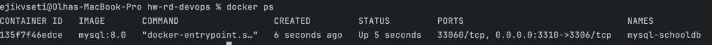
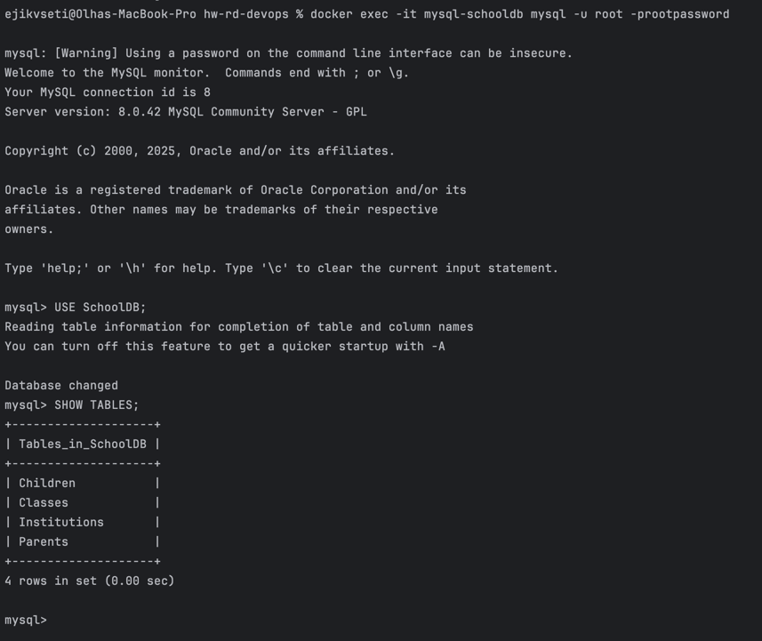
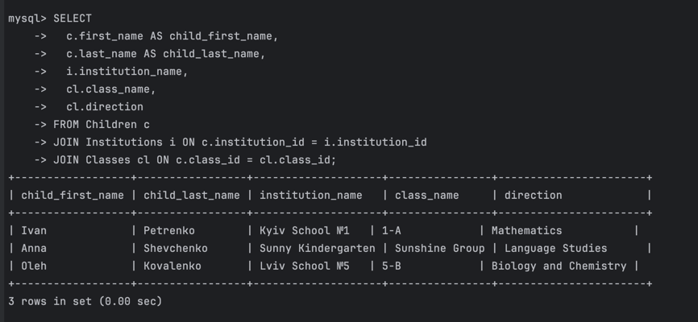
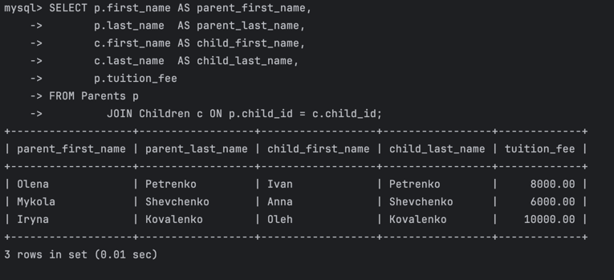
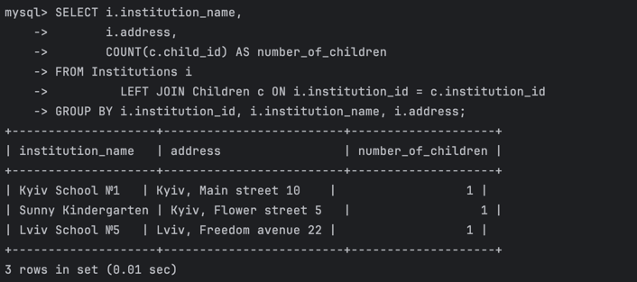
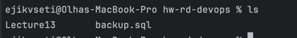
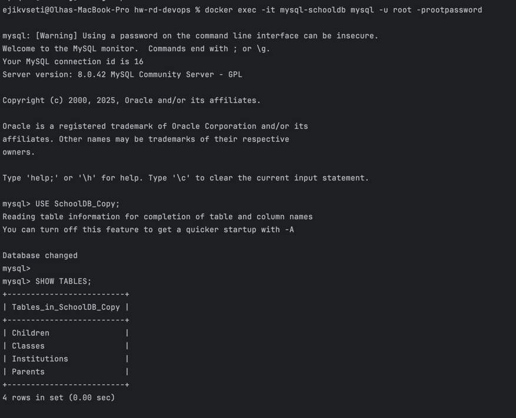
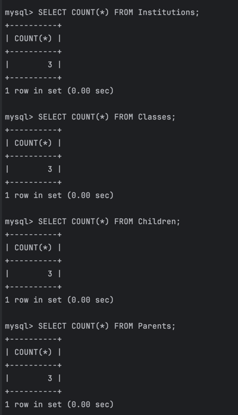
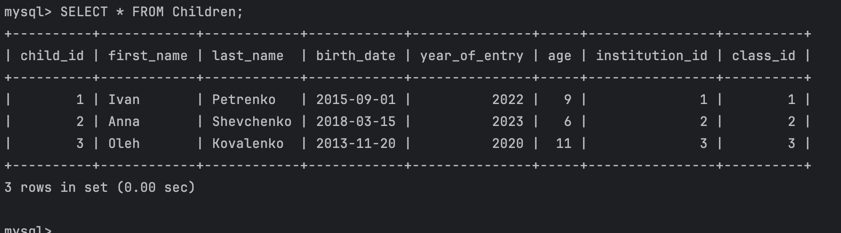
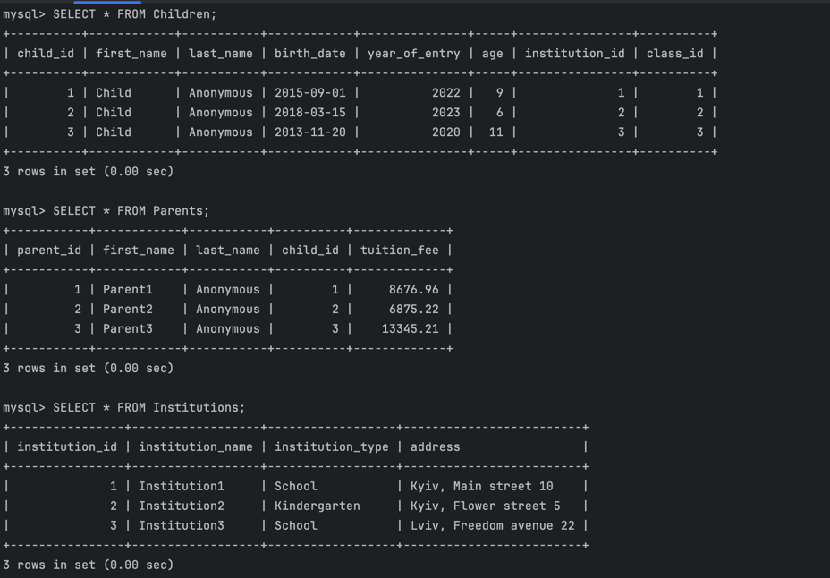

# Завдання 1: Створення бази даних для шкіл та дитячих садочків 

📄 Структура бази даних

Таблиці:
* Institutions — інформація про школи та дитсадки
* Classes — інформація про класи та напрями навчання
* Children — інформація про дітей
* Parents — інформація про батьків та оплату навчання

Всі таблиці пов'язані між собою через FOREIGN KEY.

## Створення бази даних через docker-compose.yml

```docker-compose
version: '3.8'

services:
  mysql:
    image: mysql:8.0
    container_name: mysql-schooldb
    restart: always
    environment:
      MYSQL_ROOT_PASSWORD: rootpassword
      MYSQL_DATABASE: SchoolDB
      MYSQL_USER: school_user
      MYSQL_PASSWORD: school_password
    ports:
      - "3310:3306"
    volumes:
      - mysql-data:/var/lib/mysql
      - ./init:/docker-entrypoint-initdb.d

volumes:
  mysql-data:
```

## Створення таблиць
Створюємо папку init на одному рівні з файлом docker-compose.yml.
У цій папці розміщуємо файл init.sql, який містить SQL-запити для створення таблиць і заповнення їх даними.
У файлі docker-compose.yml у розділі volumes вже додано шлях до цієї папки (./init:/docker-entrypoint-initdb.d), щоб скрипт init.sql автоматично виконався під час старту контейнера.

init.sql:
```sql
USE SchoolDB;

CREATE TABLE IF NOT EXISTS Institutions
(
    institution_id   INT AUTO_INCREMENT PRIMARY KEY,
    institution_name VARCHAR(255)                    NOT NULL,
    institution_type ENUM ('School', 'Kindergarten') NOT NULL,
    address          VARCHAR(255)                    NOT NULL
);

CREATE TABLE IF NOT EXISTS Classes
(
    class_id       INT AUTO_INCREMENT PRIMARY KEY,
    class_name     VARCHAR(255)                                                      NOT NULL,
    institution_id INT,
    direction      ENUM ('Mathematics', 'Biology and Chemistry', 'Language Studies') NOT NULL,
    FOREIGN KEY (institution_id) REFERENCES Institutions (institution_id) ON DELETE CASCADE
);

CREATE TABLE IF NOT EXISTS Children
(
    child_id       INT AUTO_INCREMENT PRIMARY KEY,
    first_name     VARCHAR(255) NOT NULL,
    last_name      VARCHAR(255) NOT NULL,
    birth_date     DATE         NOT NULL,
    year_of_entry  YEAR         NOT NULL,
    age            INT          NOT NULL,
    institution_id INT,
    class_id       INT,
    FOREIGN KEY (institution_id) REFERENCES Institutions (institution_id) ON DELETE CASCADE,
    FOREIGN KEY (class_id) REFERENCES Classes (class_id) ON DELETE CASCADE
);

CREATE TABLE IF NOT EXISTS Parents
(
    parent_id   INT AUTO_INCREMENT PRIMARY KEY,
    first_name  VARCHAR(255)   NOT NULL,
    last_name   VARCHAR(255)   NOT NULL,
    child_id    INT,
    tuition_fee DECIMAL(10, 2) NOT NULL,
    FOREIGN KEY (child_id) REFERENCES Children (child_id) ON DELETE CASCADE
);


-- Вставка записів у Institutions
INSERT INTO Institutions (institution_name, institution_type, address)
VALUES ('Kyiv School №1', 'School', 'Kyiv, Main street 10'),
       ('Sunny Kindergarten', 'Kindergarten', 'Kyiv, Flower street 5'),
       ('Lviv School №5', 'School', 'Lviv, Freedom avenue 22');

-- Вставка записів у Classes
INSERT INTO Classes (class_name, institution_id, direction)
VALUES ('1-A', 1, 'Mathematics'),
       ('Sunshine Group', 2, 'Language Studies'),
       ('5-B', 3, 'Biology and Chemistry');

-- Вставка записів у Children
INSERT INTO Children (first_name, last_name, birth_date, year_of_entry, age, institution_id, class_id)
VALUES ('Ivan', 'Petrenko', '2015-09-01', 2022, 9, 1, 1),
       ('Anna', 'Shevchenko', '2018-03-15', 2023, 6, 2, 2),
       ('Oleh', 'Kovalenko', '2013-11-20', 2020, 11, 3, 3);

-- Вставка записів у Parents
INSERT INTO Parents (first_name, last_name, child_id, tuition_fee)
VALUES ('Olena', 'Petrenko', 1, 8000.00),
       ('Mykola', 'Shevchenko', 2, 6000.00),
       ('Iryna', 'Kovalenko', 3, 10000.00);
```

## Запуск бази даних

```shell
docker-compose -f ./Lecture13/docker-compose.yml up -d
```

Після запуску контейнера можна перевірити його статус за допомогою команди docker ps
```shell
docker ps
```



* Автоматично створиться база SchoolDB
* Автоматично виконаються всі скрипти з init.sql

Підключаємось до Mysql:
```shell
docker exec -it mysql-schooldb mysql -u root -prootpassword
```

Вибираємо потрібну базу даних і переглядаємо список таблиць у ній:
```sql
USE SchoolDB;
SHOW TABLES;
```



## Операції з даними:
1. Список всіх дітей разом із закладом і напрямом навчання
   (Children + Institutions + Classes)

```sql
SELECT c.first_name AS child_first_name,
       c.last_name  AS child_last_name,
       i.institution_name,
       cl.class_name,
       cl.direction
FROM Children c
        JOIN Institutions i ON c.institution_id = i.institution_id
        JOIN Classes cl ON c.class_id = cl.class_id;
```


2. Інформація про батьків і їхніх дітей з вартістю навчання
   (Parents + Children)
```sql
SELECT p.first_name AS parent_first_name,
       p.last_name  AS parent_last_name,
       c.first_name AS child_first_name,
       c.last_name  AS child_last_name,
       p.tuition_fee
FROM Parents p
        JOIN Children c ON p.child_id = c.child_id;
```


3. Список закладів з адресами і кількістю дітей у кожному
   (Institutions + Children)

```sql
SELECT i.institution_name,
       i.address,
       COUNT(c.child_id) AS number_of_children
FROM Institutions i
        LEFT JOIN Children c ON i.institution_id = c.institution_id
GROUP BY i.institution_id, i.institution_name, i.address;
```


## 📍 Бекап і відновлення бази даних

1. Створення бекапу бази SchoolDB
```shell
docker exec -i mysql-schooldb mysqldump -u root -prootpassword SchoolDB > backup.sql
```
У результаті буде створено файл backup.sql, який містить повний дамп бази даних.



2. Перевірка цілісності даних
   Підключаємось знову до MySQL:
```shell
docker exec -it mysql-schooldb mysql -u root -prootpassword
```

3. Створюємо нову базу:

```sql
CREATE DATABASE SchoolDB_Copy;
EXIT;
```

4. Застосуйте дамп backup.sql до бази SchoolDB_Copy:

```shell
docker exec -i mysql-schooldb mysql -u root -prootpassword SchoolDB_Copy < backup.sql
```
Вся структура та дані повинні будуть відновитись у нову базу

5. Перевірка цілісності даних

Підключіться знову до MySQL:
```shell
docker exec -it mysql-schooldb mysql -u root -prootpassword
```

Обираємо потрібну БД і переглядаємо список таблиць у ній:
```sql
USE SchoolDB_Copy;
SHOW TABLES;
```


Перевіряємо кількість записів у таблицях:

```sql
SELECT COUNT(*) FROM Institutions;
SELECT COUNT(*) FROM Classes;
SELECT COUNT(*) FROM Children;
SELECT COUNT(*) FROM Parents;
```



Зробимо вибірковий запит для Children:
```sql
SELECT * FROM Children;
```


### Результат
* Бекап створено і успішно застосовано до нової бази SchoolDB_Copy
* Структура таблиць і дані повністю збережені
* Цілісність даних не порушено


# 📌Додаткове завдання: анонімізація даних
Підключаємось знову до MySQL:
```shell
docker exec -it mysql-schooldb mysql -u root -prootpassword
```

Та обираємо БД:
```sql
USE SchoolDB;
```

1. Анонімізація таблиці Children

Замінимо всі імена на Child, а прізвища на Anonymous:
```sql
UPDATE Children
SET
first_name = 'Child',
last_name = 'Anonymous';
```

2. Анонімізація таблиці Parents
```sql
UPDATE Parents
SET
first_name = CONCAT('Parent', parent_id),
last_name = 'Anonymous';
```

3. Анонімізація таблиці Institutions
```sql
UPDATE Institutions
SET
institution_name = CONCAT('Institution', institution_id);
```

4. Анонімізація фінансових даних
```sql
UPDATE Parents
SET
tuition_fee = ROUND(5000 + (RAND() * (15000 - 5000)), 2);
```

5. Перевірка результатів анонімізації
```sql
SELECT * FROM Children;
SELECT * FROM Parents;
SELECT * FROM Institutions;
```


* Імена та прізвища замінені
* Назви закладів змінені
* Вартість навчання випадкова в межах 5000–15000

