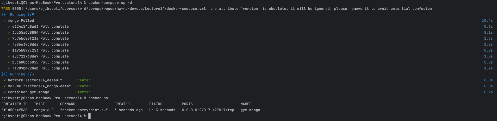
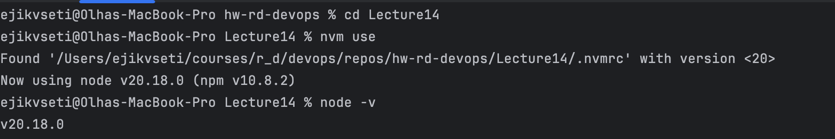

# Gym MongoDB Project

## Опис

Проєкт для роботи з базою даних MongoDB на тему спортзалу. Містить інформацію про клієнтів, їхнє членство, тренування та тренерів.

## 🐳 Підняття MongoDB через Docker

Для запуску локальної MongoDB:

```shell
docker-compose up -d
```
MongoDB буде доступна на mongodb://127.0.0.1:27017
> У Docker `0.0.0.0:27017->27017`, це означає, що MongoDB слухає на всіх інтерфейсах. Для підключення з локальної машини використовуємо саме `127.0.0.1` або `localhost`.



## 📦 Встановлення

1. Версія ноди з файлу .nvmrc (якщо використовуємо nvm)
```shell
cd ./Lecture14
nvm use
node -v
```


2. Встановлення необхідних бібліотек для роботи з монго
```shell
npm install
```

## ✅ Рішення згідно з завданням (скріпт повністю у файлі index.js)

### Створено базу `gymDatabase` та колекції `clients`, `memberships`, `workouts`, `trainers`:

```js
const db = client.db("gymDatabase");

const clients = db.collection("clients");
const memberships = db.collection("memberships");
const workouts = db.collection("workouts");
const trainers = db.collection("trainers");
```

### Заповнено кожну колекцію кількома записами:
```js
await clients.insertMany([
  { client_id: 1, name: "Anna Ivanova", age: 28, email: "anna@example.com" },
  { client_id: 2, name: "Ivan Petrov", age: 35, email: "ivan@example.com" },
  { client_id: 3, name: "Oleh Bondarenko", age: 42, email: "oleh@example.com" }
]);

await memberships.insertMany([
  { membership_id: 101, client_id: 1, start_date: "2025-01-01", end_date: "2025-12-31", type: "Annual" },
  { membership_id: 102, client_id: 2, start_date: "2025-03-01", end_date: "2025-09-01", type: "Semi-Annual" }
]);

await workouts.insertMany([
  { workout_id: 201, description: "Cardio session", difficulty: "medium" },
  { workout_id: 202, description: "Strength training", difficulty: "hard" },
  { workout_id: 203, description: "Stretching", difficulty: "easy" }
]);

await trainers.insertMany([
  { trainer_id: 301, name: "Olga Shevchenko", specialization: "Yoga" },
  { trainer_id: 302, name: "Dmytro Kravets", specialization: "Weightlifting" }
]);
```

### Виконуємо 3 запити:
1. Знайти клієнтів віком понад 30 років
```js
const over30 = await clients.find({ age: { $gt: 30 } }).toArray();
```
2. Перелічуємо тренування із середньою складністю
```js
const mediumWorkouts = await workouts.find({ difficulty: "medium" }).toArray();
```

3. Показуємо інформацію про членство клієнта з client_id = 2
```js
const membershipInfo = await memberships.find({ client_id: 2 }).toArray();
```

### Результати збережено у файл report.txt:
```js
let report = "";

report += "Клієнти старше 30:\n";
report += JSON.stringify(over30, null, 2) + "\n\n";

report += "Тренування середньої складності:\n";
report += JSON.stringify(mediumWorkouts, null, 2) + "\n\n";

report += "Членство клієнта client_id=2:\n";
report += JSON.stringify(membershipInfo, null, 2) + "\n\n";

fs.writeFileSync("report.txt", report);
```

### 🚀 Запуск повністю скрипта зі створення report.txt
```js
node index.js
```

report.txt
```json
Клієнти старше 30:
[
  {
    "_id": "6819023c70aa304315778a5f",
    "client_id": 2,
    "name": "Ivan Petrov",
    "age": 35,
    "email": "ivan@example.com"
  },
  {
    "_id": "6819023c70aa304315778a60",
    "client_id": 3,
    "name": "Oleh Bondarenko",
    "age": 42,
    "email": "oleh@example.com"
  }
]

Тренування середньої складності:
[
  {
    "_id": "6819023c70aa304315778a63",
    "workout_id": 201,
    "description": "Cardio session",
    "difficulty": "medium"
  }
]

Членство клієнта client_id=2:
[
  {
    "_id": "6819023c70aa304315778a62",
    "membership_id": 102,
    "client_id": 2,
    "start_date": "2025-03-01",
    "end_date": "2025-09-01",
    "type": "Semi-Annual"
  }
]
```