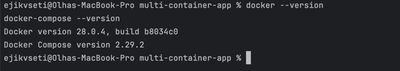
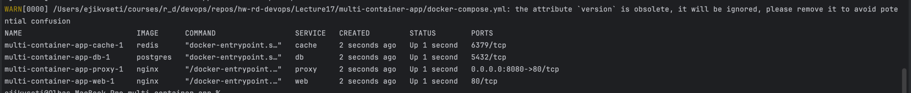
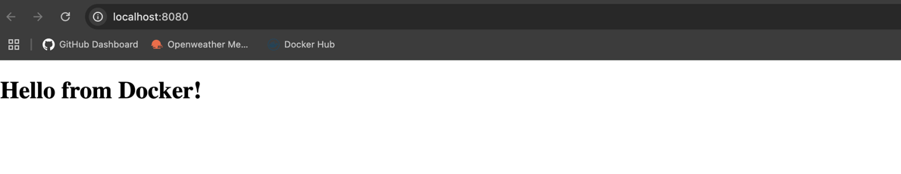
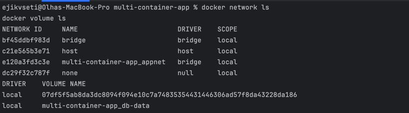
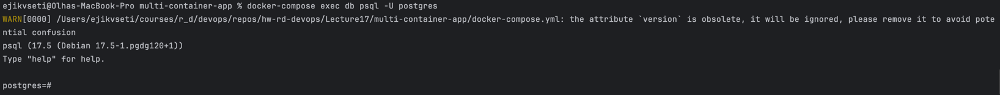
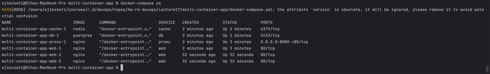

# Docker-compose

## Завдання 1: Встановлення Docker
### Для MacOS:
Завантажуємо Docker Desktop з офіційного сайту: https://www.docker.com/products/docker-desktop
Встановлюємо та запускаємо Docker Desktop
Перевіряємо, що Docker працює:

```shell
docker --version
docker-compose --version
```



## Завдання 2: Створення docker-compose.yml
### Структура проєкту:
```shell
multi-container-app/
├── docker-compose.yml
├── html/
│   └── index.html
└── nginx/
    └── default.conf
```

### nginx/default.conf:
При масштабуванні web-сервісу на кілька контейнерів, усі вони не можуть слухати один і той самий порт 8080 напряму. Щоб зберегти доступ через браузер, ми додаємо окремий сервіс proxy на базі nginx, який буде балансувати запити між усіма екземплярами web.
```nginx
upstream web_cluster {
server web:80;
}

server {
listen 80;

    location / {
        proxy_pass http://web_cluster;
    }
}
```

### html/index.html:
Файл index.html розміщується у директорії html/ і монтується у контейнер web через volume. Nginx автоматично використовує цей файл як стартову сторінку.
```html
<!DOCTYPE html>
<html>
<head>
  <title>My Docker App</title>
</head>
<body>
  <h1>Hello from Docker!</h1>
</body>
</html>
```

### docker-compose.yml:
Файл docker-compose.yml описує конфігурацію багатоконтейнерного застосунку. У цьому прикладі визначені такі сервіси:
* web — контейнер з nginx, який обслуговує HTML-файл із директорії html/.
* db — база даних PostgreSQL з томом для збереження даних.
* cache — контейнер Redis для кешування.
* proxy (у розширеній версії) — nginx reverse proxy, який розподіляє запити на кілька екземплярів web.

Також у файлі визначено:
* volumes — для збереження даних PostgreSQL.
* networks — спільна мережа appnet, щоб усі контейнери могли спілкуватися між собою.
```yaml
version: "3.9"

services:
  proxy:
    image: nginx
    ports:
      - "8080:80"
    volumes:
      - ./nginx/default.conf:/etc/nginx/conf.d/default.conf
    depends_on:
      - web
    networks:
      - appnet

  web:
    image: nginx
    volumes:
      - ./html:/usr/share/nginx/html:ro
    expose:
      - "80"
    networks:
      - appnet

  db:
    image: postgres
    environment:
      POSTGRES_PASSWORD: example
    volumes:
      - db-data:/var/lib/postgresql/data
    networks:
      - appnet

  cache:
    image: redis
    networks:
      - appnet

volumes:
  db-data:

networks:
  appnet:
```

## Завдання 3: Запуск
### Запускаємо застосунок:
```shell
docker-compose up -d
```

### Перевіряємо контейнери:
```shell
docker-compose ps
```


### Перевірка в браузері:
Перевіряємо в браузері http://localhost:8080 — має відкритись сторінка Hello from Docker!.


## Завдання 4: Мережі та томи
### Досліджуємо створені мережі та томи:
```shell
docker network ls
docker volume ls
```


### Перевіряємо підключення до бази даних:
```shell
docker-compose exec db psql -U postgres
```



## Завдання 5: Масштабування
### Масштабування:
```shell
docker-compose up -d --scale web=3
```

### Перевірка:
```shell
docker-compose ps
```
