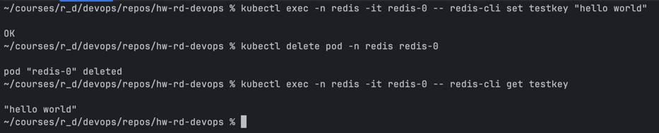
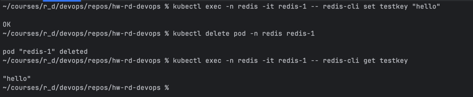
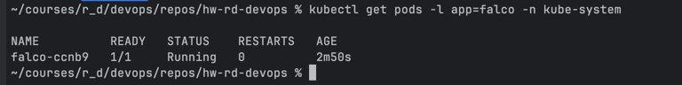
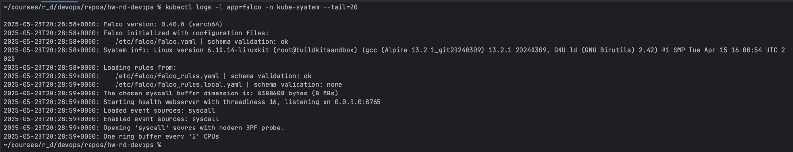
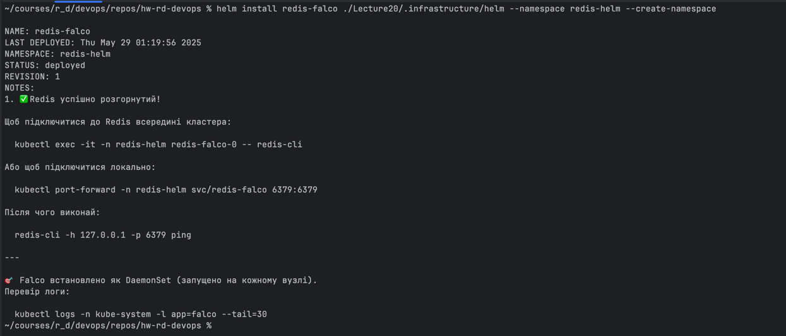
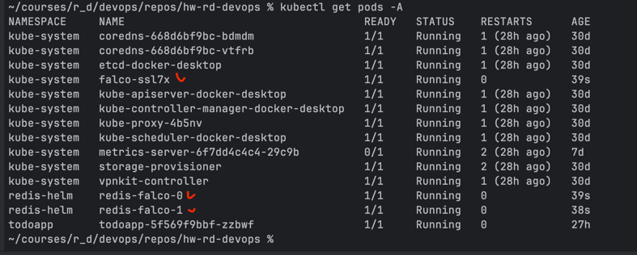
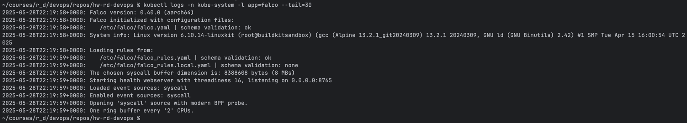
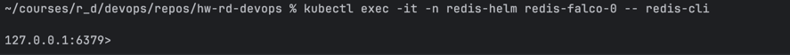
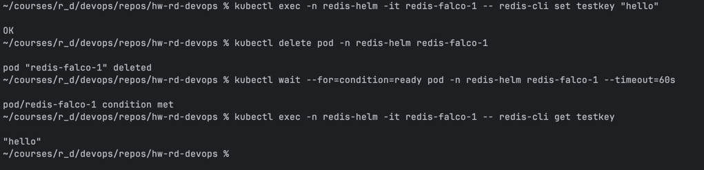

# 📌 Завдання 1: Створення StatefulSet для Redis-кластера

### Мета:
Redis-кластер використовує StatefulSet для забезпечення постійних даних і стабільних імен для кожного екземпляра Redis.
Вам потрібно створити StatefulSet для Redis із двома репліками, які взаємодіятимуть між собою.

### 1. Розміщуємо YAML-файли

* Створюємо каталог .infrastructure/ у каталог Lecture20/ проєкту

* Поміщаємо усі наступні файли у цей каталог:
  * Файл: .infrastructure/redis-namespace.yml
    ```yaml
    apiVersion: v1
    kind: Namespace
    metadata:
      name: redis
    ```

  * **Файл: .infrastructure/redis-service.yml**
    ```yaml
    apiVersion: v1
    kind: Service
    metadata:
      name: redis
      namespace: redis
    spec:
      clusterIP: None        # Headless Service для внутрішнього DNS
      selector:
        app: redis
      ports:
        - port: 6379         # Порт Redis
    ```
    #### Ключові моменти:
    ```text
    **clusterIP**: None робить сервіс headless, 
    щоб StatefulSet-поди отримали стабільні DNS імена (redis-0.redis, redis-1.redis).
    ```
    
    * **Файл: .infrastructure/redis-statefulset.yml**
        ```yaml
        apiVersion: apps/v1
        kind: StatefulSet
        metadata:
          name: redis
          namespace: redis
        spec:
          serviceName: "redis"    # Посилання на headless Service
          replicas: 2             # Кількість екземплярів Redis
          selector:
            matchLabels:
              app: redis
          template:
            metadata:
              labels:
                app: redis
            spec:
              containers:
              - name: redis
                image: redis:7.0
                command: ["redis-server", "--appendonly", "yes"]
                ports:
                - containerPort: 6379
                volumeMounts:
                - name: data
                  mountPath: /data   # Для зберігання AOF файлiв
          volumeClaimTemplates:
          - metadata:
              name: data           # Ім'я тому всередині пода
            spec:
              accessModes: ["ReadWriteOnce"]
              resources:
                requests:
                  storage: 1Gi       # Розмір тома
        ```
        #### Ключові моменти:
        ```text
        replicas: 2 створює redis-0 та redis-1 з постійними іменами.
      
        Параметр --appendonly yes забезпечує збереження команд на диск.
      
        volumeClaimTemplates автоматично створює два PVC (data-redis-0, data-redis-1) для збереження даних.
        ```
### 2. Інструкція з розгортання
#### 1. Створити namespace:
```shell
kubectl apply -f ./Lecture20/.infrastructure/redis-namespace.yml
```

#### 2. Застосувати Headless Service:
```shell
kubectl apply -f ./Lecture20/.infrastructure/redis-service.yml
```

#### 3. Розгорнути StatefulSet:
```shell
kubectl apply -f ./Lecture20/.infrastructure/redis-statefulset.yml
```

#### 4. Перевірити поди:
```shell
kubectl get pods -n redis
```
**Result:**
```shell
NAME      READY   STATUS    RESTARTS   AGE
redis-0   1/1     Running   0          19s
redis-1   1/1     Running   0          13s
```

#### 5. Перевірити збереження даних для redis-0:
```shell
# Записуємо пару ключ/значення
kubectl exec -n redis -it redis-0 -- redis-cli set testkey "hello world"

# Перезапускаємо pod
kubectl delete pod -n redis redis-0

# Після відновлення podʼа перевіряємо значення
kubectl exec -n redis -it redis-0 -- redis-cli get testkey
```
**Result:**


#### 6. Перевірити збереження даних для redis-1:
```shell
# Записуємо пару ключ/значення
kubectl exec -n redis -it redis-1 -- redis-cli set testkey "hello"

# Перезапускаємо pod
kubectl delete pod -n redis redis-1

# Після відновлення podʼа перевіряємо значення
kubectl exec -n redis -it redis-1 -- redis-cli get testkey
```
**Result:**


### 3. 🧹 Cleanup Instructions

####  ❌ Видалення ресурсів Redis-кластера

```bash
kubectl delete -f ./Lecture20/.infrastructure/redis-statefulset.yml
kubectl delete -f ./Lecture20/.infrastructure/redis-service.yml
```

#### ❌ Delete the namespace itself:

```bash
kubectl delete namespace redis
```

Якщо простір імен залишається застряглим у `Terminating`, запустимо:
```bash
kubectl get namespace redis -o json \
| jq 'del(.spec.finalizers)' \
| kubectl replace --raw "/api/v1/namespaces/redis/finalize" -f -
```

#### ✅ Перевірити, що всі ресурси видалені:

```bash
kubectl get all -A | grep redis
```


# 📌 Завдання 2: Налаштування Falco в Kubernetes за допомогою DaemonSet

### Мета:
Розгорнути інструмент Falco в кластері Kubernetes для моніторингу подій безпеки на кожному вузлі. 
Falco буде встановлено через DaemonSet.

### 1. Розміщення YAML

* Створюємо файл `./Lecture20/.infrastructure/falco-daemonset.yml`:
```yaml
apiVersion: apps/v1
kind: DaemonSet
metadata:
  name: falco
  namespace: kube-system
  labels:
    app: falco
spec:
  selector:
    matchLabels:
      app: falco
  template:
    metadata:
      labels:
        app: falco
    spec:
      containers:
      - name: falco
        image: falcosecurity/falco:latest
        securityContext:
          privileged: true
        resources:
          limits:
            memory: 256Mi
            cpu: 100m
          requests:
            memory: 128Mi
            cpu: 100m
        volumeMounts:
        - name: proc
          mountPath: /host/proc
          readOnly: true
        - name: boot
          mountPath: /host/boot
          readOnly: true
        - name: lib-modules
          mountPath: /host/lib/modules
          readOnly: true
        - name: docker-sock
          mountPath: /var/run/docker.sock
        - name: usr
          mountPath: /host/usr
          readOnly: true
      volumes:
      - name: proc
        hostPath:
          path: /proc
      - name: boot
        hostPath:
          path: /boot
      - name: lib-modules
        hostPath:
          path: /lib/modules
      - name: docker-sock
        hostPath:
          path: /var/run/docker.sock
      - name: usr
        hostPath:
          path: /usr
```

#### Ключові моменти:
```text
- Falco розгортається як DaemonSet у `kube-system`, щоб працювати на кожному вузлі
- Працює з `privileged: true` для доступу до системних викликів
- Монтовані директорії: `/proc`, `/boot`, `/lib/modules`, `/var/run/docker.sock`, `/usr`
- Обмеження ресурсів: `100m CPU`, `256Mi` memory (limits); `100m CPU`, `128Mi` memory (requests)
```

### 2. Застосування
```bash
kubectl apply -f ./Lecture20/.infrastructure/falco-daemonset.yml
```

### 3. Перевірка розгортання
```shell
kubectl get pods -l app=falco -n kube-system
```
Pod запущено:


```shell
kubectl logs -l app=falco -n kube-system --tail=20
```
Falco логування:


### 4. Очікуваний результат
✅ Pod Falco запущено на кожному вузлі  
✅ У логах видно події (файли, процеси, docker)  
✅ DaemonSet працює з правами `privileged` і має необхідні монтовані директорії

---

### 🧹 Cleanup

```bash
kubectl delete -f ./Lecture20/.infrastructure/falco-daemonset.yml
```


# 📌 Опціональне завдання: Розгортання через Helm Chart

### Мета:
Перенести обидва завдання (Redis + Falco) у Helm-чарт, щоб спростити розгортання, параметризацію та повторне використання.

#### 1. Перевір, що Helm встановлено:
```shell
helm version
```
Якщо не встановлено то на Мак встановимо через:
```shell
brew install helm
```

#### 2. Створюємо Helm-чарт та переносимо до робочого каталогу:
```shell
helm create redis-falco
mv redis-falco ./Lecture20/.infrastructure/helm/
```

#### 3. Замінемо `./Lecture20/.infrastructure/helm/templates/tests/test-connection.yaml` щоб тестувати Redis:
```yaml
apiVersion: v1
kind: Pod
metadata:
  name: '{{ include "redis-falco.fullname" . }}-test-connection'
  labels:
    {{- include "redis-falco.labels" . | nindent 4 }}
  annotations:
    "helm.sh/hook": test
spec:
  containers:
    - name: redis-cli
      image: redis:alpine
      command: ["redis-cli"]
      args: ["-h", '{{ include "redis-falco.fullname" . }}', "ping"]
  restartPolicy: Never
```

#### 4. Видаляємо зайві файли:
```shell
rm -rf ./Lecture20/.infrastructure/helm/templates/deployment.yaml \
       ./Lecture20/.infrastructure/helm/templates/hpa.yaml \
       ./Lecture20/.infrastructure/helm/templates/ingress.yaml \
       ./Lecture20/.infrastructure/helm/templates/serviceaccount.yaml
```

#### 5. Оновлюємо `values.yaml` для Redis:
```yaml
replicaCount: 2

image:
  repository: redis
  pullPolicy: IfNotPresent
  tag: "7.0"

service:
  type: ClusterIP
  port: 6379

resources:
  limits:
    cpu: 100m
    memory: 128Mi
  requests:
    cpu: 100m
    memory: 128Mi

persistence:
  enabled: true
  accessMode: ReadWriteOnce
  size: 1Gi

ingress:
  enabled: false
  tls: []
  hosts: []
```

#### 6. Додаємо в `templates/`:
- `service.yaml`
- `statefulset.yaml`
- `falco-daemonset.yaml`

- `service.yaml`
```yaml
apiVersion: v1
kind: Service
metadata:
  name: {{ include "redis-falco.fullname" . }}
  labels:
    {{- include "redis-falco.labels" . | nindent 4 }}
spec:
  clusterIP: None  # робить Service headless (необхідно для StatefulSet)
  type: {{ .Values.service.type }}
  ports:
    - port: {{ .Values.service.port }}
      targetPort: 6379
      protocol: TCP
      name: redis
  selector:
    {{- include "redis-falco.selectorLabels" . | nindent 4 }}
```
**Ключові моменти:**
```text
- clusterIP: None — це обов'язково, щоб StatefulSet міг звертатися до кожного пода по DNS (наприклад: redis-0.redis.default.svc.cluster.local)
- targetPort: 6379 — Redis слухає на порту 6379
```

- `statefulset.yaml`
```yaml
apiVersion: apps/v1
kind: StatefulSet
metadata:
  name: {{ include "redis-falco.fullname" . }}
  labels:
    {{- include "redis-falco.labels" . | nindent 4 }}
spec:
  serviceName: {{ include "redis-falco.fullname" . }}-headless
  replicas: {{ .Values.replicaCount }}
  selector:
    matchLabels:
      {{- include "redis-falco.selectorLabels" . | nindent 6 }}
  template:
    metadata:
      labels:
        {{- include "redis-falco.selectorLabels" . | nindent 8 }}
    spec:
      containers:
        - name: redis
          image: "{{ .Values.image.repository }}:{{ .Values.image.tag }}"
          imagePullPolicy: {{ .Values.image.pullPolicy }}
          command: ["redis-server", "--appendonly", "yes"]
          ports:
            - containerPort: {{ .Values.service.port }}
              name: redis
          volumeMounts:
            - name: data
              mountPath: /data
          resources:
            {{- toYaml .Values.resources | nindent 12 }}
  volumeClaimTemplates:
    - metadata:
        name: data
      spec:
        accessModes: [{{ .Values.persistence.accessMode | quote }}]
        resources:
          requests:
            storage: {{ .Values.persistence.size }}
```
**Ключові моменти:**
```text
- kind: StatefulSet — використовується для стано-залежного застосунку (Redis) з персистентним зберіганням.
- serviceName: {{ include "redis.fullname" . }}-headless — headless-сервіс забезпечує стабільні DNS-імена для подів (обов’язково для StatefulSet).
- clusterIP: None — це обов'язково, щоб StatefulSet міг звертатися до кожного пода по DNS (наприклад: redis-0.redis.default.svc.cluster.local).
- replicas: {{ .Values.replicaCount }} — кількість екземплярів Redis, які будуть створені.
- volumeClaimTemplates — створює окремий PVC для кожного Redis-пода.
- mountPath: /data — Redis буде зберігати свої дані в цьому каталозі.
- command: ["redis-server", "--appendonly", "yes"] — вмикає AOF (Append Only File) для збереження даних.
- targetPort: 6379 — Redis слухає на порту 6379.
- image: redis:7.0 — образ Redis задається через values.yaml.
- resources — дозволяє обмежити ресурси, які Redis може використовувати.
```

- `falco-daemonset.yaml`
```yaml
apiVersion: apps/v1
kind: DaemonSet
metadata:
  name: falco
  namespace: kube-system
  labels:
    app: falco
spec:
  selector:
    matchLabels:
      app: falco
  template:
    metadata:
      labels:
        app: falco
    spec:
      containers:
        - name: falco
          image: falcosecurity/falco:latest
          securityContext:
            privileged: true
          resources:
            requests:
              cpu: 100m
              memory: 128Mi
            limits:
              cpu: 100m
              memory: 256Mi
          volumeMounts:
            - name: proc
              mountPath: /host/proc
              readOnly: true
            - name: boot
              mountPath: /host/boot
              readOnly: true
            - name: lib-modules
              mountPath: /host/lib/modules
              readOnly: true
            - name: docker-sock
              mountPath: /var/run/docker.sock
            - name: usr
              mountPath: /host/usr
              readOnly: true
      volumes:
        - name: proc
          hostPath:
            path: /proc
        - name: boot
          hostPath:
            path: /boot
        - name: lib-modules
          hostPath:
            path: /lib/modules
        - name: docker-sock
          hostPath:
            path: /var/run/docker.sock
        - name: usr
          hostPath:
            path: /usr
```

- `NOTES.txt`
```shell
```

---

### 🌟 Запуск Helm-чарту
```bash
helm install redis-falco ./Lecture20/.infrastructure/helm --namespace redis-helm --create-namespace
```


### Перевірка подів та Falco:
```shell
kubectl get pods -A
```


```shell
kubectl logs -n kube-system -l app=falco --tail=30
```


```shell
kubectl exec -it -n redis-helm redis-falco-0 -- redis-cli
```


#### Перевірка збереження даних (Redis + PVC):
```shell
# 1. Записуємо ключ у Redis
kubectl exec -n redis-helm -it redis-falco-1 -- redis-cli set testkey "hello"

# 2. Видаляємо pod (він відновиться завдяки StatefulSet)
kubectl delete pod -n redis-helm redis-falco-1

# 3. Чекаємо, поки pod знову запуститься:
kubectl wait --for=condition=ready pod -n redis-helm redis-falco-1 --timeout=60s

# 4. Перевіряємо, чи збереглось значення
kubectl exec -n redis-helm -it redis-falco-1 -- redis-cli get testkey
```



> ⚠️ **Примітка:** з міркувань безпеки Falco рекомендується розгортати окремим Helm-чартом, але для спрощення він інтегрований до цього завдання.

📄 Готово: Redis + Falco розгорнуті через один Helm-чарт.

### 🧹 Cleanup

```bash
helm uninstall redis-falco --namespace redis-helm
```