# 📌 Опис виконання завдання

### 1. Створення та налаштування VPC
* Переходимо на VPC DashBoard та створюємо нову VPC:
  * Тиснемо "Create VPC" та обираємо "VPC only", щоб створити VPC без підмереж, шлюзів та таблиць маршрутизації:
    * Назва: dev-vpc-01 
    * CIDR-блок: 10.0.0.0/16
    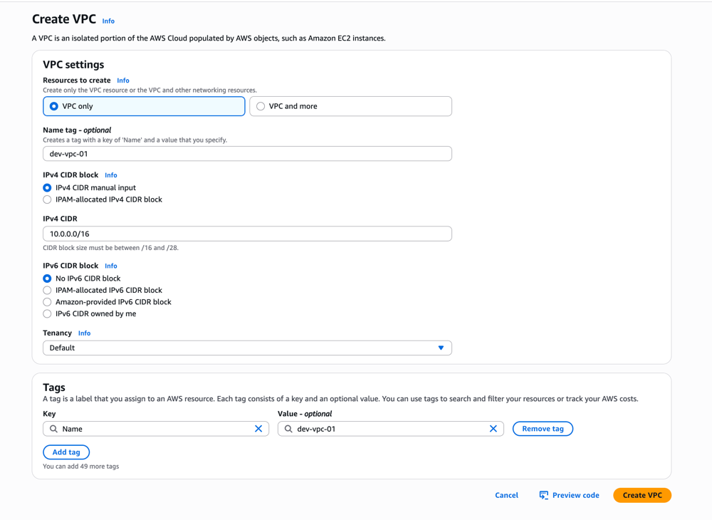
    
    * Тиснемо "Create VPC" для створення VPC
    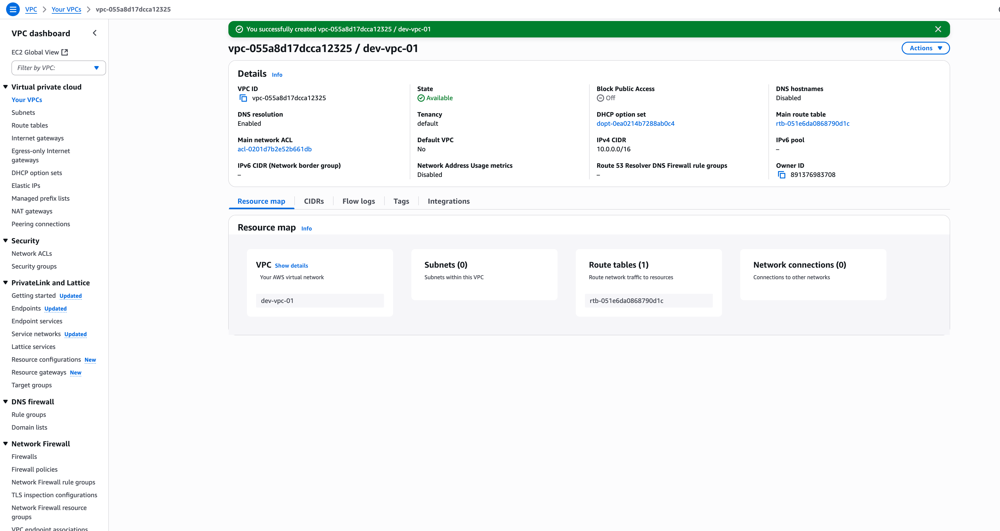

* Переходимо на вкладку **Subnets** та створюємо дві підмережі в VPC:
  * Публічна підмережа:
    * Назва: public-subnet-01
    * CIDR-блок: 10.0.1.0/24
    * Зона доступності: eu-north-1a
    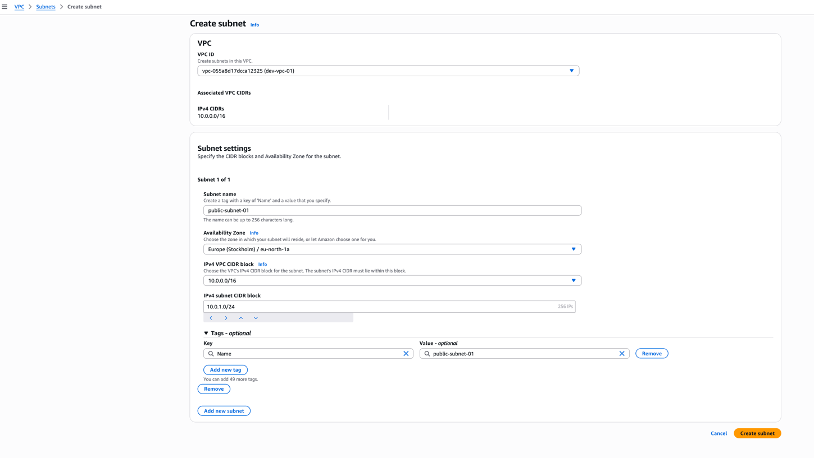
    * Тиснемо "Create subnet" для створення публічної підмережі:
    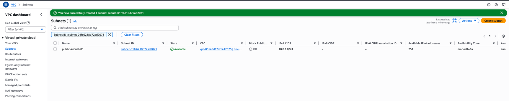
  * Cтворюємо приватну підмережу:
    * Назва: private-subnet-01
    * CIDR-блок: 10.0.2.0/24
    * Зона доступності: eu-north-1b
    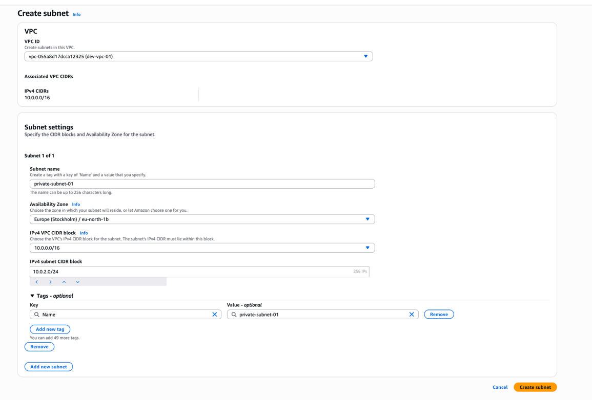
    * Тиснемо "Create subnet" для створення приватної підмережі:
    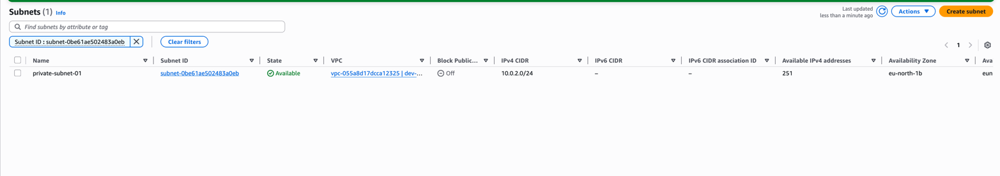
* Оновлюємо Subnets і бачимо обидві підмережі в списку
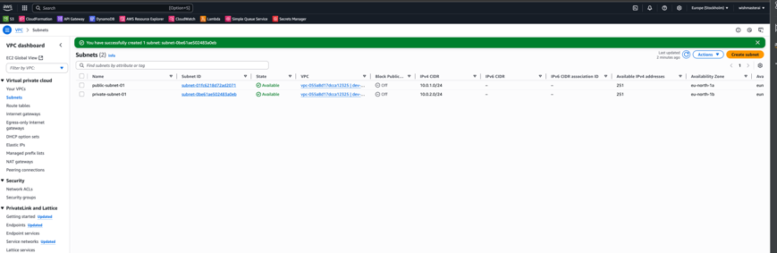

* Переходимо на вкладку **Internet gateways** та створюємо та налаштовуємо інтернет-шлюз:
  * Назва: dev-igw
  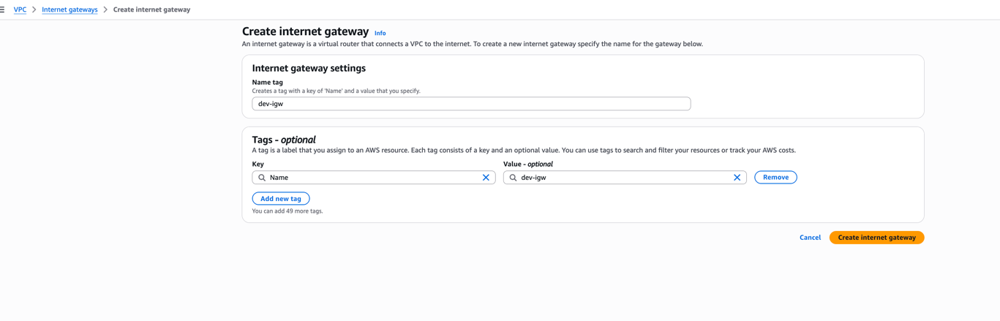
  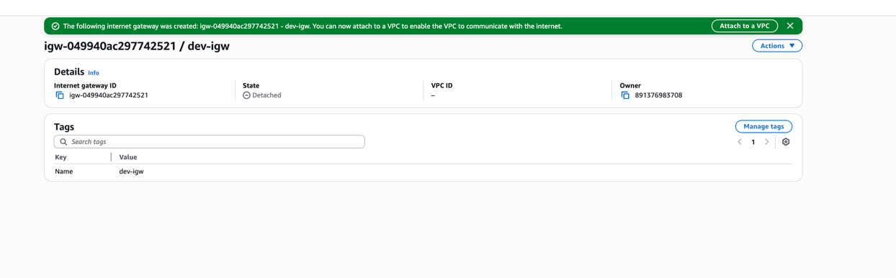
  * Прив'язуємо до VPC dev-vpc-01: 
    * Вибираємо створений IGW та тиснемо "Actions" → "Attach to VPC", після чого побачимо, що IGW прив'язано до VPC:
    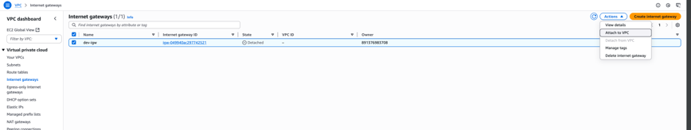
    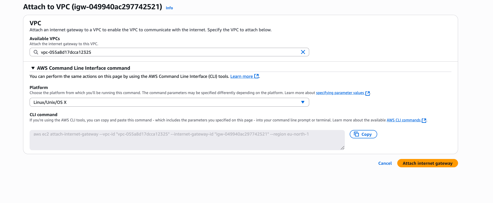
    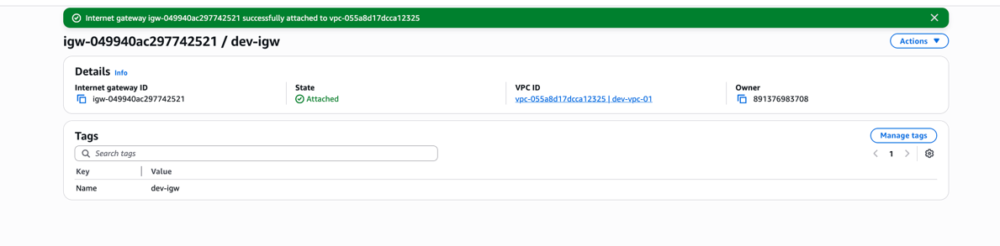
    
  * Переходимо на вкладку **Route tables** та налаштовуємо таблицю маршрутизації:
    * За замовчанням вже створена таблиця маршрутизації для VPC dev-vpc-01, відкриваємо її:
   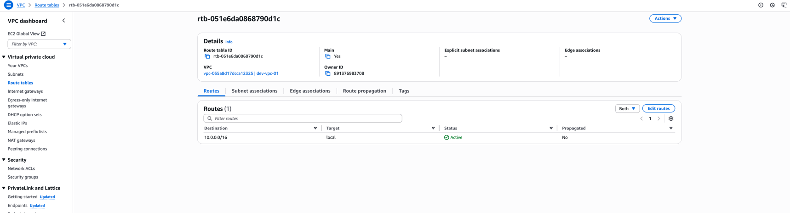
    * Додаємо маршрут для публічної підмережі:
      * Тиснемо "Edit routes" → "Add route": 
        * Destination: 0.0.0.0/0
        * Target: dev-igw (інтернет-шлюз)
        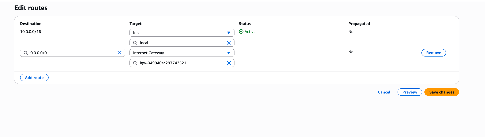
        * Тиснемо "Save changes" для збереження маршруту:
        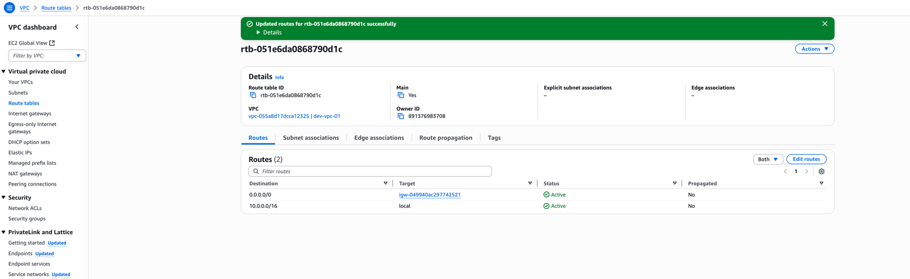
      * Прив'язуємо таблицю маршрутизації до публічної підмережі:
        * Вибираємо таблицю маршрутизації, тиснемо "Subnet associations" → "Edit subnet associations":
          * Вибираємо public-subnet-01 та тиснемо "Save associations":
          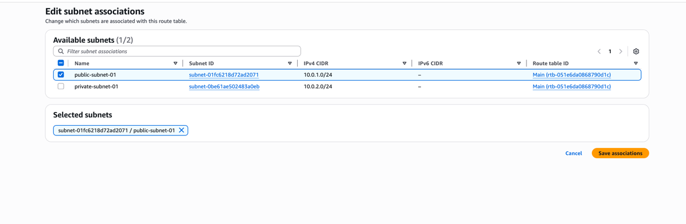
          * Тепер таблиця маршрутизації прив'язана до публічної підмережі (Explicit subnet association):
          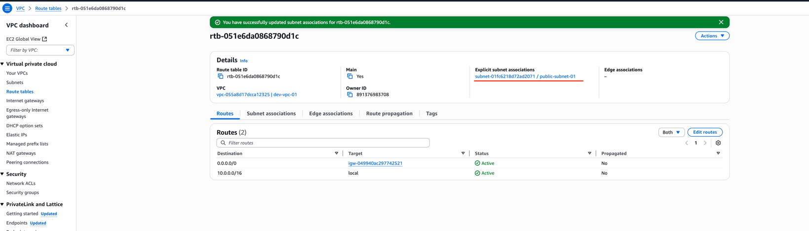
### 2. Налаштування груп безпеки (Security Groups) та списків контролю доступу (ACL)
* Переходимо на вкладку Security Group та створюємо Security Group:
  * Назва: web-sg
  * Description: Security Group for lecture 22
  * VPC: dev-vpc-01
  * Вхідні правила:
    * HTTP (80) — 0.0.0.0/0
    * SSH (22) — 0.0.0.0/0
  * Вихідні правила: увесь трафік дозволено
  * Tags: 
    * Key: Name, Value: web-sg
    * Тиснемо "Create security group" для створення SG:
    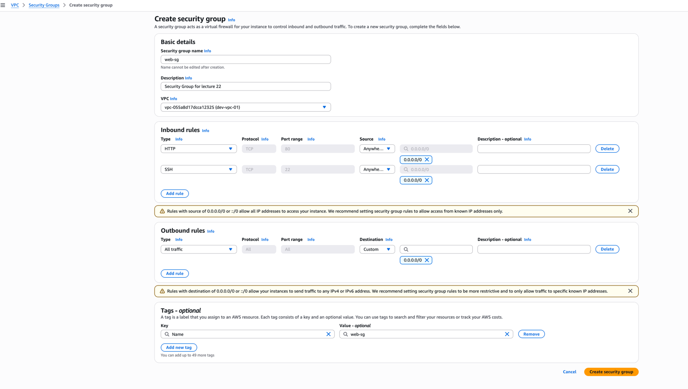
    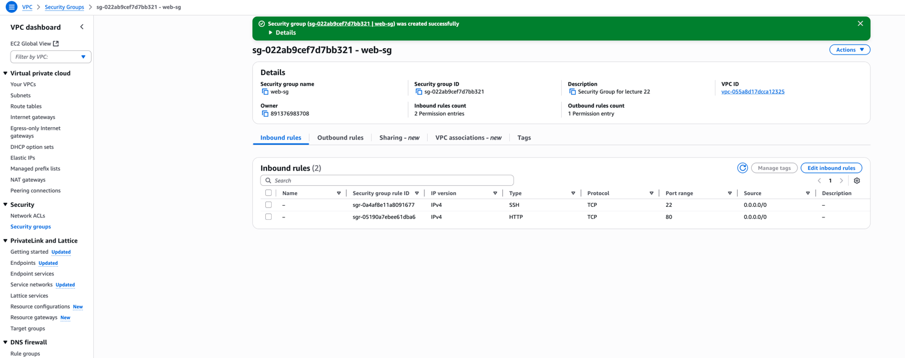
* ACL залишено дефолтним (вхідні та вихідні правила дозволяють увесь трафік):
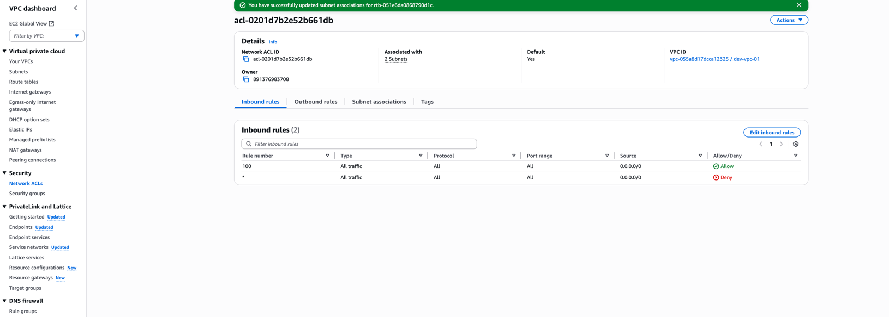
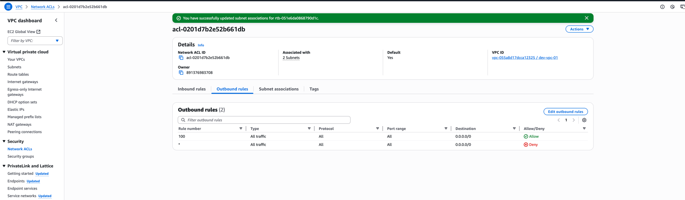
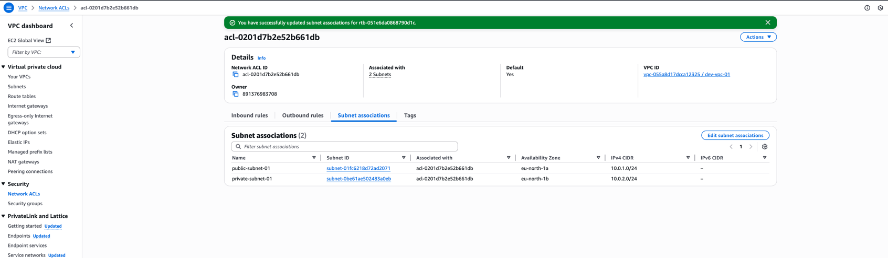

### 3. Запуск інстансу EC2
* Переходимо до EC2 DashBoard та створюємо інстанс EC2 (tab Instances/Launch instances):
  * Назва: dev-ec2
  * AMI: Amazon Linux 2023 (новіший, рекомендований AWS, free tier elegible)
  * Architecture: x86_64 (сумісна з Free Tier, стабільна)
  * Тип: t3.micro (Free Tier eligible)
  * Key pair: створюємо новий ключ
    * Назва: dev-key
    * Тип ключа: RSA
    * Формат: pem (для Linux/Mac)
    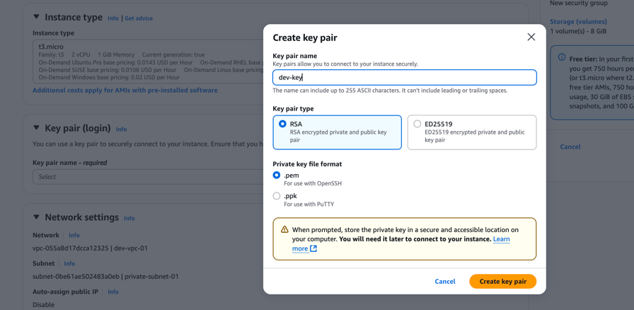
    * Тиснемо "Create key pair" для створення ключа
    * Зберігаємо dev-key.pem на локальному комп'ютері в безпечному місці
  * Прив'язуємо до public-subnet-01
  * Призначаємо Security Group: web-sg
  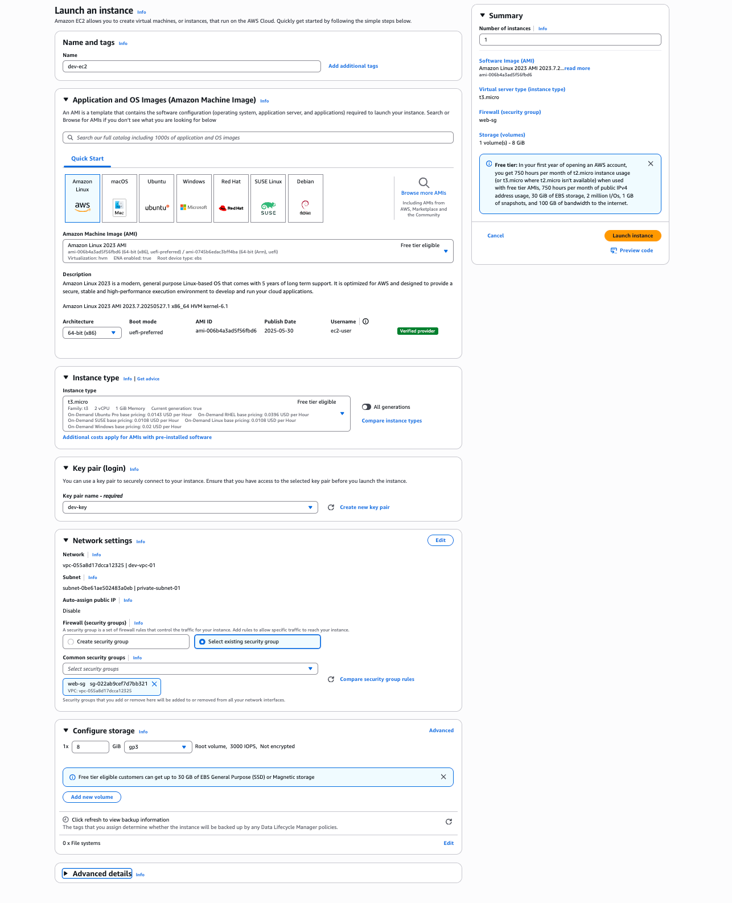
  * Тиснемо "Launch instance" для запуску інстансу:
  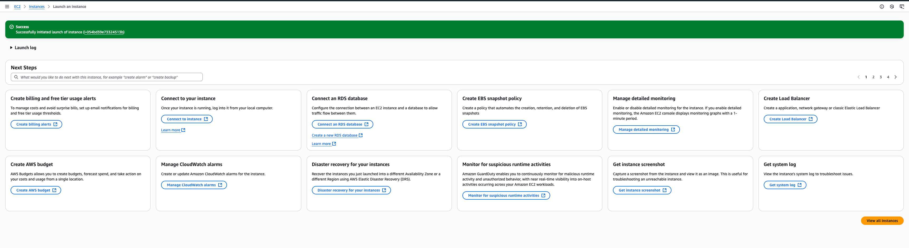
* Після запуску інстансу dev-ec2, перевіряємо його статус (повинен бути "running"):
  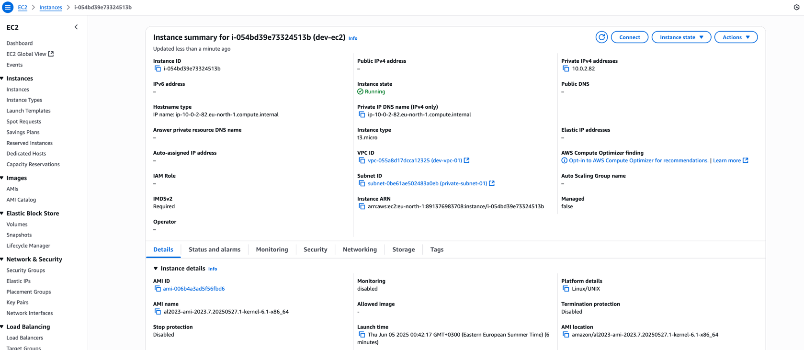

### 4. Призначення еластичної IP-адреси (EIP)
* Переходимо до пункту **Elastic IPs** та створюємо нову Elastic IP:
  * Тиснемо "Allocate Elastic IP address"
    * Public IPv4 address pool: залишаємо Amazon's pool of IPv4 addresses (за замовчанням)
    * Network border group: повинен збігатися з регіоном, у якому створено VPC (eu-north-1)
    * Тег (рекомендовано):
      * Key: Name, Value: dev-eip
    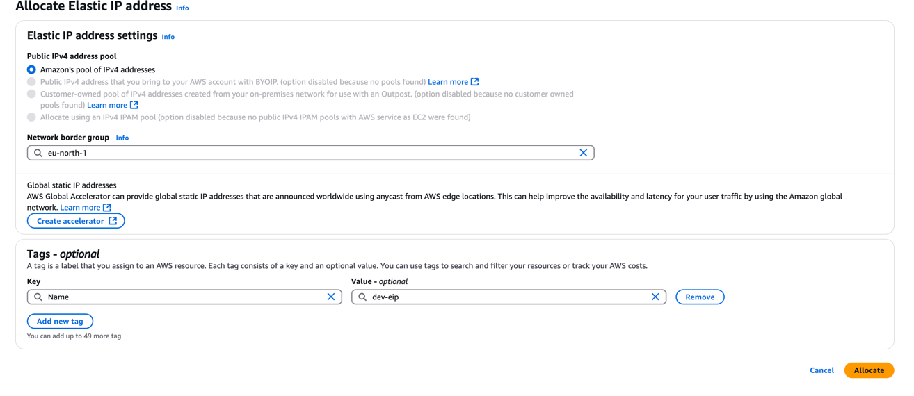
    * Натискаємо "Allocate"
    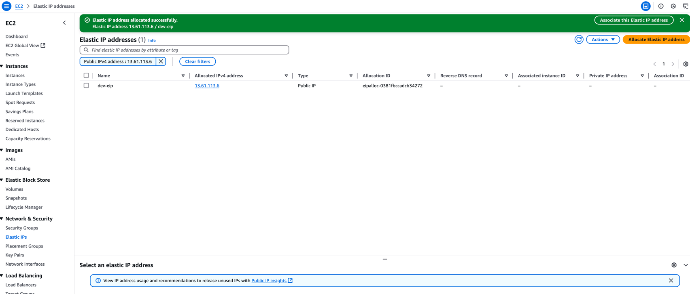
    * Після створення входимо до dev-eip та натискаємо "Associate Elastic IP address"
      * Обираємо EC2 інстанс dev-ec2
      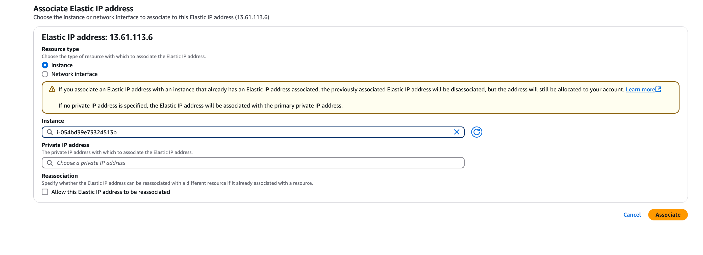
      * Натискаємо "Associate"
      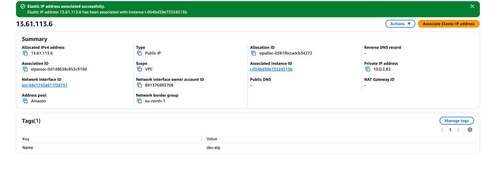
    * Після призначення EIP можна підключитися до інстансу за допомогою SSH:
      * Відкриваємо термінал на локальному комп'ютері
      * Переходимо до теки, де збережено dev-key.pem
      * Виконуємо команди (Де `13.61.113.6` — це Elastic IP, який ми призначили інстансу dev-ec2):
        ```shell
        chmod 400 dev-key.pem
        ssh -i dev-key.pem ec2-user@13.61.113.6
        ```
        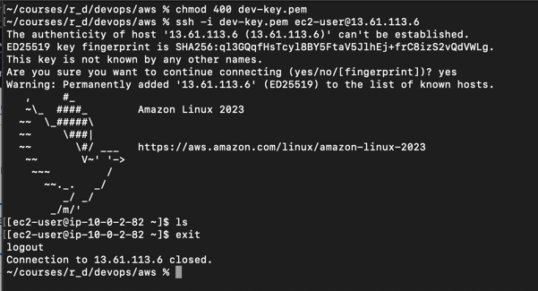

### 5. Завершення роботи
* SSH-ключ `dev-key` збережено для подальших завдань — наразі не видаляємо його.
* Інші створені ресурси треба видалити, щоб уникнути подальших витрат:
  * EC2 інстанс
  * Elastic IP (не забути відв'язати перед видаленням, інакше буде тарифікуватись)
  * Security Group (якщо не використовується іншими ресурсами)
  * Інтернет-шлюз
  * Підмережі
  * Таблиця маршрутизації (якщо створювали окрему)
  * VPC

* Видаляємо всі ресурси, які були створені в рамках цього завдання по черзі:
    * EC2 інстанс dev-ec2 (Instance state → Terminate (delete) instance)
    * Elastic IP `dev-eip` (Disassociate → Release)
      * Якщо інстанс вже має статус `Terminated`, кнопка Disassociate може бути неактивною — це означає, що IP вже автоматично відв’язаний. У такому разі можна одразу натискати **Release Elastic IP address**.
    * Security Group web-sg (Actions → Delete security group)
    * Інтернет-шлюз dev-igw (Actions → Detach from VPC → Delete internet gateway)
    * Підмережі public-subnet-01 та private-subnet-01 (Actions → Delete subnet)
    * VPC dev-vpc-01 (Actions → Delete VPC)
      * Таблиця маршрутизації (видаляється автоматично при видаленні VPC)
  * Після видалення всіх ресурсів, можна перевірити через AWS Resource Groups -> Tag Editor, що більше немає створених ресурсів:
    * можна обрати навіть всі регіони та всі підтримувані сервіси, щоб переконатися, що все видалено:
    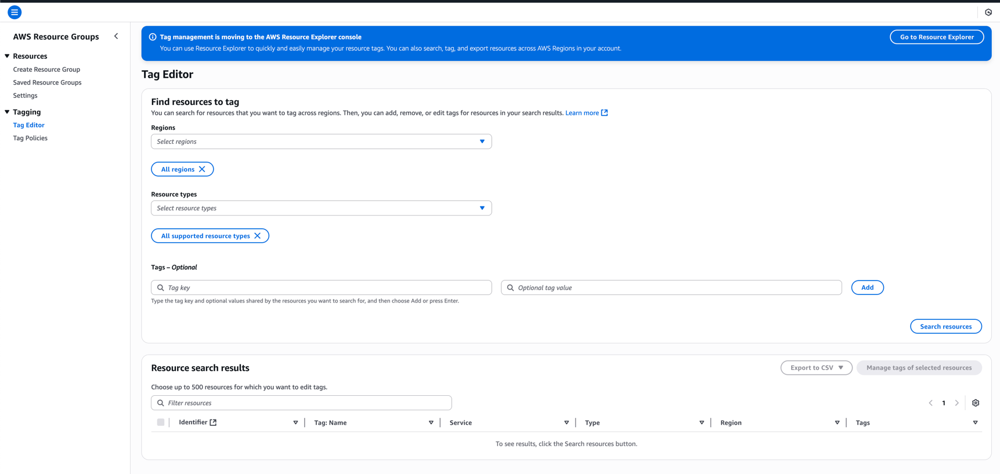
    * Натискаємо "Search resources" та перевіряємо, що немає жодних ресурсів які треба видалити:
    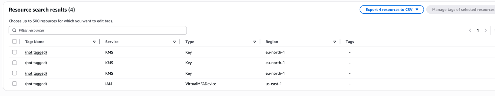
