# 📌 Опис виконання завдання

### 1. Створення кластеру EKS через AWS Management Console

1. Створення кластера EKS
   - Signin → EKS → Create cluster.
       * У секції Configuration options обераємо ✅ Custom configuration
       * EKS Auto Mode вимкнена
       * Cluster name: hw-cluster
       * Upgrade policy: залишаємо за замовчуванням Standard
         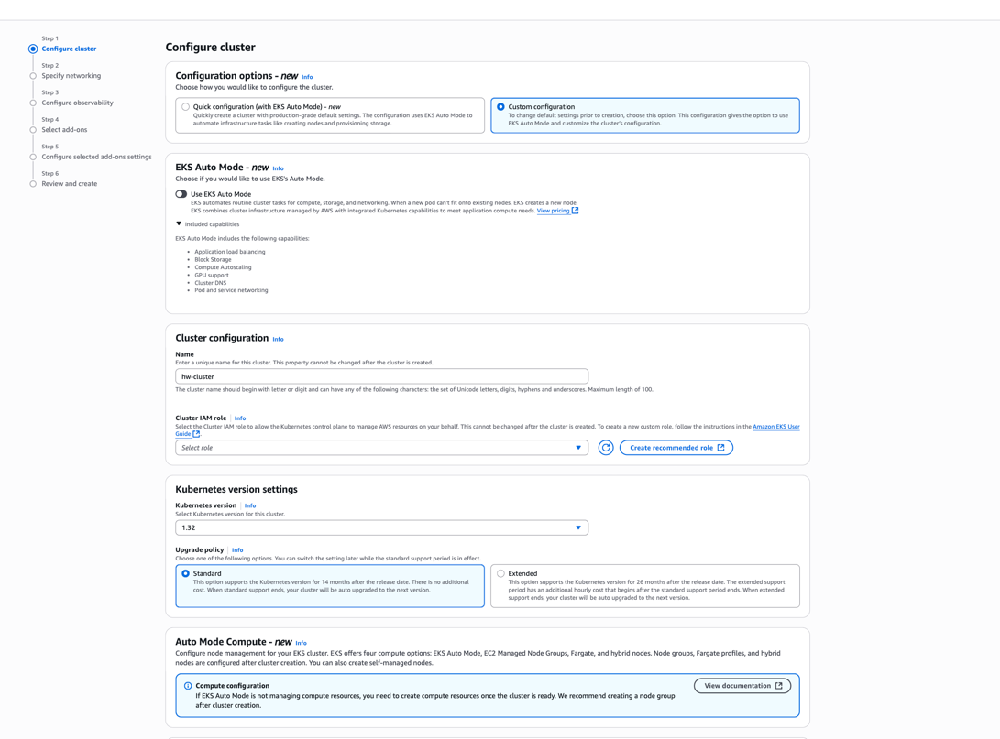
       * Залишаємо Allow cluster administration access
       * Cluster authentication mode: залишаємо за замовчуванням EKS API
       * Kubernetes version: лишаємо за замовчуванням (нині—1.32)
         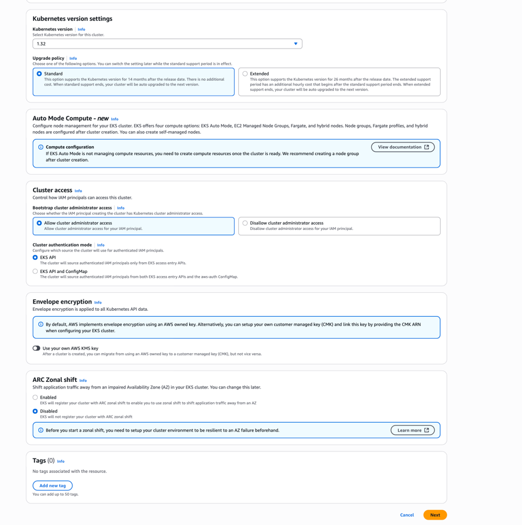

       * Створюємо Cluster IAM role через кнопку Create recommended role
           * Обираємо опцію EKS-Cluster, Це дозволяє Kubernetes control plane (тобто сам кластер) керувати ресурсами
             AWS (наприклад, створювати ENI, EBS для PVC тощо)
             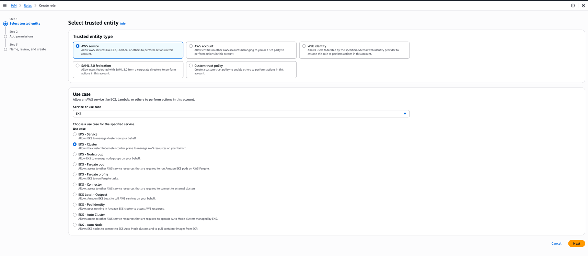
           * Тиснемо Next та обираємо полісі AmazonEKSClusterPolicy, яка рекомендована для EKS кластерів.
             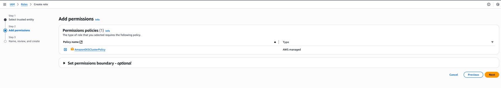
           * Далі даємо назву AmazonEKSClusterHWRole та тиснемо Create role, щоб створити IAM роль для кластера.
             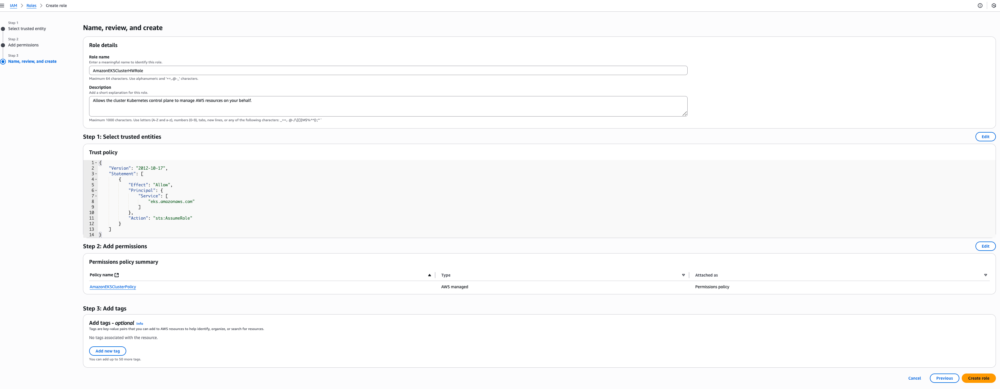
           * Обираємо створену роль AmazonEKSClusterHWRole.
       * Далі переходимо по кнопці Next: Networking
           * ✅ Створюємо VPC для EKS через AWS Console
               * Переходимо у сервіс VPC → зліва Your VPCs → натисни Create VPC оберемо vpc and more. Назвемо eks-vpc
                 та залишимо все за замовчуванням і створимо 2 public + 2 private subnet у різних AZ.
                 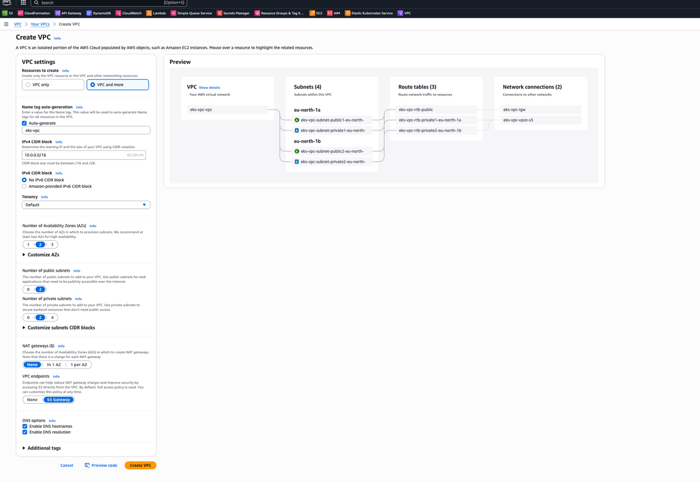
                 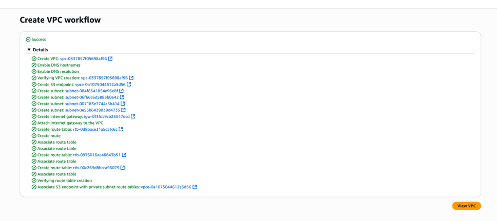
           * Повертаємось до створення кластера EKS, обираємо створену VPC ekc-vpc та 2 public subnet.
           * Additional security groups (optional): залишити порожнім — AWS створить усе сам
             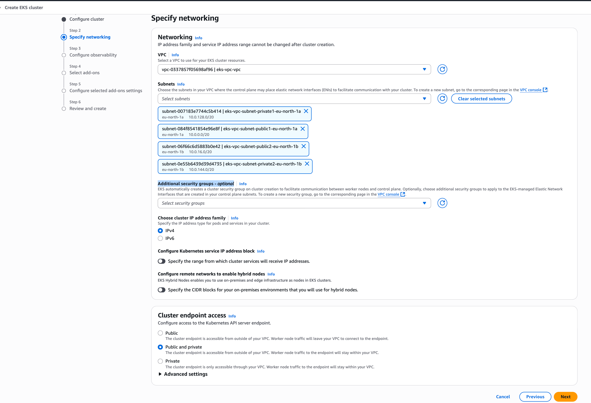
           * На кроці Configure observability залиш усе вимкненим
             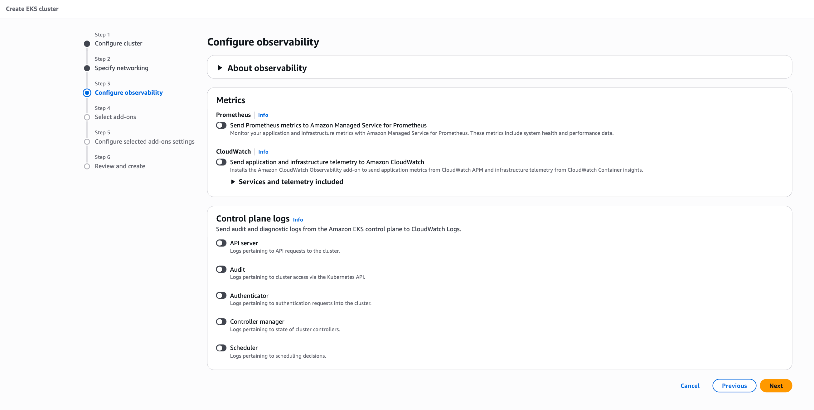
           * На кроці Select add-ons залишимо включеними CoreDNS, kube-proxy, VPC CNI, Amazon EKS Pod Identity Agent and Amazon EBS CSI Driver (інші вимкнемо якщо є)
             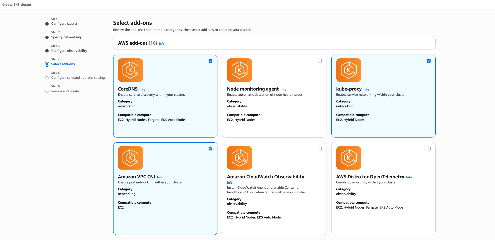
           * На кроці Configure selected add-ons settings додамо нову роль для Amazon EBS CSI Driver, яка дозволить автоматично створювати EBS томи для PVC (policy AmazonEBSCSIDriverPolicy).
             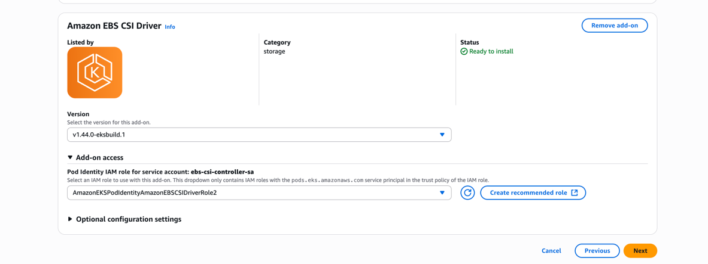
           * На кроці Review and create залишимо все за замовчуванням, перевіримо, що все правильно, і натиснемо Create
           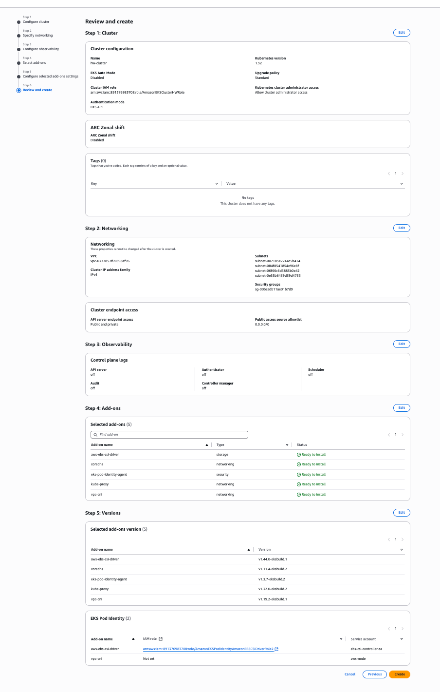

2. Застосовуйте EC2 інстанси типу t3.medium
    * Перед запуском Node Group необхідно переконатись, що обрані сабнети є дійсно публічними. Для цього:
        * Перейди в AWS Console → VPC → Subnets
        * Обери паблік сабнети
        * Для кожного сабнету перевір:
            * ✅ Увімкнено Auto-assign public IPv4 address → Якщо вимкнено: Edit subnet settings → Enable → Save
              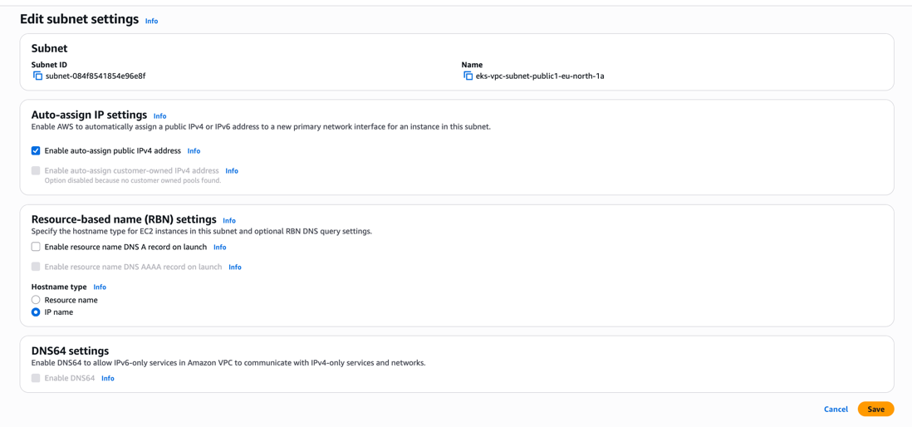
              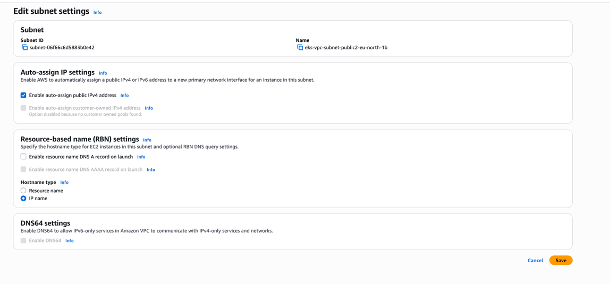
            * ✅ Сабнет пов'язаний із Route Table, яка містить маршрут
          ```shell
          Destination: 0.0.0.0/0
          Target:      igw-xxxxxxxx
          ```
            * ✅ VPC має Internet Gateway, прикріплений до цієї VPC
              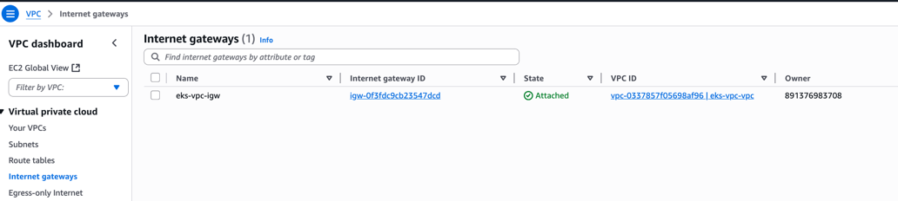
    * Після створення кластера, перейдіть до вкладки Compute → Add node group
      * Name workers
      * Створюємо нову роль з політиками:
          * AmazonEKSWorkerNodePolicy
          * AmazonEKS_CNI_Policy
          * AmazonEC2ContainerRegistryReadOnly
          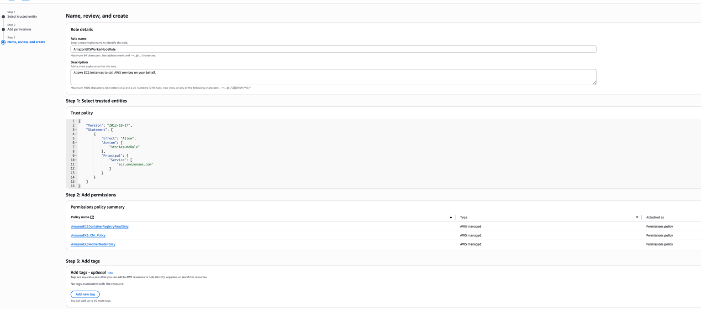
      * Обираємо нову роль, яку створили на попередньому кроці.
      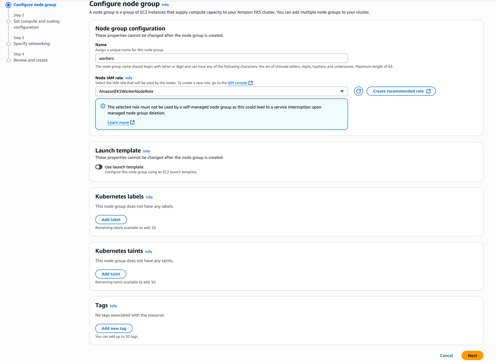
      * Тип EC2: t3.medium
      * Кількість: Desired / Min / Max = 2
      * Натисни Next → Create
      * Після створення — дві EC2-ноди зʼявляться в обраному регіоні в EC2 Console.
        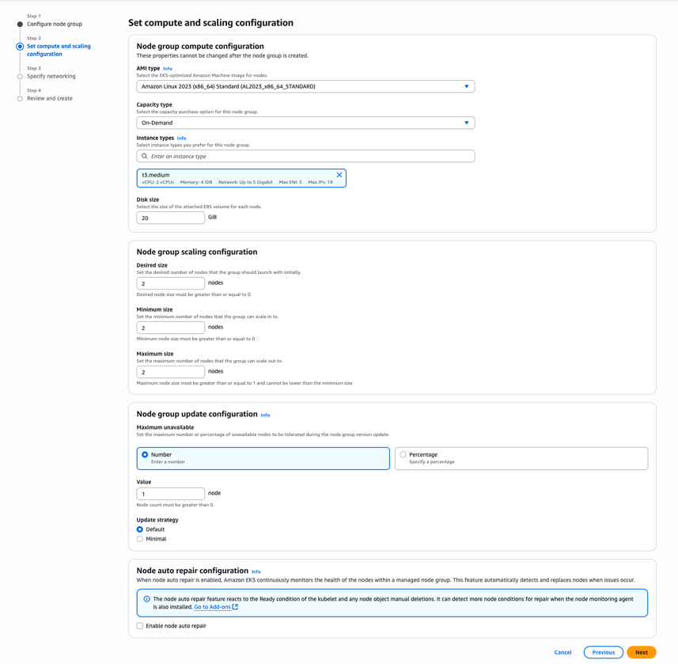
      * Specify Networking залишаємо public subnet, які ми створили раніше, так як кластер буде доступний з інтернету.
        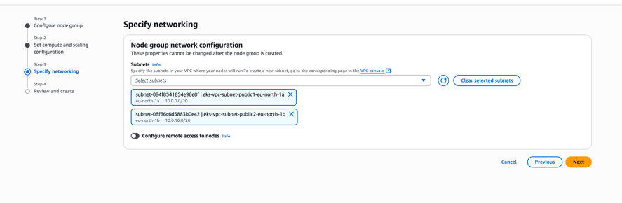
      
      * Ревюємо та створюємо
      
        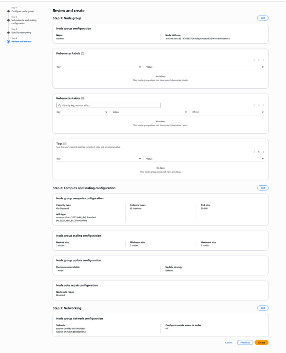

### 2. Налаштування kubectl для доступу до кластера

* Перш ніж підключити kubectl, переконайтесь, що поточний AWS IAM-користувач має дозвіл на доступ до кластеру.
    ```bash
    aws eks describe-cluster --name hw-cluster --region eu-north-1 --query "cluster.status"
    ```
    * Якщо команда повертає AccessDeniedException, значить IAM-користувачу потрібно додати політику з правами доступу до
      EKS
    ```json
    {
        "Version": "2012-10-17",
        "Statement": [
            {
                "Sid": "EKSFullAccess",
                "Effect": "Allow",
                "Action": [
                    "eks:*",
                    "ec2:DescribeSubnets",
                    "ec2:DescribeSecurityGroups",
                    "ec2:DescribeVpcs",
                    "ec2:DescribeRouteTables",
                    "ec2:DescribeInternetGateways",
                    "iam:GetRole",
                    "iam:ListRoles",
                    "cloudformation:DescribeStacks",
                    "cloudformation:ListStacks",
                    "cloudformation:GetTemplate",
                    "autoscaling:DescribeAutoScalingGroups",
                    "elasticloadbalancing:DescribeLoadBalancers"
                ],
                "Resource": "*"
            },
            {
                "Sid": "SafePassRoleToEKS",
                "Effect": "Allow",
                "Action": "iam:PassRole",
                "Resource": "*",
                "Condition": {
                    "StringEquals": {
                        "iam:PassedToService": "eks.amazonaws.com"
                    }
                }
            }
        ]
    }
    ```
    * Також на вкладці Access кластеру необхідно додати юзера та назначити йому полісі AmazonEKSClusterAdminPolicy
    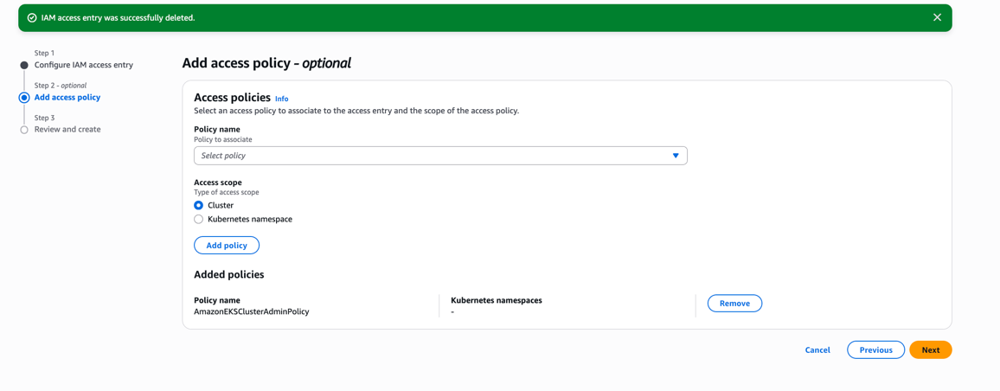
    * Після надання доступу IAM-користувачу до кластера, можна оновити локальну конфігурацію kubectl та перевірити
      доступ до кластеру:
    ```bash
    aws eks update-kubeconfig --region eu-north-1 --name hw-cluster
    kubectl get nodes
    ```
  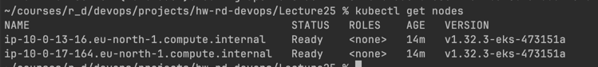

### 3. Розгортання статичного веб-сайту
1. Створити файл index.html (./site/index.html)
```html
<!DOCTYPE html>
<html>
  <head>
    <title>My Static Site</title>
  </head>
  <body>
    <h1>Hello from EKS!</h1>
  </body>
</html>
```

2. Створити ConfigMap з HTML-файлу (./site/index.html)
```shell
kubectl create configmap website-html \
  --from-file=site/index.html \
  --dry-run=client -o yaml > ./.infrastructure/configmap.yaml
```
створеться файл `./.infrastructure/configmap.yaml` з таким вмістом:
```yaml
apiVersion: v1
data:
  index.html: |
    <!DOCTYPE html>
    <html>
      <head>
        <title>My Static Site</title>
      </head>
      <body>
        <h1>Hello from EKS!</h1>
      </body>
    </html>
kind: ConfigMap
metadata:
  creationTimestamp: null
  name: website-html
```
3. Deployment з nginx (./.infrastructure/deployment.yaml)
```yaml
apiVersion: apps/v1
kind: Deployment
metadata:
  name: website
spec:
  replicas: 1
  selector:
    matchLabels:
      app: website
  template:
    metadata:
      labels:
        app: website
    spec:
      containers:
        - name: nginx
          image: nginx:alpine
          ports:
            - containerPort: 80
          volumeMounts:
            - name: html
              mountPath: /usr/share/nginx/html/index.html
              subPath: index.html
      volumes:
        - name: html
          configMap:
            name: website-html
```

4. Service типу LoadBalancer (./.infrastructure/service.yaml)
```yaml
apiVersion: v1
kind: Service
metadata:
  name: website-service
spec:
  type: LoadBalancer
  selector:
    app: website
  ports:
    - protocol: TCP
      port: 80
      targetPort: 80
```

* Переконаємось що ми в коректному контексті кластера:
```bash
kubectl config current-context
```
повинно повернути `arn:aws:eks:<region>:<account-id>:cluster/hw-cluster`

5. Розгортаємо всі ресурси
```shell
kubectl apply -f ./.infrastructure/configmap.yaml
kubectl apply -f ./.infrastructure/deployment.yaml
kubectl apply -f ./.infrastructure/service.yaml
```
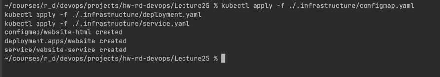

6. Перевіряємо статус Deployment та Service
```bash
kubectl get pods
kubectl get svc
```
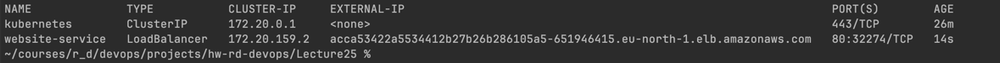

7. Заходимо на сайт
```shell
http://acca53422a5534412b27b26b286105a5-651946415.eu-north-1.elb.amazonaws.com.eu-north-1.elb.amazonaws.com
```
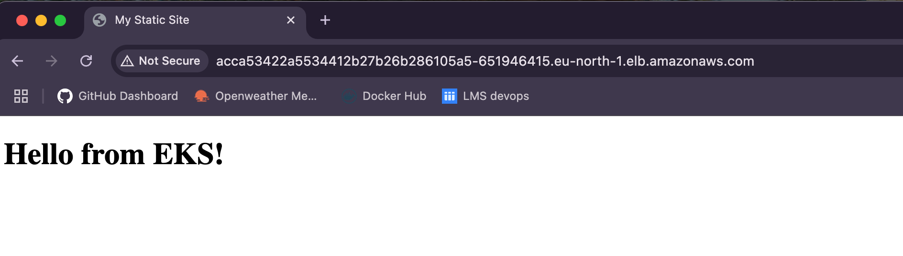

### 4. Створення PersistentVolumeClaim для збереження даних

* Використовуйте динамічне створення сховища (StorageClass), щоб зробити PersistentVolumeClaim
* Розгорніть Pod, який застосовує цей PVC, щоб зберігати дані на EBS-диску

1. Перевіряємо, що у нас є StorageClass gp3, якщо ні то використовуємо StorageClass gp2:
```bash
kubectl get storageclass
```
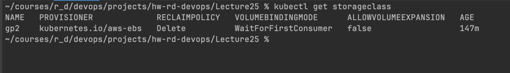

Якщо gp2 то створимо новий StorageClass, який явно використовує EBS (./.infrastructure/storageclass.yaml):
```yaml
apiVersion: storage.k8s.io/v1
kind: StorageClass
metadata:
  name: ebs-csi
provisioner: ebs.csi.aws.com
volumeBindingMode: WaitForFirstConsumer
```
Застосуємо його:
```bash
kubectl apply -f .infrastructure/storageclass.yaml
```

2. Створюємо PVC (./.infrastructure/pvc.yaml)

Вказуємо замість gp3 — ebs-csi, якщо у вас немає gp3 StorageClass.
```yaml
apiVersion: v1
kind: PersistentVolumeClaim
metadata:
  name: demo-pvc
spec:
  accessModes:
    - ReadWriteOnce
  resources:
    requests:
      storage: 1Gi
  storageClassName: ebs-csi
```


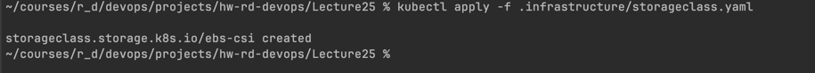

3. Створюємо Pod, який використовує PVC (./.infrastructure/pod-pvc.yaml)
```yaml
apiVersion: v1
kind: Pod
metadata:
  name: demo-pod
spec:
  containers:
    - name: busybox
      image: busybox
      command: ["sh", "-c", "echo 'Hello from EBS volume' > /data/hello.txt && sleep 3600"]
      volumeMounts:
        - name: data-volume
          mountPath: /data
  volumes:
    - name: data-volume
      persistentVolumeClaim:
        claimName: demo-pvc
```

4. Застосовуємо ресурси

Перед застосуванням встановимо add-on 'Amazon EBS CSI Driver' для EKS, якщо він ще не встановлений. (з полтітикою AmazonEBSCSIDriverPolicy)

```bash
kubectl apply -f ./.infrastructure/pvc.yaml
kubectl apply -f ./.infrastructure/pod-pvc.yaml
```
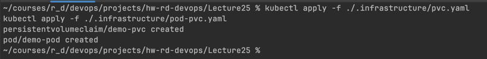

5. Перевіряємо
```bash
kubectl get pvc
kubectl get pod test-pod
```
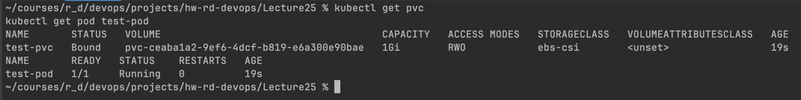

### 5. Запуск завдання за допомогою Job

1. Створемо YAML-файл з описом Job (./.infrastructure/hello-job.yaml)
```yaml
apiVersion: batch/v1
kind: Job
metadata:
  name: hello-job
spec:
  template:
    spec:
      containers:
        - name: hello
          image: busybox
          command: ["sh", "-c", "echo 'Hello from EKS!'"]
      restartPolicy: Never
  backoffLimit: 2
```

2. Застосуємо цей Job у кластері
```shell
kubectl apply -f ./.infrastructure/hello-job.yaml
```
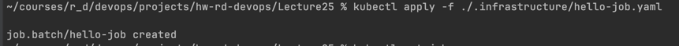

3. Перевіремо статус Job
```shell
kubectl get jobs
```
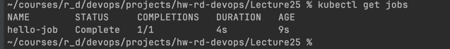

4. Знайдемо Pod, що був створений для цього Job
```shell
kubectl get pods --selector=job-name=hello-job
```
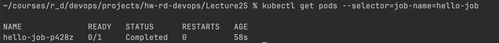

5. Перевіремо лог виконання Pod
```shell
kubectl logs -l job-name=hello-job
```
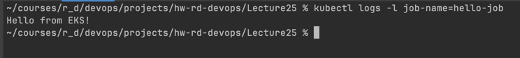

### 6. Розгортання тестового застосунку

1. Створемо Deployment (наприклад, з образом httpd, ./.infrastructure/httpd-deployment.yaml)

```yaml
apiVersion: apps/v1
kind: Deployment
metadata:
  name: httpd-deployment
spec:
  replicas: 2
  selector:
    matchLabels:
      app: httpd
  template:
    metadata:
      labels:
        app: httpd
    spec:
      containers:
        - name: httpd
          image: httpd:latest
          ports:
            - containerPort: 80
```

2. Створемо Service типу ClusterIP (./.infrastructure/httpd-service.yaml)

```yaml
apiVersion: v1
kind: Service
metadata:
  name: httpd-service
spec:
  selector:
    app: httpd
  ports:
    - protocol: TCP
      port: 80
      targetPort: 80
  type: ClusterIP
```

3. Застосуємо Deployment і Service

```shell
kubectl apply -f ./.infrastructure/httpd-deployment.yaml
kubectl apply -f ./.infrastructure/httpd-service.yaml
```
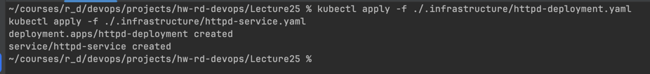

4. Перевіремо, що все працює

```shell
kubectl get pods -l app=httpd
```
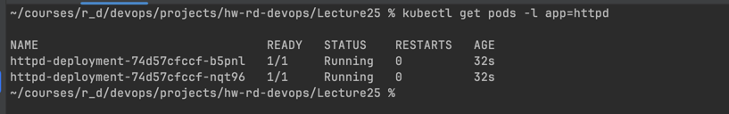

Перевіремо Service:

```shell
kubectl get svc httpd-service
```
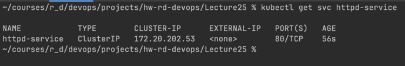

5. Перевіремо доступність застосунку всередині кластера

```shell
kubectl run curl --image=radial/busyboxplus:curl -it --restart=Never --rm \
  -- curl httpd-service:80
```
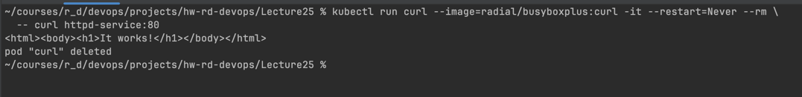

### 7. Робота з неймспейсами

* Створіть окремий namespace dev і розгорніть у ньому застосунок з 5 репліками на основі образу busybox. Контейнер
  повинен виконувати команду sleep 3600.

1. Створимо namespace dev:

```shell
kubectl create namespace dev
```
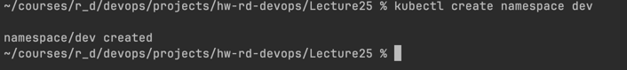

2. Створимо Deployment з 5 репліками на основі busybox, що виконує sleep 3600 (./.infrastructure/dev-deployment.yaml)
```yaml
apiVersion: apps/v1
kind: Deployment
metadata:
  name: busybox-sleeper
  namespace: dev
spec:
  replicas: 5
  selector:
    matchLabels:
      app: sleeper
  template:
    metadata:
      labels:
        app: sleeper
    spec:
      containers:
        - name: busybox
          image: busybox
          command: ["sleep", "3600"]
```

3. Застосуємо Deployment:
```shell
kubectl apply -f ./.infrastructure/dev-deployment.yaml
```
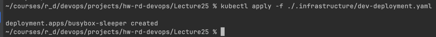

4. Перевіремо, що всі поди працюють:
```shell
kubectl get pods -n dev
```
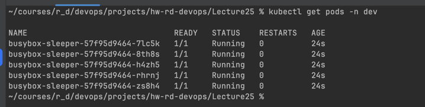

### 8. Очищення ресурсів

* Deployment, Pod, Service, PVC тощо після завершення роботи

1. Видалити Deployment-и та Service-и:
```shell
kubectl delete -f ./.infrastructure/configmap.yaml
kubectl delete -f ./.infrastructure/deployment.yaml
kubectl delete -f ./.infrastructure/service.yaml

kubectl delete -f ./.infrastructure/httpd-deployment.yaml
kubectl delete -f ./.infrastructure/httpd-service.yaml

kubectl delete -f ./.infrastructure/dev-deployment.yaml
```
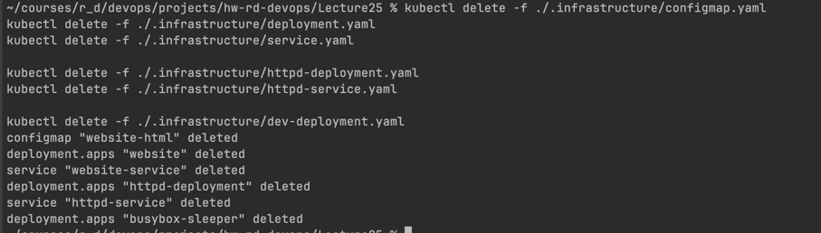

2. Видалити PVC, Pod і StorageClass:
```shell
kubectl delete -f ./.infrastructure/pvc.yaml
kubectl delete -f ./.infrastructure/pod-pvc.yaml
kubectl delete -f ./.infrastructure/storageclass.yaml
```

3. Видалити Job:
```shell
kubectl delete -f ./.infrastructure/hello-job.yaml
```
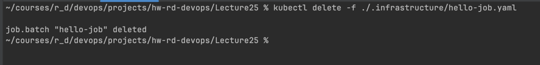

4. Видалити namespace dev:
```shell
kubectl delete namespace dev
```
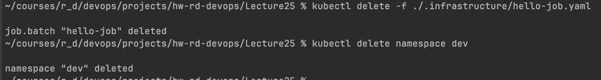

5. Видаляємо (через AWS Management Console): 
 - Node Group
 - Cluster
 - VPC та інші ресурси

6. Перевіряємо через Resource Groups & Tag Editor що все видалено


   
