_# 📌 Опис виконання завдання

## 1. Створення RDS інстансу
1. Переходимо на сервіс RDS у AWS Management Console та створюємо новий інстанс бази даних.
   * Вибираємо Create database
   * Тип бази: MySQL (можна обрати PostgreSQL за бажанням)
   * Шаблон: Free tier
   * Конфігурація:
       * DB instance identifier: library-db
       * Master username: admin
       * Master password: створіть надійний пароль
       * DB instance class: db.t3.micro
       * Дисковий простір: 20 ГБ (General Purpose SSD)
       * Увімкніть Public access для підключення до бази з вашого комп'ютера
   * У розділі Network & Security:
       * Створюємо нову VPC
       * Створюємо нову security group
   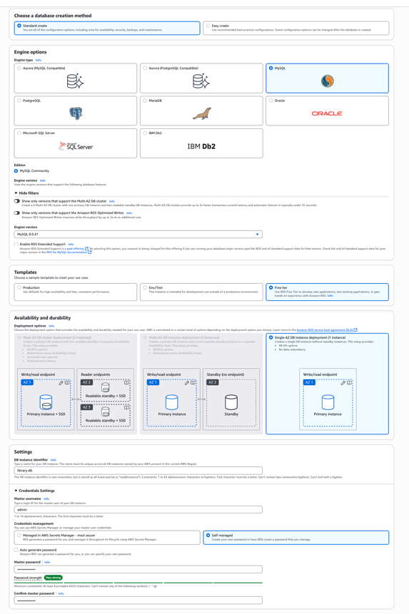
   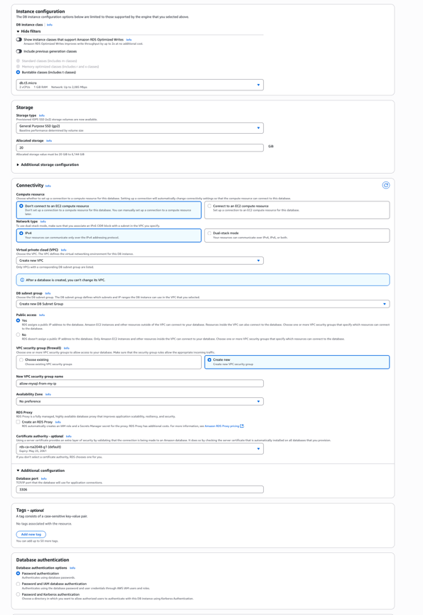
   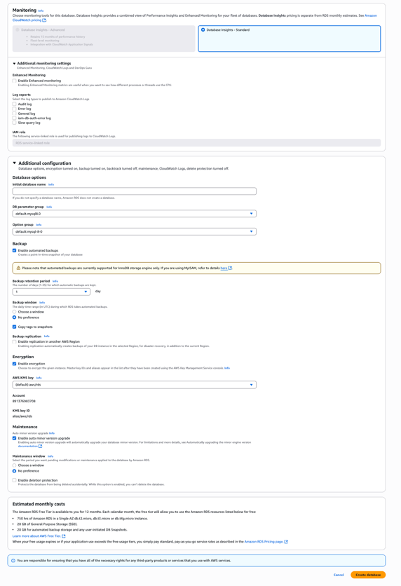

   Дочекаємось завершення створення інстансу.
   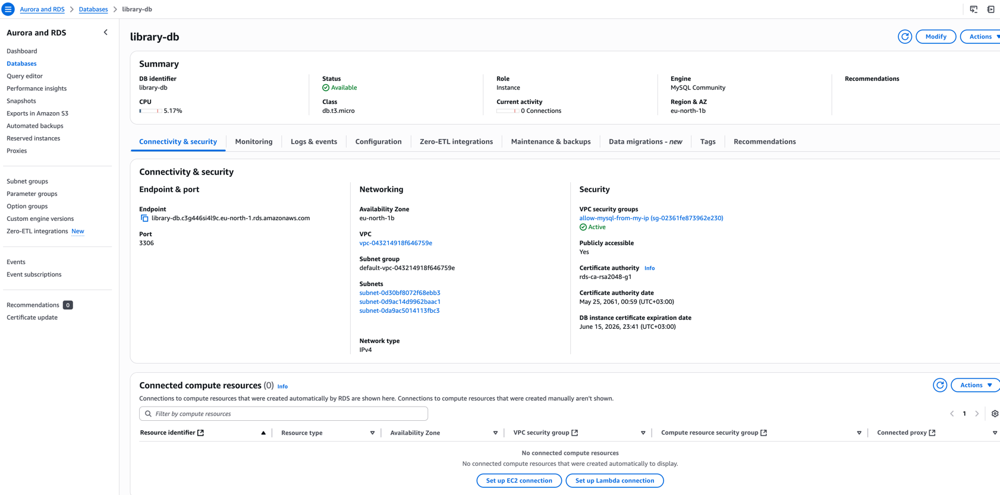

2. Перевіримо що AWS додав правило до security group, якщо ні, то треба зробити вручну:
   * Перейдемо в EC2 (через пошук по сервісах → EC2)
   * Зліва в меню оберемо Security Groups
   * Знайдемо свою групу: allow-mysql-from-my-ip
   * Відкриємо її → вкладка Inbound rules
     * Натиснемо Edit inbound rules
     * Натисни Add rule:
       * Type: MySQL/Aurora
       * Port: 3306
       * Source: вибери My IP
     * Натиснемо Save rules
  

## 2. Підключення до бази

- Клієнт: **JetBrains DataGrip**
- Host: `@library-db.c3g446si4l9c.eu-north-1.rds.amazonaws.com`
- Port: `3306`
- User: `admin`
- Password: **(встановлений пароль)**

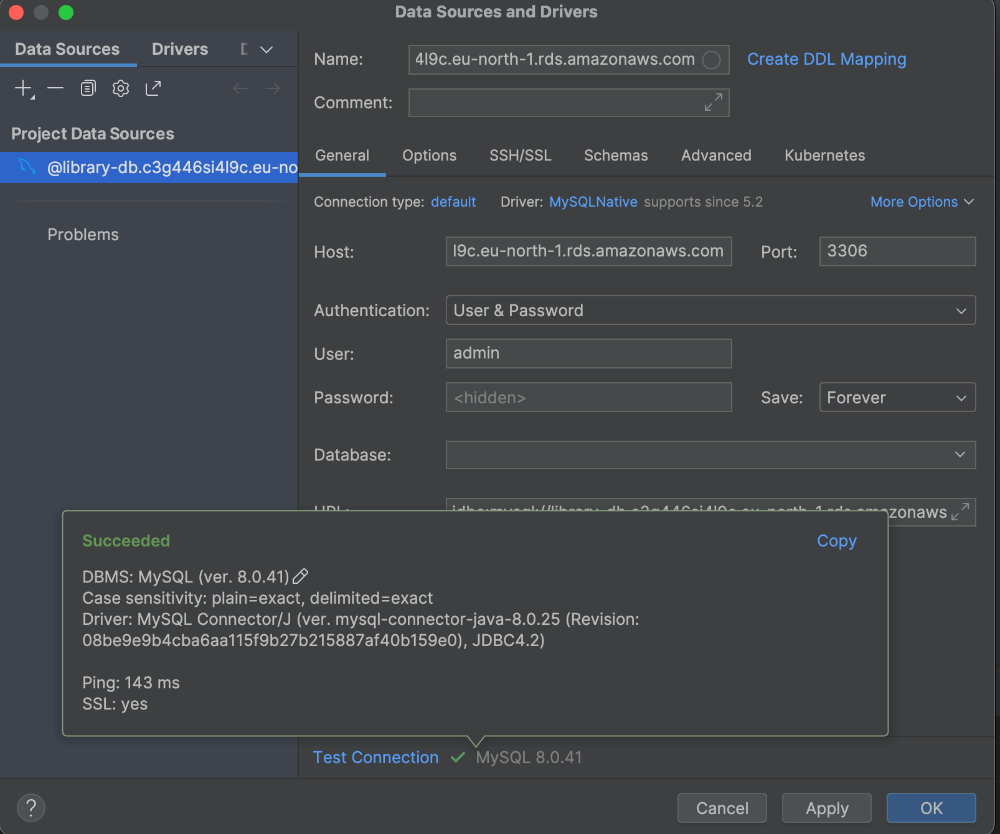

## 3. Створення бази та таблиць

```sql
CREATE DATABASE library;
USE library;

CREATE TABLE authors (
    id INT AUTO_INCREMENT PRIMARY KEY,
    name VARCHAR(255) NOT NULL,
    country VARCHAR(255)
);

CREATE TABLE books (
    id INT AUTO_INCREMENT PRIMARY KEY,
    title VARCHAR(255) NOT NULL,
    author_id INT,
    genre VARCHAR(50),
    FOREIGN KEY (author_id) REFERENCES authors(id)
);

CREATE TABLE reading_status (
    id INT AUTO_INCREMENT PRIMARY KEY,
    book_id INT,
    status ENUM('reading', 'completed', 'planned') NOT NULL,
    last_updated TIMESTAMP DEFAULT CURRENT_TIMESTAMP,
    FOREIGN KEY (book_id) REFERENCES books(id)
);
```

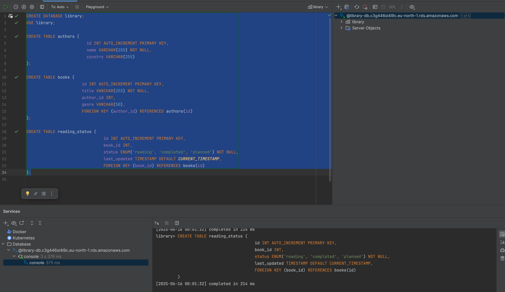

## 4. Внесення даних

```sql
INSERT INTO authors (name, country) VALUES 
('George Orwell', 'United Kingdom'),
('J.K. Rowling', 'United Kingdom'),
('Haruki Murakami', 'Japan');

INSERT INTO books (title, author_id, genre) VALUES 
('1984', 1, 'Dystopian'),
('Harry Potter and the Philosopher\'s Stone', 2, 'Fantasy'),
('Kafka on the Shore', 3, 'Magical realism');

INSERT INTO reading_status (book_id, status) VALUES 
(1, 'reading');
```

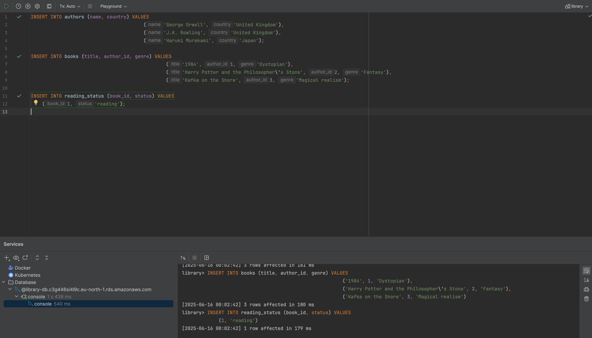

## 5. Виконання запитів

### 5.1 Книги, які ще не прочитані:

```sql
SELECT books.title, authors.name 
FROM books
JOIN authors ON books.author_id = authors.id
LEFT JOIN reading_status ON books.id = reading_status.book_id
WHERE reading_status.status IS NULL OR reading_status.status != 'completed';
```
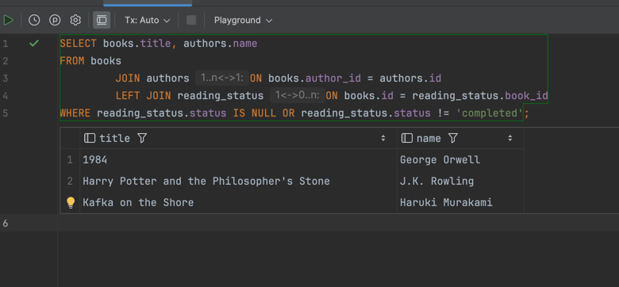

### 5.2 Кількість книг у процесі читання:

```sql
SELECT COUNT(*) AS reading_books
FROM reading_status
WHERE status = 'reading';
```
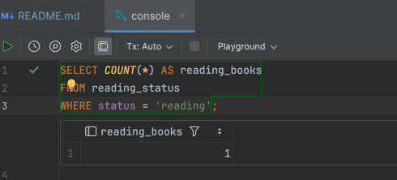

## 6. Налаштування доступу

```sql
CREATE USER 'library_user'@'%' IDENTIFIED BY 'StrongPassword123';
GRANT SELECT, INSERT, UPDATE ON library.* TO 'library_user'@'%';
FLUSH PRIVILEGES;
```
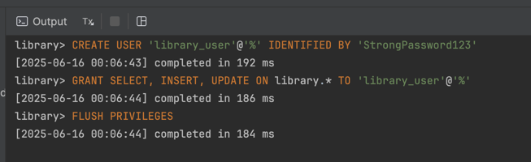

## 7. Моніторинг та резервне копіювання
* Backup retention: 7 днів (увімкнено через Modify → Backup retention period)
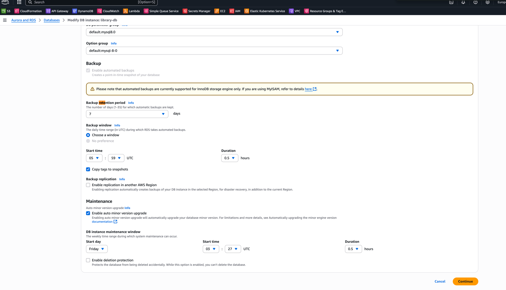
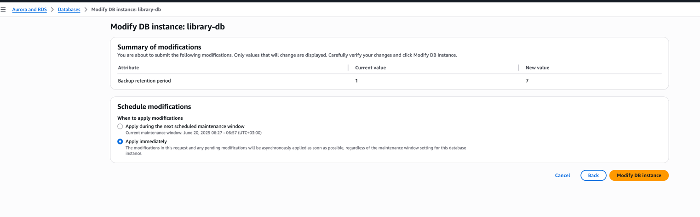

* CloudWatch: переглянемо метрики:
  * CPU Utilization
  * Database connections
  * Read/Write IOPS

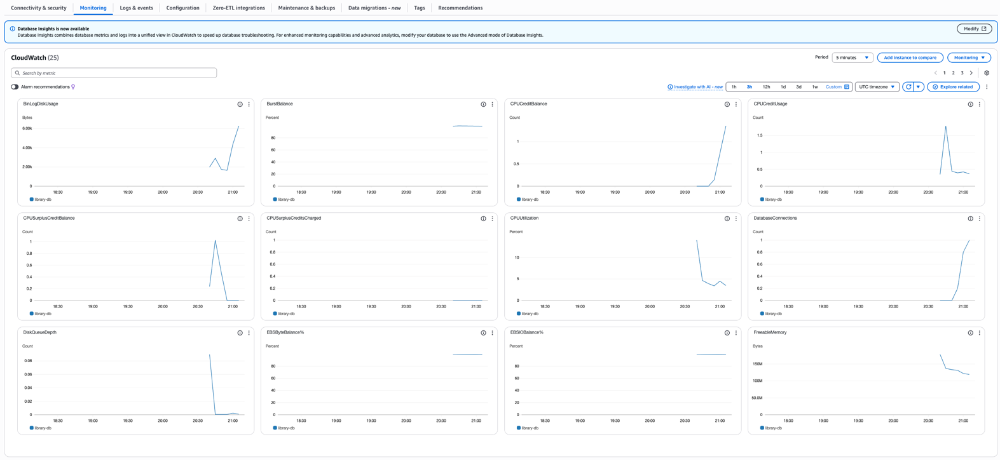


# Додаткове завдання (за бажанням)

### Створення RDS через AWS CLI:

1. Додамо юзеру permission на створення RDS інстансів:
```json
{
  "Version": "2012-10-17",
  "Statement": [
    {
      "Effect": "Allow",
      "Action": [
        "rds:CreateDBInstance",
        "rds:DescribeDBInstances",
        "rds:DeleteDBInstance",
        "rds:DescribeDBSubnetGroups",
        "ec2:DeleteSecurityGroup"
      ],
      "Resource": "*"
    }
  ]
}
```

2. Виконаємо команду для створення RDS інстансу через AWS CLI:

```bash
aws rds create-db-instance \
  --db-instance-identifier library-db-cli \
  --db-instance-class db.t3.micro \
  --engine mysql \
  --master-username admin \
  --master-user-password StrongPassword123 \
  --allocated-storage 20 \
  --publicly-accessible \
  --backup-retention-period 7 \
  --vpc-security-group-ids sg-02361fe873962e230 \
  --db-subnet-group-name default-vpc-043214918f646759e \
  --availability-zone eu-north-1a
```
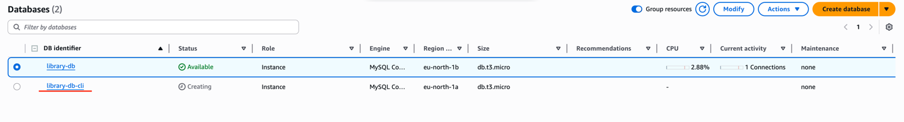


Перевіремо статус створення інстансу (через хвилин 5-10)

```sql
aws rds describe-db-instances \
  --db-instance-identifier library-db-cli \
  --query "DBInstances[0].DBInstanceStatus"
```

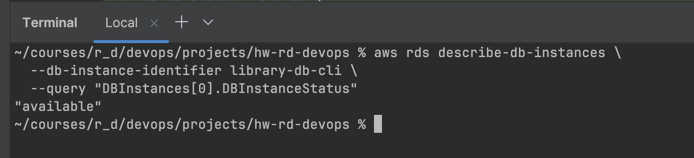

## 8. Видалення ресурсів та перевірка через Resource Groups & Tags

1. Видалимо RDS інстанси через AWS CLI:
```shell
aws rds delete-db-instance \
  --db-instance-identifier library-db \
  --skip-final-snapshot
```

```shell
aws rds delete-db-instance \
  --db-instance-identifier library-db-cli \
  --skip-final-snapshot
```

2. Видалимо security group:
```shell
aws ec2 delete-security-group --group-id sg-02361fe873962e230
```

3. Перевіримо, що ресурси видалено через Resource Groups & Tags і якщо щось залишилось, то видалимо вручну.
