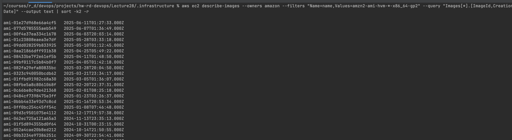
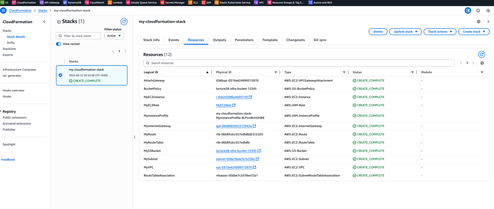
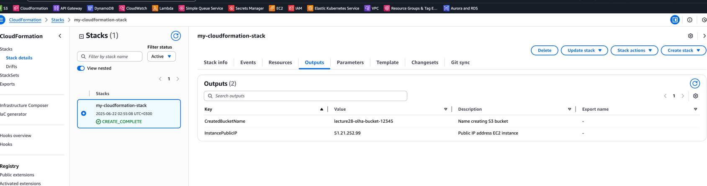
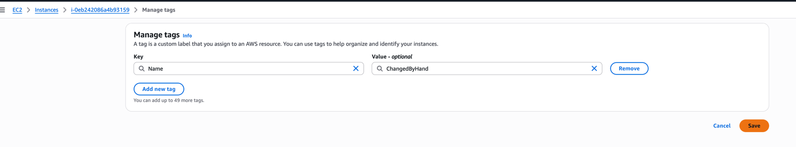
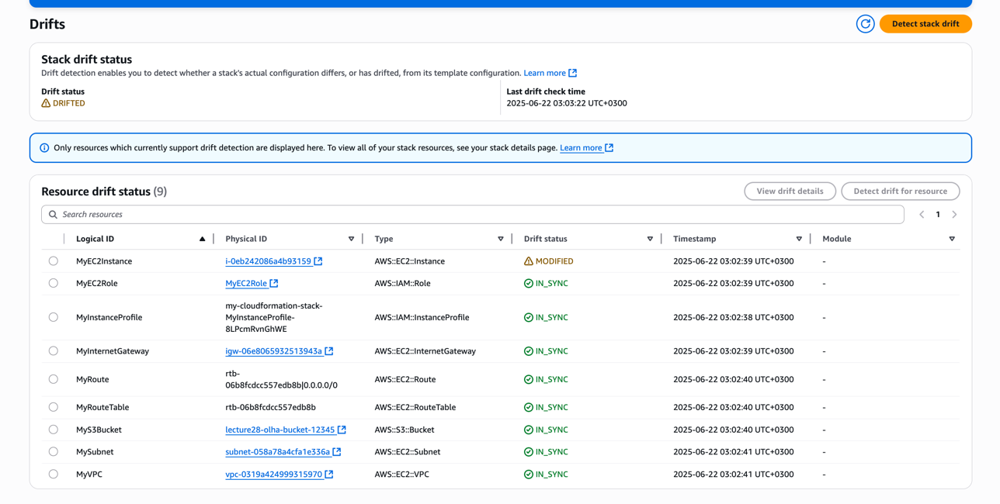
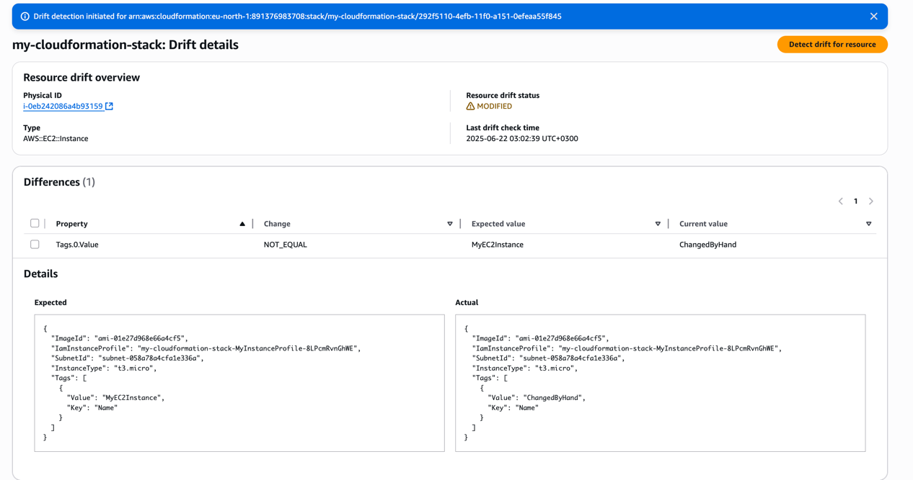

# AWS CloudFormation – Завдання з VPC, EC2, IAM Role та S3 Bucket

## 📌 Опис
### 1. Підготовка

Потрібно мати:
- AWS CLI, налаштований через `aws configure`
- Перевіряємо ami ID для регіону `eu-north-1`:
```bash
aws ec2 describe-images --owners amazon --filters "Name=name,Values=amzn2-ami-hvm-*-x86_64-gp2" --query "Images[*].[ImageId,CreationDate]" --output text | sort -k2 -r
```


Візьмемо найновіший `ami-01e27d968e66a4cf5` від `2025-06-11` та додамо до шаблону.
- Шаблон (./infrastructure/cloud_formation.yaml) створює інфраструктуру в AWS, що включає:
- VPC з публічною підмережею
- EC2 інстанс з IAM роллю
- Приватний S3 bucket з версіонуванням
- Internet Gateway та маршрут до інтернету
- Політику безпечного доступу до S3

```yaml
AWSTemplateFormatVersion: '2010-09-09'
Description: Infrastructure with VPC, EC2, IAM Role, and S3 Bucket

Parameters:
  BucketName:
    Type: String
    Description: Unique name for S3 bucket

Resources:
  MyVPC:
    Type: AWS::EC2::VPC
    Properties:
      CidrBlock: 10.0.0.0/16
      Tags:
        - Key: Name
          Value: MyVPC

  MySubnet:
    Type: AWS::EC2::Subnet
    Properties:
      VpcId: !Ref MyVPC
      CidrBlock: 10.0.1.0/24
      MapPublicIpOnLaunch: true
      AvailabilityZone: eu-north-1a
      Tags:
        - Key: Name
          Value: MyPublicSubnet

  MyInternetGateway:
    Type: AWS::EC2::InternetGateway

  AttachGateway:
    Type: AWS::EC2::VPCGatewayAttachment
    Properties:
      VpcId: !Ref MyVPC
      InternetGatewayId: !Ref MyInternetGateway

  MyRouteTable:
    Type: AWS::EC2::RouteTable
    Properties:
      VpcId: !Ref MyVPC

  MyRoute:
    Type: AWS::EC2::Route
    Properties:
      RouteTableId: !Ref MyRouteTable
      DestinationCidrBlock: 0.0.0.0/0
      GatewayId: !Ref MyInternetGateway

  RouteTableAssociation:
    Type: AWS::EC2::SubnetRouteTableAssociation
    Properties:
      SubnetId: !Ref MySubnet
      RouteTableId: !Ref MyRouteTable

  MyInstanceProfile:
    Type: AWS::IAM::InstanceProfile
    Properties:
      Roles: [ !Ref MyEC2Role ]

  MyEC2Role:
    Type: AWS::IAM::Role
    Properties:
      RoleName: MyEC2Role
      AssumeRolePolicyDocument:
        Version: "2012-10-17"
        Statement:
          - Effect: Allow
            Principal:
              Service: ec2.amazonaws.com
            Action: sts:AssumeRole
      ManagedPolicyArns:
        - arn:aws:iam::aws:policy/AmazonS3ReadOnlyAccess

  MyEC2Instance:
    Type: AWS::EC2::Instance
    Properties:
      InstanceType: t3.micro
      ImageId: ami-01e27d968e66a4cf5
      SubnetId: !Ref MySubnet
      IamInstanceProfile: !Ref MyInstanceProfile
      Tags:
        - Key: Name
          Value: MyEC2Instance

  MyS3Bucket:
    Type: AWS::S3::Bucket
    Properties:
      BucketName: !Ref BucketName
      VersioningConfiguration:
        Status: Enabled

  BucketPolicy:
    Type: AWS::S3::BucketPolicy
    DependsOn: MyEC2Role
    Properties:
      Bucket: !Ref MyS3Bucket
      PolicyDocument:
        Version: "2012-10-17"
        Statement:
          - Sid: AllowReadOnlyToEC2Role
            Effect: Allow
            Principal:
              AWS: "arn:aws:iam::891376983708:role/MyEC2Role"
            Action: s3:GetObject
            Resource: !Sub "arn:aws:s3:::${BucketName}/*"
            Condition:
              Bool:
                aws:SecureTransport: "true"

Outputs:
  InstancePublicIP:
    Description: Public IP address EC2 instance
    Value: !GetAtt MyEC2Instance.PublicIp

  CreatedBucketName:
    Description: Name creating S3 bucket
    Value: !Ref MyS3Bucket
```

## 🔧 Як запустити

#### Додаємо policy до користувача або групи

```json
{
  "Version": "2012-10-17",
  "Statement": [
    {
      "Effect": "Allow",
      "Action": [
        "iam:CreateRole",
        "iam:TagRole",
        "iam:GetRole",
        "iam:ListRoles",
        "iam:CreateInstanceProfile",
        "iam:AddRoleToInstanceProfile",
        "iam:AttachRolePolicy",
        "iam:DeleteRole",
        "iam:RemoveRoleFromInstanceProfile",
        "iam:DeleteInstanceProfile",
        "iam:DetachRolePolicy"
      ],
      "Resource": "*"
    },
    {
      "Effect": "Allow",
      "Action": "iam:PassRole",
      "Resource": "*",
      "Condition": {
        "StringEquals": {
          "iam:PassedToService": "ec2.amazonaws.com"
        }
      }
    },
    {
      "Effect": "Allow",
      "Action": "tag:TagResources",
      "Resource": "*"
    },
    {
      "Effect": "Allow",
      "Action": [
        "cloudformation:CreateStack",
        "cloudformation:DescribeStacks",
        "cloudformation:GetTemplate",
        "cloudformation:ValidateTemplate",
        "cloudformation:DeleteStack",
        "cloudformation:UpdateStack",
        "cloudformation:DescribeStackEvents",
        "cloudformation:ListStackResources",
        "cloudformation:DetectStackDrift",
        "cloudformation:DescribeStackDriftDetectionStatus"
      ],
      "Resource": "*"
    },
    {
      "Effect": "Allow",
      "Action": [
        "ec2:CreateVpc",
        "ec2:CreateSubnet",
        "ec2:Describe*",
        "ec2:CreateInternetGateway",
        "ec2:AttachInternetGateway",
        "ec2:CreateRouteTable",
        "ec2:CreateRoute",
        "ec2:AssociateRouteTable",
        "ec2:RunInstances",
        "ec2:CreateTags",
        "ec2:DescribeInstances",
        "ec2:DescribeImages",
        "ec2:ModifyVpcAttribute",
        "ec2:ModifySubnetAttribute",
        "ec2:TerminateInstances",
        "ec2:DeleteVpc",
        "ec2:DeleteSubnet",
        "ec2:DeleteInternetGateway",
        "ec2:DeleteRouteTable",
        "ec2:DeleteRoute",
        "ec2:ReleaseAddress",
        "ec2:DeleteNetworkInterface",
        "ec2:DeleteSecurityGroup",
        "ec2:DetachInternetGateway",
        "ec2:DisassociateRouteTable"
      ],
      "Resource": "*"
    },
    {
      "Effect": "Allow",
      "Action": [
        "s3:CreateBucket",
        "s3:PutBucketPolicy",
        "s3:PutBucketVersioning",
        "s3:GetBucketLocation",
        "s3:ListBucket",
        "s3:GetObject",
        "s3:DeleteBucket",
        "s3:DeleteBucketPolicy"
      ],
      "Resource": "*"
    }
  ]
}
```

### 2. Команда для створення стеку

- Переходимо до директорії з файлом `cloud_formation.yaml`
```shell
cd ./infrastructure
```

- Унікальне ім’я для S3 bucket (наприклад, `lecture28-olha-bucket-12345`)

```bash
aws cloudformation create-stack \
  --stack-name my-cloudformation-stack \
  --template-body file://cloud_formation.yaml \
  --parameters ParameterKey=BucketName,ParameterValue=lecture28-olha-bucket-12345 \
  --capabilities CAPABILITY_NAMED_IAM
```
> 🔐 Важливо: опція `--capabilities CAPABILITY_NAMED_IAM` потрібен для створення IAM ролей.

## ✅ Наступні кроки:
- Перейдемо в AWS Console → CloudFormation та перевіремо вкладку Resources



- Перевір вкладку Outputs:




## 🧪 Перевірка Drift
- Перейдемо до EC2 → Instances → виберіть свій інстанс → Tags.
- Змінемо тег Name з MyEC2Instance на, наприклад, ChangedByHand та збережемо зміни.


- Відкриваємо **AWS Console → CloudFormation** та перейдемо до Detect stack Drift та натиснемо **Detect drift**.:


- Оберемо modified MyEC2Instance та натиснемо **View drifted resources**:


## 🧼 Видалення стеку

```bash
aws cloudformation delete-stack --stack-name my-cloudformation-stack
```

> 💡 Після видалення стеку всі повʼязані ресурси (EC2, VPC, S3) також буде видалено.

