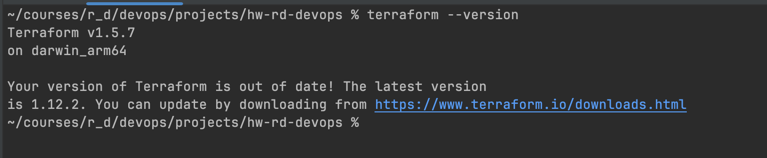
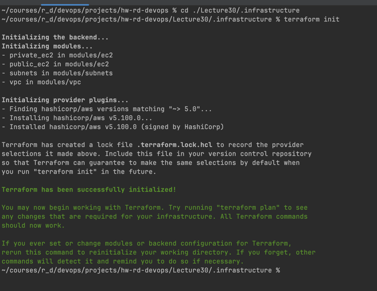
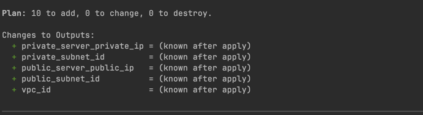
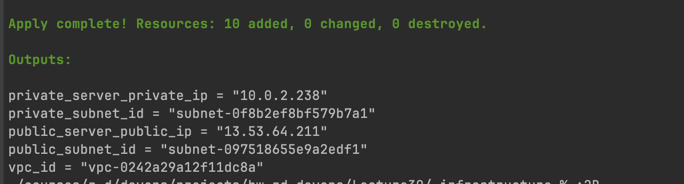
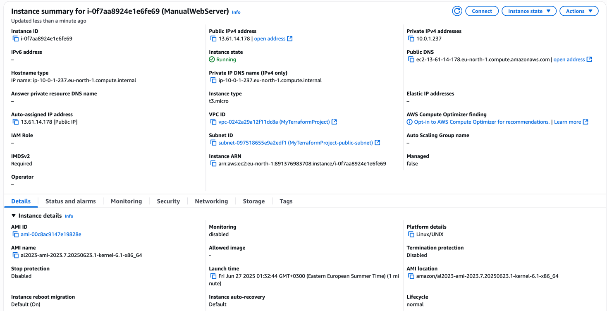
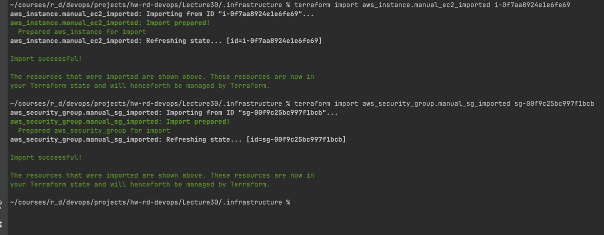
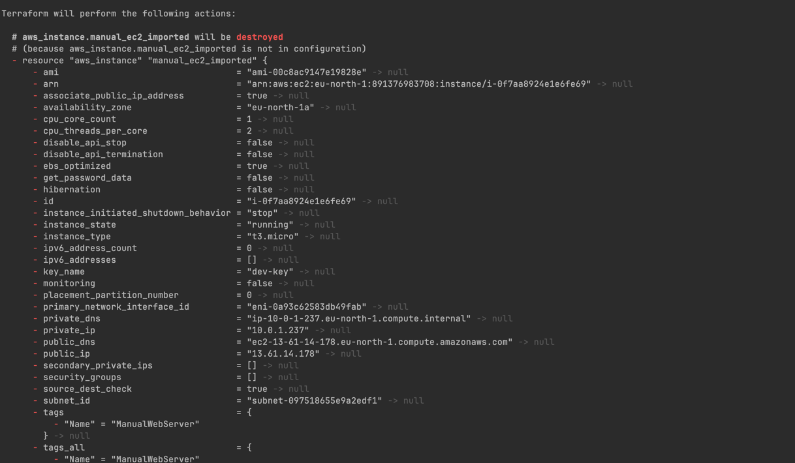
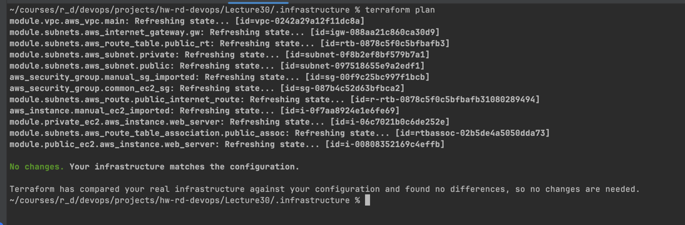
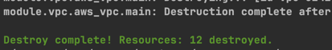

# Home Works Devops

## Підготовка

- Перевіряємо, що terraform встановлено, та версію:

```bash
terraform --version
```


- додаємо Policy для доступу до AWS:
```json
{
  "Version": "2012-10-17",
  "Statement": [
    {
      "Effect": "Allow",
      "Action": [
        "iam:CreateRole",
        "iam:TagRole",
        "iam:GetRole",
        "iam:ListRoles",
        "iam:CreateInstanceProfile",
        "iam:AddRoleToInstanceProfile",
        "iam:AttachRolePolicy",
        "iam:DeleteRole",
        "iam:RemoveRoleFromInstanceProfile",
        "iam:DeleteInstanceProfile",
        "iam:DetachRolePolicy"
      ],
      "Resource": "*"
    },
    {
      "Effect": "Allow",
      "Action": "iam:PassRole",
      "Resource": "*",
      "Condition": {
        "StringEquals": {
          "iam:PassedToService": "ec2.amazonaws.com"
        }
      }
    },
    {
      "Effect": "Allow",
      "Action": "tag:TagResources",
      "Resource": "*"
    },
    {
      "Effect": "Allow",
      "Action": [
        "ec2:CreateVpc",
        "ec2:CreateSubnet",
        "ec2:Describe*",
        "ec2:CreateInternetGateway",
        "ec2:AttachInternetGateway",
        "ec2:CreateRouteTable",
        "ec2:CreateRoute",
        "ec2:AssociateRouteTable",
        "ec2:RunInstances",
        "ec2:CreateTags",
        "ec2:DescribeInstances",
        "ec2:DescribeImages",
        "ec2:ModifyVpcAttribute",
        "ec2:ModifySubnetAttribute",
        "ec2:TerminateInstances",
        "ec2:DeleteVpc",
        "ec2:DeleteSubnet",
        "ec2:DeleteInternetGateway",
        "ec2:DeleteRouteTable",
        "ec2:DeleteRoute",
        "ec2:ReleaseAddress",
        "ec2:DeleteNetworkInterface",
        "ec2:DeleteSecurityGroup",
        "ec2:DetachInternetGateway",
        "ec2:DisassociateRouteTable",
        "ec2:CreateSecurityGroup",
        "ec2:RevokeSecurityGroupEgress",
        "ec2:AuthorizeSecurityGroupIngress",
        "ec2:AuthorizeSecurityGroupEgress"
      ],
      "Resource": "*"
    },
    {
      "Effect": "Allow",
      "Action": [
        "s3:CreateBucket",
        "s3:PutBucketPolicy",
        "s3:PutBucketVersioning",
        "s3:GetBucketLocation",
        "s3:ListBucket",
        "s3:GetObject",
        "s3:DeleteBucket",
        "s3:DeleteBucketPolicy"
      ],
      "Resource": "*"
    }
  ]
}
```

## Створення VPC з двома серверами у публічній та приватній підмережі за допомогою Terraform, застосовуючи модулі

### 1. Створення модуля VPC (modules/vpc/)

- modules/vpc/main.tf:

```hcl
resource "aws_vpc" "main" {
  cidr_block           = var.vpc_cidr_block
  enable_dns_hostnames = true
  enable_dns_support   = true

  tags = {
    Name = var.vpc_name
  }
}
```

- modules/vpc/variables.tf:
```hcl
variable "vpc_cidr_block" {
  description = "CIDR block for the VPC"
  type        = string
}

variable "vpc_name" {
  description = "Name for the VPC"
  type        = string
}
```

- modules/vpc/outputs.tf:

```hcl
output "vpc_id" {
  description = "The ID of the VPC"
  value       = aws_vpc.main.id
}

output "vpc_cidr_block" {
  description = "The CIDR block of the VPC"
  value       = aws_vpc.main.cidr_block
}
```

### 2. Створення модуля Subnet (modules/subnet/)
Цей модуль буде створювати публічну та приватну підмережі, а також Internet Gateway та Route Table для публічної підмережі.

- modules/subnets/main.tf:

```hcl
resource "aws_subnet" "public" {
  vpc_id                  = var.vpc_id
  cidr_block              = var.public_subnet_cidr_block
  availability_zone       = var.availability_zone
  map_public_ip_on_launch = true

  tags = {
    Name = "${var.project_name}-public-subnet"
  }
}

resource "aws_subnet" "private" {
  vpc_id            = var.vpc_id
  cidr_block        = var.private_subnet_cidr_block
  availability_zone = var.availability_zone

  tags = {
    Name = "${var.project_name}-private-subnet"
  }
}

resource "aws_internet_gateway" "gw" {
  vpc_id = var.vpc_id

  tags = {
    Name = "${var.project_name}-igw"
  }
}

resource "aws_route_table" "public_rt" {
  vpc_id = var.vpc_id

  tags = {
    Name = "${var.project_name}-public-rt"
  }
}

resource "aws_route" "public_internet_route" {
  route_table_id         = aws_route_table.public_rt.id
  destination_cidr_block = "0.0.0.0/0"
  gateway_id             = aws_internet_gateway.gw.id
}

resource "aws_route_table_association" "public_assoc" {
  subnet_id      = aws_subnet.public.id
  route_table_id = aws_route_table.public_rt.id
}
```

- modules/subnets/variables.tf:

```hcl
variable "vpc_id" {
  description = "The ID of the VPC to associate subnets with"
  type        = string
}

variable "public_subnet_cidr_block" {
  description = "CIDR block for the public subnet"
  type        = string
}

variable "private_subnet_cidr_block" {
  description = "CIDR block for the private subnet"
  type        = string
}

variable "availability_zone" {
  description = "AWS Availability Zone"
  type        = string
}

variable "project_name" {
  description = "Name of the project for tagging"
  type        = string
}
```

- modules/subnets/outputs.tf:

```hcl
output "public_subnet_id" {
  description = "The ID of the public subnet"
  value       = aws_subnet.public.id
}

output "private_subnet_id" {
  description = "The ID of the private subnet"
  value       = aws_subnet.private.id
}
```

### 3. Створення модуля EC2 (modules/ec2/)
Цей модуль створюватиме Security Group та EC2 інстанс.

- modules/ec2/main.tf:

```hcl
resource "aws_security_group" "ec2_sg" {
  name        = "${var.project_name}-ec2-sg"
  description = "Allow SSH and HTTP access"
  vpc_id      = var.vpc_id

  ingress {
    from_port   = 22
    to_port     = 22
    protocol    = "tcp"
    cidr_blocks = ["0.0.0.0/0"]
  }

  ingress {
    from_port   = 80
    to_port     = 80
    protocol    = "tcp"
    cidr_blocks = ["0.0.0.0/0"]
  }

  egress {
    from_port   = 0
    to_port     = 0
    protocol    = "-1"
    cidr_blocks = ["0.0.0.0/0"]
  }

  tags = {
    Name = "${var.project_name}-ec2-sg"
  }
}

resource "aws_instance" "web_server" {
  ami           = var.ami_id
  instance_type = var.instance_type
  subnet_id     = var.subnet_id
  vpc_security_group_ids = [aws_security_group.ec2_sg.id]
  key_name      = var.key_pair_name # Ensure you have created a key pair in AWS

  tags = {
    Name = var.instance_name
  }

  user_data = <<-EOF
              #!/bin/bash
              echo "Hello from Terraform EC2!" > index.html
              nohup busybox httpd -f -p 80 &
              EOF
}
```

- modules/ec2/variables.tf:

```hcl
variable "vpc_id" {
  description = "The ID of the VPC"
  type        = string
}

variable "subnet_id" {
  description = "The ID of the subnet to launch the instance in"
  type        = string
}

variable "ami_id" {
  description = "AMI ID for the EC2 instance"
  type        = string
}

variable "instance_type" {
  description = "Instance type for the EC2 instance"
  type        = string
}

variable "instance_name" {
  description = "Name for the EC2 instance"
  type        = string
}

variable "project_name" {
  description = "Name of the project for tagging"
  type        = string
}

variable "security_group_id" {
  description = "The ID of the security group to attach to the EC2 instance"
  type        = string
}

variable "key_pair_name" {
  description = "Name of the AWS key pair to use for SSH access"
  type        = string
}
```

- modules/ec2/outputs.tf:

```hcl
output "instance_id" {
  description = "The ID of the EC2 instance"
  value       = aws_instance.web_server.id
}

output "public_ip" {
  description = "The public IP address of the EC2 instance"
  value       = aws_instance.web_server.public_ip
}

output "private_ip" {
  description = "The private IP address of the EC2 instance"
  value       = aws_instance.web_server.private_ip
}
```

### 4. Використання модулів в основному конфігураційному файлі

- main.tf (корінь проєкту):

```hcl
provider "aws" {
  region = var.aws_region
}

module "vpc" {
  source       = "./modules/vpc"
  vpc_cidr_block = var.vpc_cidr_block
  vpc_name     = var.project_name
}

module "subnets" {
  source                 = "./modules/subnets"
  vpc_id                 = module.vpc.vpc_id
  public_subnet_cidr_block = var.public_subnet_cidr_block
  private_subnet_cidr_block = var.private_subnet_cidr_block
  availability_zone      = var.aws_availability_zone
  project_name           = var.project_name
}

module "public_ec2" {
  source          = "./modules/ec2"
  vpc_id          = module.vpc.vpc_id
  subnet_id       = module.subnets.public_subnet_id
  ami_id          = var.ami_id
  instance_type   = var.instance_type
  instance_name   = "${var.project_name}-public-server"
  project_name    = var.project_name
  key_pair_name   = var.key_pair_name
}

module "private_ec2" {
  source          = "./modules/ec2"
  vpc_id          = module.vpc.vpc_id
  subnet_id       = module.subnets.private_subnet_id
  ami_id          = var.ami_id
  instance_type   = var.instance_type
  instance_name   = "${var.project_name}-private-server"
  project_name    = var.project_name
  key_pair_name   = var.key_pair_name
}
```

- variables.tf (корінь проєкту):

```hcl
variable "aws_region" {
  description = "AWS region"
  type        = string
  default     = "eu-north-1"
}

variable "aws_availability_zone" {
  description = "AWS Availability Zone"
  type        = string
  default     = "eu-north-1a"
}

variable "project_name" {
  description = "Name for the project"
  type        = string
  default     = "MyTerraformProject"
}

variable "vpc_cidr_block" {
  description = "CIDR block for the main VPC"
  type        = string
  default     = "10.0.0.0/16"
}

variable "public_subnet_cidr_block" {
  description = "CIDR block for the public subnet"
  type        = string
  default     = "10.0.1.0/24"
}

variable "private_subnet_cidr_block" {
  description = "CIDR block for the private subnet"
  type        = string
  default     = "10.0.2.0/24"
}

variable "ami_id" {
  description = "AMI ID for the EC2 instances (e.g., Amazon Linux 2 AMI)"
  type        = string
  # eu-north-1 Amazon Linux 2 AMI: ami-0da6daf5e3e5ea2a8
  default = "ami-0da6daf5e3e5ea2a8"
}

variable "instance_type" {
  description = "EC2 instance type"
  type        = string
  default     = "t3.micro"
}

variable "key_pair_name" {
  description = "Name of the AWS key pair to use for SSH access"
  type        = string
  # Create a key pair in AWS
  default     = "dev-key"
}
```

- outputs.tf (корінь проєкту):

```hcl
output "vpc_id" {
  description = "The ID of the created VPC"
  value       = module.vpc.vpc_id
}

output "public_subnet_id" {
  description = "The ID of the public subnet"
  value       = module.subnets.public_subnet_id
}

output "private_subnet_id" {
  description = "The ID of the private subnet"
  value       = module.subnets.private_subnet_id
}

output "public_server_public_ip" {
  description = "Public IP of the public EC2 instance"
  value       = module.public_ec2.public_ip
}

output "private_server_private_ip" {
  description = "Private IP of the private EC2 instance"
  value       = module.private_ec2.private_ip
}
```

- versions.tf (корінь проєкту):

```hcl
terraform {
  required_providers {
    aws = {
      source  = "hashicorp/aws"
      version = "~> 5.0"
    }
  }

  required_version = ">= 1.0.0"
}
```

### 5. Початкова ініціалізація та застосування

- робоча директорія:
```shell
cd ./Lecture30/.infrastructure
```

- виконуємо ініціалізацію Terraform:
```bash
terraform init
```


- планування:
```bash
terraform plan
```


- застосування конфігурації:
```bash
terraform apply --auto-approve
```


## Імпортування наявних ресурсів в Terraform-конфігурації

### 1. Створюємо кілька ресурсів вручну за допомогою AWS Management Console

- Створюємо ще один EC2 інстанс у публічній підмережі та назвемо ManualWebServer.
- Додаємо до нього Security Group з назвою ManualSecurityGroup з дозволом вхідного трафіку по порту 8080.


- ID EC2 інстансу: `i-0f7aa8924e1e6fe69`
- ID Security Group: `sg-00f9c25bc997f1bcb`

### 2. Імпорт наявних ресурсів у Terraform-конфігурації

- виконаємо команду terraform import, вказавши адресу ресурсу в конфігурації Terraform та ID реального ресурсу в AWS.
```shell
# Імпорт EC2 інстансу
terraform import aws_instance.manual_ec2_imported i-0f7aa8924e1e6fe69 # ID EC2

# Імпорт Security Group
terraform import aws_security_group.manual_sg_imported sg-00f9c25bc997f1bcb # ID SG
```



- Після успішного імпорту, Terraform оновив свій state-файл, але не файли .tf
- Виконаємо наступну команду, щоб Terraform мав повну інформацію про ці ресурси:
```bash
terraform plan
```

- Скопіюємо згенеровані зміни в блоки ресурсів aws_instance.manual_ec2_imported та aws_security_group.manual_sg_imported
  

- додаємо блоки до корневого файлу main.tf
```hcl
resource "aws_security_group" "manual_sg_imported" {
  name        = "ManualSecurityGroup"
  description = "ManualSecurityGroup created 2025-06-26T22:28:39.410Z"
  vpc_id      = module.vpc.vpc_id # Reference the VPC created by the VPC module

  ingress {
    from_port   = 8080
    to_port     = 8080
    protocol    = "tcp"
    cidr_blocks = ["0.0.0.0/0"]
    description = ""
  }

  egress {
    from_port   = 0
    to_port     = 0
    protocol    = "-1"
    cidr_blocks = ["0.0.0.0/0"]
    description = ""
  }

  tags = {}
}

resource "aws_instance" "manual_ec2_imported" {
  ami                                  = "ami-00c8ac9147e19828e"
  instance_type                        = "t3.micro"
  subnet_id                            = "subnet-097518655e9a2edf1"
  vpc_security_group_ids               = [aws_security_group.manual_sg_imported.id]
  key_name                             = "dev-key"
  tags = {
    Name = "ManualWebServer"
  }
}
```

### 3. Перевірка, що Terraform створює ідентичну інфраструктуру

- виконаємо ще раз:
```shell
terraform plan
```


No changes. Your infrastructure matches the configuration. (або подібне повідомлення). Це означає, що Terraform тепер повністю контролює імпортовані ресурси і бачить їх такими, якими вони є в AWS.


## Очистка ресурсів

- видаляємо всі ресурси, створені Terraform:

```bash
terraform destroy --auto-approve
```


- видаляємо всі файли Terraform, щоб почати з чистого аркуша:

```bash
rm -rf .terraform/
rm terraform.tfstate
rm terraform.tfstate.backup
rm .terraform.lock.hcl
```
