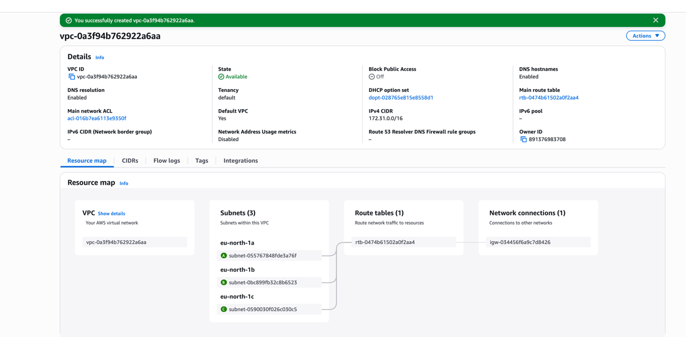
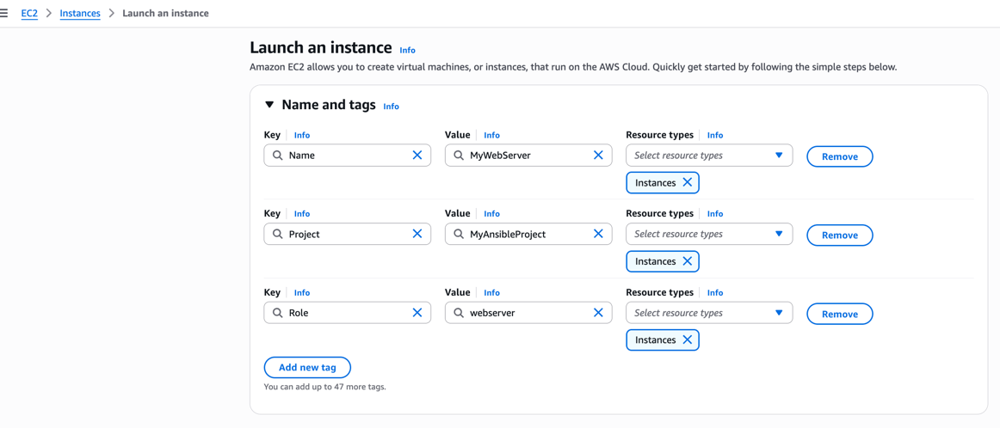
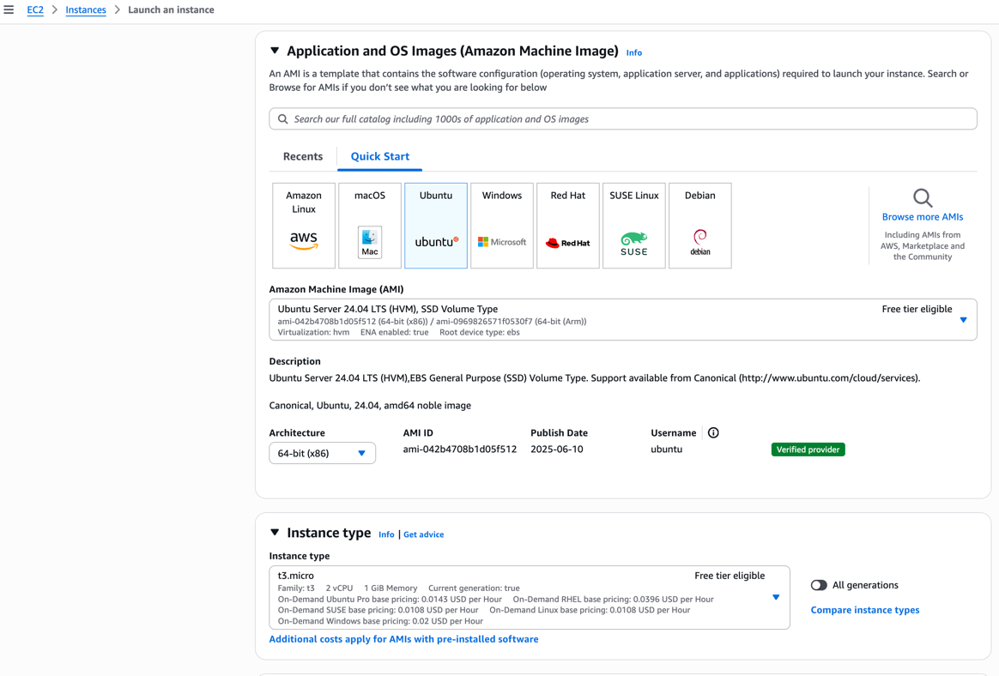
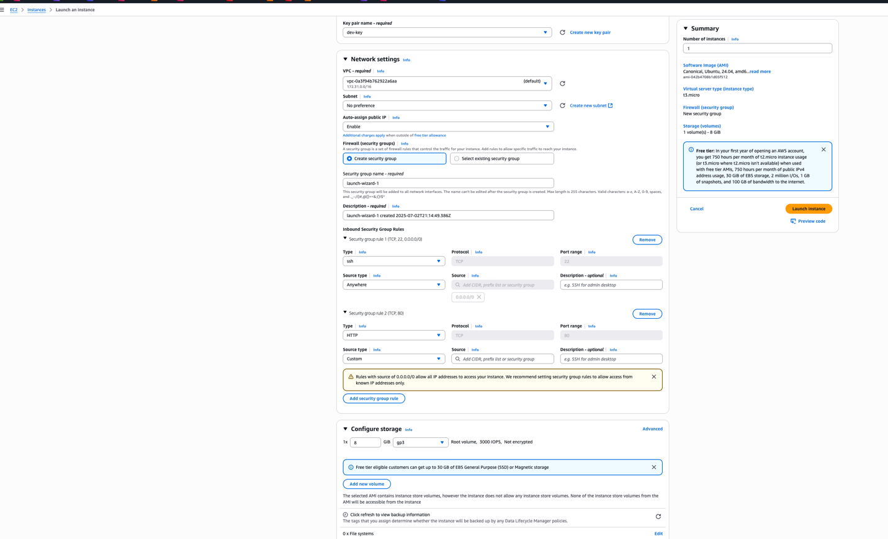
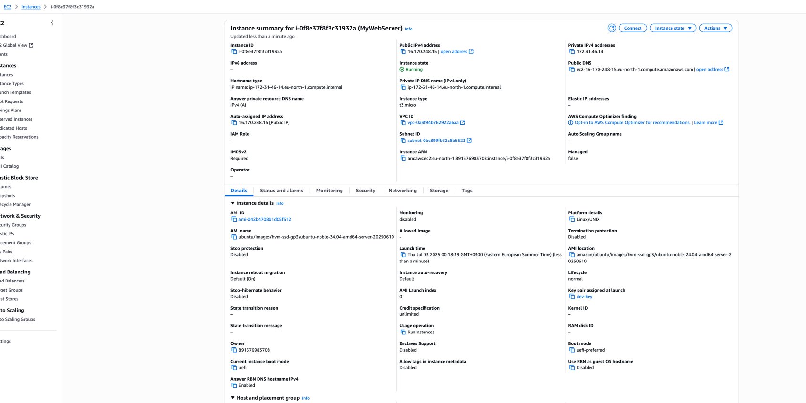
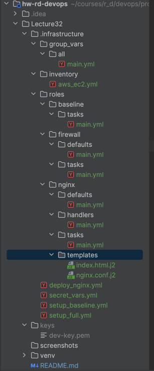
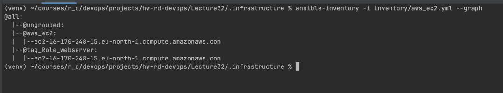
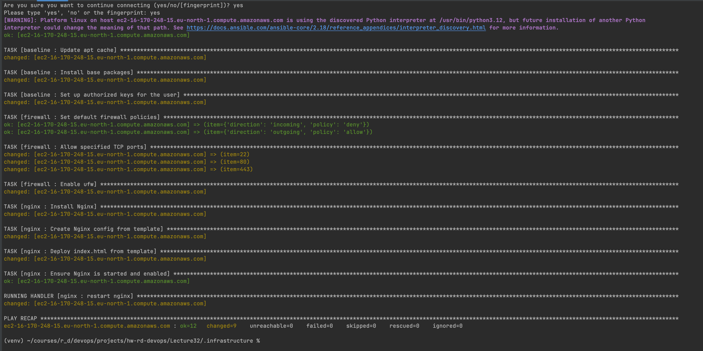
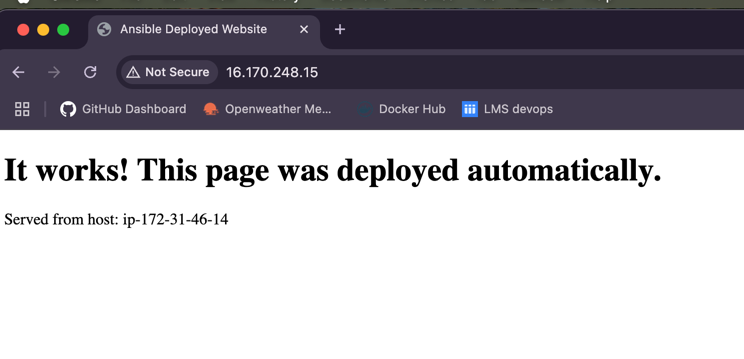

# Home Works Devops
# Ansible: Автоматичне налаштування серверів на AWS

Цей проєкт демонструє використання Ansible для автоматизації налаштування конфігурації EC2-інстансів в AWS.

## Опис завдання

* **Створення ролі "baseline"**: Налаштування SSH-ключів та встановлення базових пакетів (`vim`, `git`, `mc`, `ufw`).
* **Створення ролі "firewall"**: Налаштування базових правил брандмауера за допомогою `ufw`.
* **Створення ролі "Nginx"**: Встановлення Nginx, налаштування конфігураційного файлу та розгортання `index.html` з використанням шаблонів.
* **Застосування dynamic inventory**: Налаштування динамічного інвентарю для AWS для керування інфраструктурою.
* **Використання Ansible Vault**: Шифрування конфіденційних даних (SSH-ключ).
* **Створення декількох playbooks**: Конфігурація плейбуків для різних сценаріїв використання наявних ролей.

---

## Передумови

Перед початком роботи переконаймося, що на нашій локальній машині встановлено та налаштовано наступне:

1.  **Аккаунт AWS**: Активний обліковий запис AWS.
2.  **AWS CLI**: Встановлений та налаштований AWS Command Line Interface.
    ```bash
    aws configure
    ```
3.  **Віртуальне середовище Python (Рекомендовано)**: Для ізоляції залежностей проєкту, гарною практикою є використання `venv`.
    * *Створіть віртуальне середовище в каталозі проєкту:*
        ```bash
        python3 -m venv venv
        ```
    * *Активуйте його:*
        ```bash
        source venv/bin/activate
        ```
    * *Після активації всі наступні `pip` команди будуть виконуватися в цьому ізольованому середовищі.*

4.  **Ansible**: Встановлена остання версія Ansible.
    * *Щоб перевірити, чи встановлено Ansible, виконайте:*
        ```bash
        ansible --version
        ```
    * *Щоб встановити Ansible через Homebrew (рекомендовано для macOS):*
        ```bash
        brew install ansible
        ```
    * *Або встановіть через pip (в активному venv):*
        ```bash
        pip install ansible
        ```
5.  **Python `boto3`**: Бібліотека Python для роботи з AWS API.
    * *Встановіть в активному venv:*
        ```bash
        pip install boto3
        ```
6.  **Ansible AWS Collection**: Колекція модулів для роботи з AWS.
    ```bash
    ansible-galaxy collection install amazon.aws
    ```
7.  **SSH-ключ**: Підготовлена пара SSH-ключів (публічний та приватний) для доступу до EC2.
    * **Додайте приватний ключ до ssh-agent**, щоб Ansible міг його автоматично використовувати для з'єднання. Замініть шлях на ваш реальний.
        ```bash
        chmod 600 ./keys/dev-key.pem
        ssh-add ./keys/dev-key.pem
        ```
    * **Отримаємо вміст публічного ключа**. Цей текст ми покладемо в Ansible Vault.
        ```bash
        ssh-keygen -y -f ./keys/dev-key.pem
        ```
         
        ```text
         ssh-rsa AAAAB3NzaC1yc2EAAAADAQABAAABAQDyFl0hDtF/w449NZ3ZEJPoQt/ZS4IxHmQ3q6UWpFmAH5q9uje7rVa3vkq84HqjZSxQxbIGFzb1OPBGIluOJqnNXU072QfijF5PfzBuHnhb7KVFMlK49IW9LZ2xwKwGcaWeAho/u/Hx0ky6RV1AV3IhvMV6YVolppXdyJJj6vNwK2af+vBIRl2n6DqaHt2m43g8r9rIZ+8OJbF+NzhsniF1TU4rQjrD8YrOlN2SVd+gHFuIh66Gr684lL+X70lHMRJRDt9/ZIz9JyELbuFG2DzpPCrwkRYA5tPqCk1QRHBKB+7umHQXnOyEv+klqZ1HNDeE7IwpM8No+4YIqONOECJF
        ```

## Покрокова інструкція

### Крок 1. Підготовка інфраструктури та проєкту

На цьому етапі ми підготуємо все необхідне в AWS та на локальній машині.

#### 1.1. Створення IAM Policy для Ansible
Створимо політику з мінімально необхідними правами для читання інформації про EC2-інстанси.
1.  Перейдемо до сервісу **IAM** -> **Policies** -> **Create policy** та додамо до юзера.
    ```json
    {
        "Version": "2012-10-17",
        "Statement": [
            {
                "Effect": "Allow",
                "Action": [
                    "ec2:DescribeInstances",
                    "ec2:DescribeRegions",
                    "ec2:DescribeHosts",
                    "ec2:DescribeTags",
                    "ec2:DescribeVpcs",
                    "ec2:DescribeSubnets"
                ],
                "Resource": "*"
            }
        ]
    }
    ```

#### 1.2. Запуск EC2-інстанса
Створимо сервер, яким буде керувати Ansible.
1. Якщо немає VPC, то переходимо на **VPC Dashboard** -> **Actions** -> **Create Default VPC**. Після цього AWS автоматично створить для вас нову VPC за замовчуванням, а також підмережі (subnets) в кожній зоні доступності, інтернет-шлюз та таблицю маршрутизації.

2. Переходимо до сервісу **EC2** -> **Launch instances**.
3. Додаємо Name and tags (Перша секція на сторінці)
    - Name: MyWebServer
    - Additional tags:
      - Key: Project, Value: MyAnsibleProject
      - Key: Role, Value: webserver

4. Вибераємо AMI **Ubuntu Server 22.04 LTS** та тип інстанса `t3.micro`.

5. Обираємо **dev-key** для доступу по SSH.
6. У налаштуваннях мережі (Network settings) створюємо Security Group, яка дозволяє вхідний трафік на порти **22 (SSH)** та **80 (HTTP)**.

7. Запустемо інстанс.


#### 1.3. Створюємо структури проєкту (папка `./.infrastructure`)
На локальній машині створюємо наступну структуру каталогів та файлів.


### Крок 2. Реалізація завдань Ansible

Тепер наповнимо створені файли контентом відповідно до завдань.

#### 2.1. Створення ролі "baseline"
Ця роль встановлює базові пакети та додає наш SSH-ключ.

**`roles/baseline/tasks/main.yml`**
```yaml
---
- name: Update apt cache
  ansible.builtin.apt:
    update_cache: yes
    cache_valid_time: 3600
  become: yes

- name: Install base packages
  ansible.builtin.apt:
    name:
      - vim
      - git
      - mc
      - ufw
    state: present
  become: yes

- name: Set up authorized keys for the user
  ansible.posix.authorized_key:
    user: "{{ ansible_user }}"
    state: present
    key: "{{ ssh_public_key }}"
  become: yes
```

#### 2.2. Створення ролі "firewall"
Ця роль налаштовує брандмауер `ufw`.

**`roles/firewall/defaults/main.yml`** (Правила за замовчуванням)
```yaml
---
firewall_allowed_tcp_ports:
  - "22"   # SSH (дуже важливо!)
  - "80"   # HTTP
  - "443"  # HTTPS

```
**`roles/firewall/tasks/main.yml`**
```yaml
---
- name: Set default firewall policies
  community.general.ufw:
    direction: "{{ item.direction }}"
    policy: "{{ item.policy }}"
  loop:
    - { direction: 'incoming', policy: 'deny' }
    - { direction: 'outgoing', policy: 'allow' }
  become: yes

- name: Allow specified TCP ports
  community.general.ufw:
    rule: allow
    port: "{{ item }}"
    proto: tcp
  loop: "{{ firewall_allowed_tcp_ports }}"
  become: yes

- name: Enable ufw
  community.general.ufw:
    state: enabled
  become: yes
```

#### 2.3. Створення ролі "Nginx"
Ця роль встановлює та налаштовує Nginx.

**`roles/nginx/tasks/main.yml`**
```yaml
---
- name: Install Nginx
  ansible.builtin.apt:
    name: nginx
    state: present
  become: yes

- name: Create Nginx config from template
  ansible.builtin.template:
    src: nginx.conf.j2
    dest: /etc/nginx/sites-available/default
  become: yes
  notify: restart nginx

- name: Deploy index.html from template
  ansible.builtin.template:
    src: index.html.j2
    dest: /var/www/html/index.html
  become: yes

- name: Ensure Nginx is started and enabled
  ansible.builtin.service:
    name: nginx
    state: started
    enabled: yes
  become: yes
```
**`roles/nginx/handlers/main.yml`**
```yaml
---
- name: restart nginx
  ansible.builtin.service:
    name: nginx
    state: restarted
  become: yes
```
**`roles/nginx/templates/index.html.j2`**
```html
<!DOCTYPE html>
<html>
    <head>
      <title>{{ page_title }}</title>
    </head>
    <body>
        <h1>{{ welcome_message }}</h1>
        <p>Served from host: {{ ansible_hostname }}</p>
    </body>
</html>
```

**`roles/nginx/templates/nginx.conf.j2`**
```nginx
server {
  listen 80 default_server;
  listen [::]:80 default_server;

  root /var/www/html;
  index index.html index.htm;

  server_name _;

  location / {
  try_files $uri $uri/ =404;
  }
}
```

#### 2.4. Застосування dynamic inventory
Файл `inventory/aws_ec2.yml` описує, як Ansible має отримувати інформацію про хости з AWS. Змінні в `group_vars` застосовуються до знайдених хостів.

**`inventory/aws_ec2.yml`**
```yaml
---
plugin: amazon.aws.aws_ec2
regions:
  - eu-north-1
filters:
  tag:Project: MyAnsibleProject
keyed_groups:
  - key: tags.Role
    prefix: tag_Role
```
**`group_vars/all/main.yml`**
```yaml
---
ansible_user: ubuntu

page_title: "Ansible Deployed Website"
welcome_message: "It works! This page was deployed automatically."
```

#### 2.5. Використання Ansible Vault
Створимо зашифрований файл для нашого публічного ключа.
1.  Виконаємо команду та введемо пароль:
    ```bash
    cd ./.infrastructure
    ansible-vault create secret_vars.yml
    ```
2.  Коли відкриється редактор vim, вставте наступний вміст, замінивши `ssh-rsa...` на наш реальний публічний ключ 
2.  Коли відкриється редактор, вставимо наступний вміст, замінивши `ssh-rsa...` на ваш реальний публічний ключ (який ви отримали на [кроці 7 розділу "Передумови"](#передумови)).

**`secret_vars.yml`**
```yaml
ssh_public_key: " ssh-rsa AAAAB3NzaC1yc2EAAAADAQABAAABAQDyFl0hDtF/w449NZ3ZEJPoQt/ZS4IxHmQ3q6UWpFmAH5q9uje7rVa3vkq84HqjZSxQxbIGFzb1OPBGIluOJqnNXU072QfijF5PfzBuHnhb7KVFMlK49IW9LZ2xwKwGcaWeAho/u/Hx0ky6RV1AV3IhvMV6YVolppXdyJJj6vNwK2af+vBIRl2n6DqaHt2m43g8r9rIZ+8OJbF+NzhsniF1TU4rQjrD8YrOlN2SVd+gHFuIh66Gr684lL+X70lHMRJRDt9/ZIz9JyELbuFG2DzpPCrwkRYA5tPqCk1QRHBKB+7umHQXnOyEv+klqZ1HNDeE7IwpM8No+4YIqONOECJF"
```
Закроємо vim і збережемо зміни (натисніть `:wq`).

#### 2.6. Створення декількох playbooks
Ці файли об'єднують ролі для виконання конкретних сценаріїв.

**`setup_full.yml`** (Повне налаштування)
```yaml
---
- name: Full server setup for webservers
  hosts: tag_Role_webserver
  vars_files:
    - secret_vars.yml
  roles:
    - baseline
    - firewall
    - nginx
```
**`setup_baseline.yml`** (Тільки базові налаштування)
```yaml
---
- name: Apply baseline and firewall configuration
  hosts: all
  vars_files:
    - secret_vars.yml
  roles:
    - baseline
    - firewall
```
**`deploy_nginx.yml`** (Тільки розгортання Nginx)
```yaml
---
- name: Deploy or update the Nginx application
  hosts: tag_Role_webserver
  roles:
    - nginx
```

### Крок 3. Виконання та перевірка

1.  **Перевіримо динамічний інвентар**: Переконаймося, що Ansible "бачить" наш інстанс.
    ```bash
    ansible-inventory -i inventory/aws_ec2.yml --graph
    ```
    
    * Команда ansible-inventory успішно виконалася:
      * Вона підключилася до AWS.
      * Знайшла наш EC2-інстанс. 
      * Правильно додала його до групи @tag_Role_webserver завдяки тегам, які ми вказали.


2.  **Запускаємо плейбук** для повного налаштування сервера.
    ```bash
    ansible-playbook -i inventory/aws_ec2.yml setup_full.yml --ask-vault-pass
    ```
    * Під час виконання команди нам буде запропоновано ввести пароль для Ansible Vault, який ми створили раніше.
    * Після успішного виконання ми побачимо повідомлення про те, що всі завдання виконані без помилок.
    
    

3.  **Перевіряємо результат**: Переходимо за публічною IP-адресою нашого EC2-інстанса в браузері: `http://16.170.248.15/`. Ми повинні побачити вебсторінку, створену Ansible.



### Крок 4. Видалення ресурсів

1.  **Видаляємо EC2-інстанс**: Переходимо до консолі EC2, обираємо створений інстанс та натискаємо **Instance state -> Terminate instance**.
2.  **Видалимо IAM-політику**: Перейдемо до IAM -> Policies , та видалемо її.
3.  **Видалимо VPC**: Якщо створювали VPC, то також видаліть її, перейшовши до VPC Dashboard -> Actions -> Delete VPC.


## Висновки

* Ansible дозволяє ефективно автоматизувати налаштування серверів в AWS, використовуючи динамічний інвентар та шифрування конфіденційних даних. Цей проєкт демонструє основні принципи роботи з Ansible для розгортання вебсерверів на базі Nginx.
* Різниця з Terraform полягає в тому, що Ansible більше орієнтований на конфігурацію та управління станом вже існуючих ресурсів, тоді як Terraform використовується для створення та управління інфраструктурою як кодом. Ansible може бути використаний для налаштування серверів після їх створення, тоді як Terraform відповідає за створення самих ресурсів.
