# Інтеграція Jenkins для CI/CD Java-проєкту

## Мета завдання:

1. Ознайомитися з основами Jenkins.
2. Налаштувати Freestyle Pipeline для автоматизації.
3. Використати декларативний пайплайн для побудови CI/CD-процесу.
4. Додати нотифікації в Telegram про статус виконання білда.

## 📌 Основний проєкт

Візьмемо простий Java-проєкт на основі Maven. Використовуємо репозиторій Spring Boot Example Application.

1. Форкнемо проєкт:
* Заходимо у репозиторій https://github.com/spring-guides/gs-spring-boot і форкнемо його у власний GitHub-акаунт https://github.com/olhadevops/gs-spring-boot

## 📌 Завдання 1: Деплой Jenkins

Запустемо Jenkins в Docker:

1. Додамо плагіни (./.infrastructure/plugins.txt):
   - Створюємо файл з назвою plugins.txt і додамо до нього точні назви плагінів, які потрібні для завдання. Jenkins автоматично встановить їх під час першого запуску.
    ```text
    git
    workflow-aggregator
    ssh-agent
    ```
      * git — для роботи з Git.
      * workflow-aggregator — це мета-плагін, який включає всі необхідні для Pipeline плагіни.
      * ssh-agent — для роботи з SSH-ключами.

2. Запустимо Jenkins в Docker (./.infrastructure/Dockerfile):
    - Тепер створюємо сам Dockerfile. Він буде брати офіційний образ Jenkins і копіювати в нього наш список плагінів.
```dockerfile
# Використовуємо офіційний LTS образ Jenkins з підтримкою Java 17
FROM jenkins/jenkins:lts-jdk17

# Перемикаємося на користувача root для встановлення плагінів
USER root 
# Копіюємо файл зі списком плагінів у спеціальну директорію
COPY plugins.txt /usr/share/jenkins/ref/plugins.txt    

# Запускаємо скрипт для встановлення плагінів зі списку
RUN jenkins-plugin-cli -f /usr/share/jenkins/ref/plugins.txt    

# Повертаємося до стандартного користувача jenkins
USER jenkins
```

3. Створення docker-compose.yml (./.infrastructure/docker-compose.yml):
- Використання Docker Compose робить запуск і керування контейнером значно простішим.
```yaml
version: '3.8'

services:
  jenkins:
    build: . # Збирати образ з Dockerfile у поточній директорії
    container_name: my-jenkins
    ports:
      - "8080:8080" # Порт для веб-інтерфейсу
      - "50000:50000" # Порт для агентів
    volumes:
      - jenkins_home:/var/jenkins_home # Зберігаємо дані Jenkins
    restart: unless-stopped

volumes:
  jenkins_home: {}
```

4. Запуск Jenkins:
- Тепер, коли всі три файли (Dockerfile, plugins.txt, docker-compose.yml) знаходяться в одній папці, відкриваємо термінал у цій папці виконуємо одну команду:
```shell
docker-compose up --build -d
```
* `--build` — змусить Docker зібрати твій кастомний образ згідно з Dockerfile.
* `-d` — запустить контейнер у фоновому режимі.

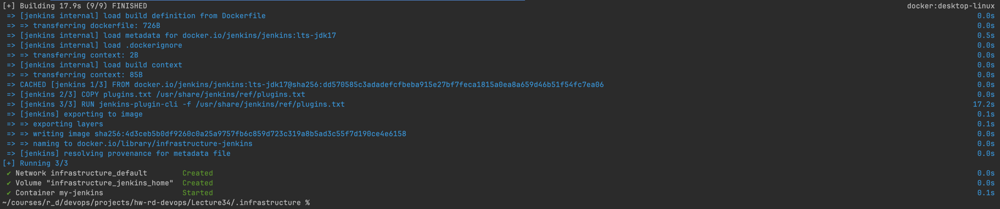

- Отримаємо початковий пароль адміністратора:
```shell
docker exec my-jenkins cat /var/jenkins_home/secrets/initialAdminPassword
```

- Відкриємо у браузері http://localhost:8080 та введемо отриманий пароль.

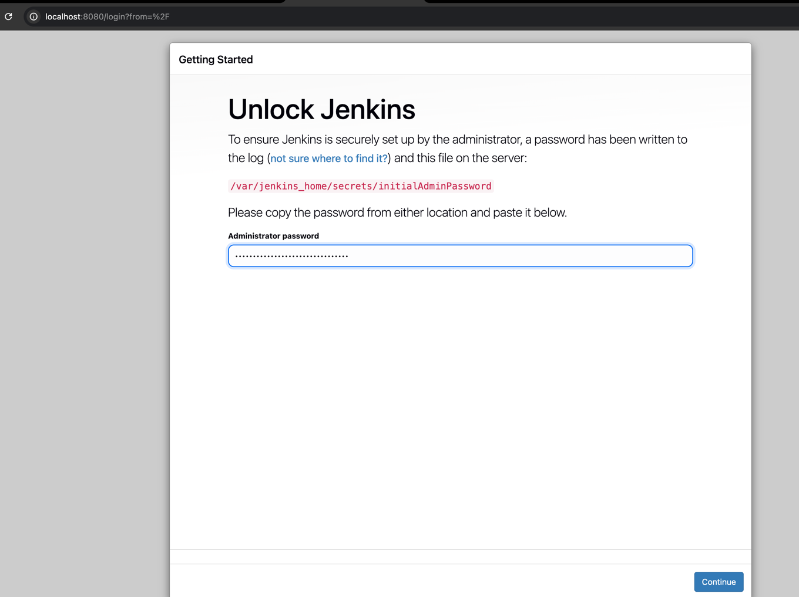

- Далі обираємо "Install suggested plugins" для встановлення рекомендованих плагінів.

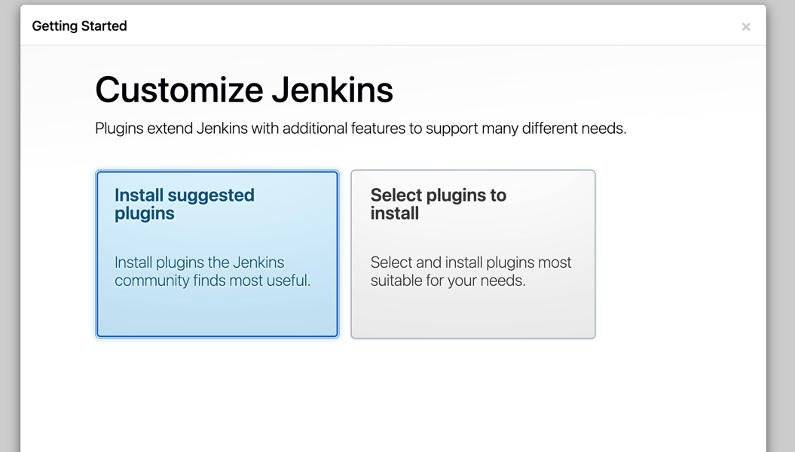

- Skip and continue as admin — пропускаємо створення користувача і продовжуємо як адміністратор.
- Save and Finish — завершуємо налаштування.
- Start using Jenkins — переходимо до головної сторінки Jenkins.
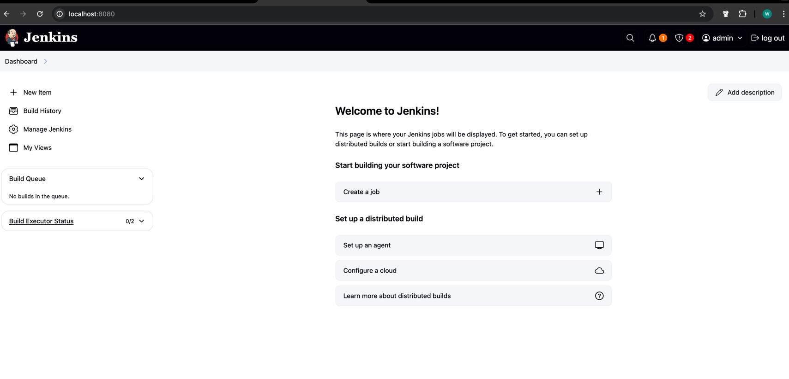

- Перевіримо плагіни:
  - Перейдемо до "Manage Jenkins" -> "Plugins".
  - У вкладці "Installed plugins" перевіримо, що плагіни `git`, `workflow-aggregator` та `ssh-agent` встановлені.

## 📌 Завдання 2: Налаштувати EC2

### 1. Створюємо інстанс Amazon EC2 (Amazon Linux 2 або Ubuntu).

Налаштовуємо SSH-доступ і встановлюємо Java та переконаємося, що Jenkins може підключатися до EC2 через SSH.

#### 1.1. Перейдемо до сервісу **IAM** та додамо до юзера політику AmazonSSMManagedInstanceCore
```json
    {
    "Version": "2012-10-17",
    "Statement": [
        {
            "Effect": "Allow",
            "Action": [
                "ssm:DescribeAssociation",
                "ssm:GetDeployablePatchSnapshotForInstance",
                "ssm:GetDocument",
                "ssm:DescribeDocument",
                "ssm:GetManifest",
                "ssm:GetParameter",
                "ssm:GetParameters",
                "ssm:ListAssociations",
                "ssm:ListInstanceAssociations",
                "ssm:PutInventory",
                "ssm:PutComplianceItems",
                "ssm:PutConfigurePackageResult",
                "ssm:UpdateAssociationStatus",
                "ssm:UpdateInstanceAssociationStatus",
                "ssm:UpdateInstanceInformation"
            ],
            "Resource": "*"
        },
        {
            "Effect": "Allow",
            "Action": [
                "ssmmessages:CreateControlChannel",
                "ssmmessages:CreateDataChannel",
                "ssmmessages:OpenControlChannel",
                "ssmmessages:OpenDataChannel"
            ],
            "Resource": "*"
        },
        {
            "Effect": "Allow",
            "Action": [
                "ec2messages:AcknowledgeMessage",
                "ec2messages:DeleteMessage",
                "ec2messages:FailMessage",
                "ec2messages:GetEndpoint",
                "ec2messages:GetMessages",
                "ec2messages:SendReply"
            ],
            "Resource": "*"
        }
    ]
}
```
#### 1.2. Запуск EC2-інстанса
Створимо сервер для розгортання нашого застосунку.
1. Якщо немає VPC, то переходимо на **VPC Dashboard** -> **Actions** -> **Create Default VPC**. Після цього AWS автоматично створить для вас нову VPC за замовчуванням, а також підмережі (subnets) в кожній зоні доступності, інтернет-шлюз та таблицю маршрутизації.
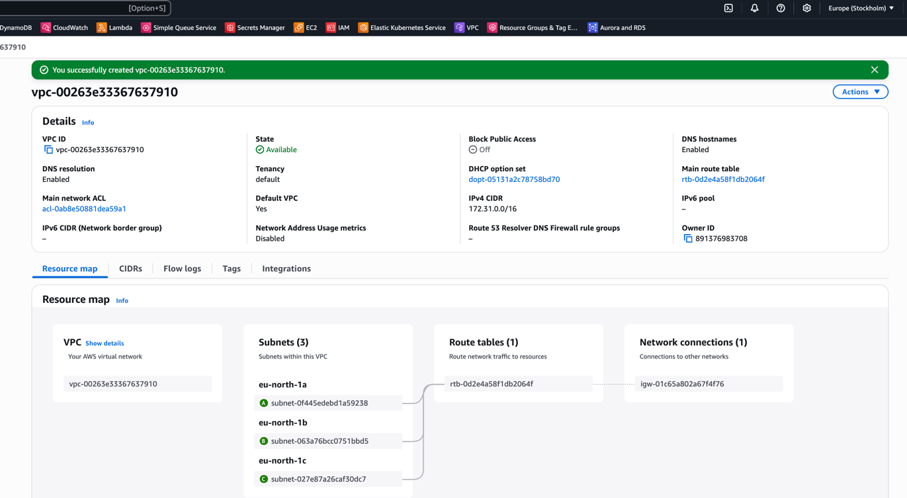
2. Переходимо до сервісу **EC2** -> **Launch instances**.
3. Додаємо Name (Перша секція на сторінці)
    - Name: jenkins-deploy-server
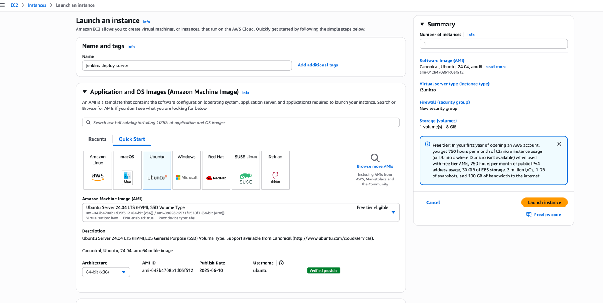
4. Вибераємо AMI **Ubuntu Server 22.04 LTS** та тип інстанса `t3.micro`.
5. Обираємо **dev-key** для доступу по SSH.
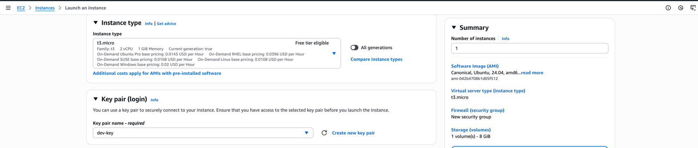
6. Додамо правила для вхідного трафіку на порти 22 (SSH) та 8080 (Custom TCP) з джерела Anywhere.
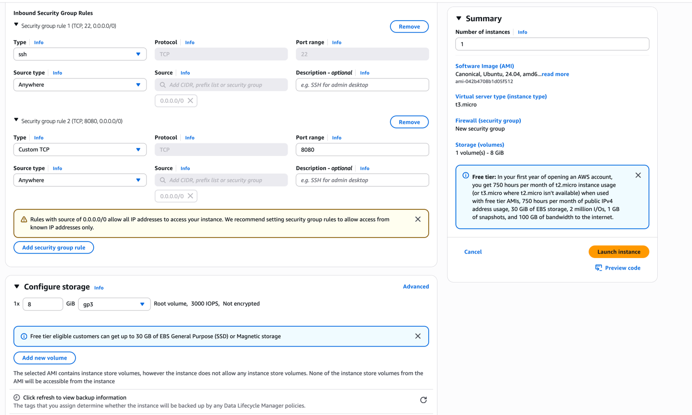
7. Запустемо інстанс.
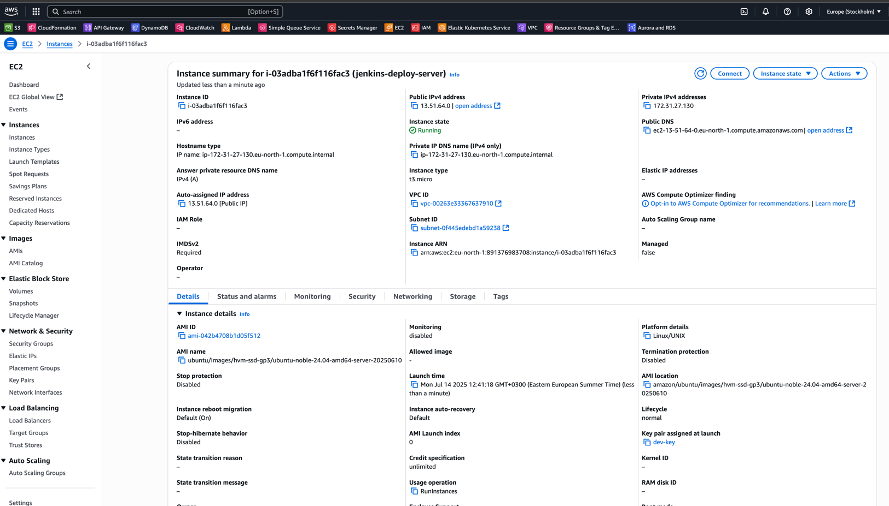

### 2.  Налаштування сервера
Підключимось до сервера та встановимо необхідне програмне забезпечення.

#### 1. Підключимось до інстанса по SSH, використовуючи його Public IP та завантажений ключ:

```shell
cd ./.infrastructure
chmod 400 dev-key.pem
ssh -i jenkins-ec2-key.pem ubuntu@13.51.64.0
```
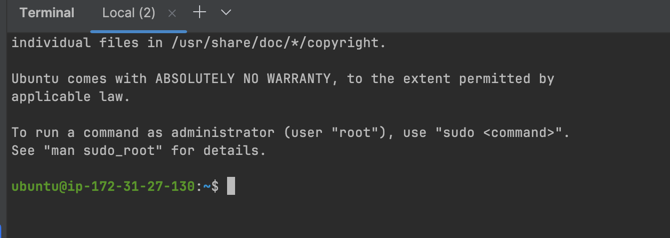
2. Встановимо Java 17:
```shell
sudo apt update
sudo apt install openjdk-17-jdk -y
```
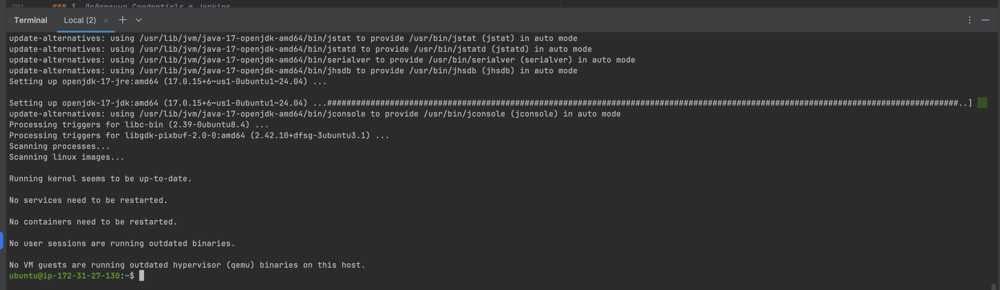

3. Створемо новий файл скрипту за допомогою редактора nano в ec2, який знадобиться для запуску нашого застосунку:
```shell
nano /home/ubuntu/start_app.sh
```

4. Вставимо наступний код у файл start_app.sh:
```shell
#!/bin/bash

echo "Stopping old application process..."
# Вбиваємо старий процес більш точно, за назвою .jar файлу
pkill -f 'spring-boot-complete' || true
sleep 2 # Даємо час процесу завершитись

echo "Starting new application process in /home/ubuntu/app"
cd /home/ubuntu/app

# Запускаємо новий процес
nohup java -jar *.jar > app.log 2>&1 &

echo "Deployment script finished."
```

```shell
chmod +x /home/ubuntu/start_app.sh
```

### 3. Додавання Credentials в Jenkins
Надамо Jenkins доступ до нашого нового сервера.

1. Перейдемо в Jenkins: Manage Jenkins -> Credentials.
2. Натиснемо (global) -> Add Credentials.
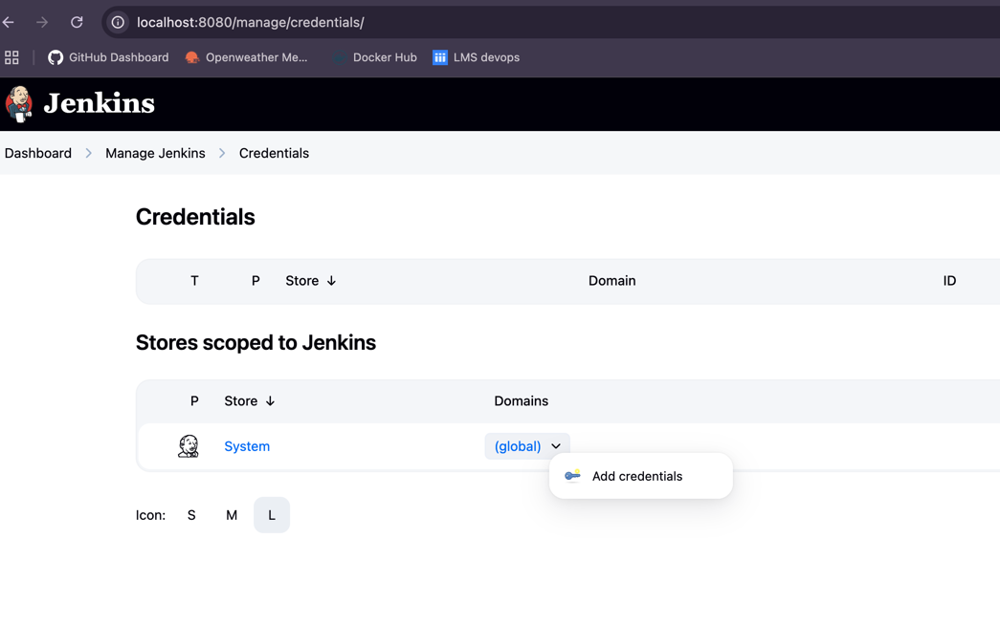
3. Заповнимо поля:
   - Kind: SSH Username with private key
   - ID: ec2-ssh-key
   - Description: EC2 SSH Key
   - Username: ubuntu
   - Private Key: Enter directly. Вставимо вміст файлу dev-key.pem.
4. Натиснемо Create. Тепер Jenkins може "логінитися" на EC2.
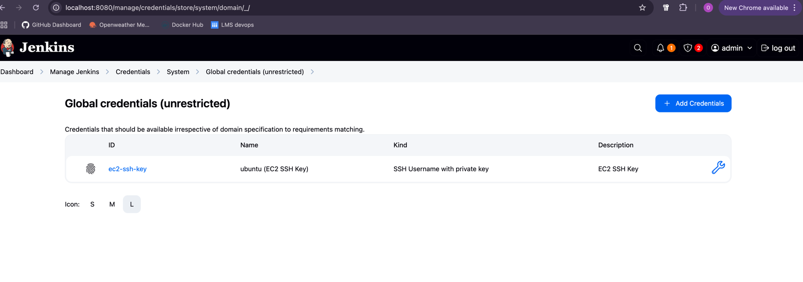

## 📌 Завдання 3: Налаштувати Freestyle Job
1. Встановимо плагіни:
    - Встановимо плагін Publish Over SSH:
        - Якщо плагін не встановлено, то перейдемо в Manage Jenkins -> Plugins -> Available plugins та знайдемо Publish Over SSH. Встановимо його та перезапустимо Jenkins.
        ```shell
        docker restart my-jenkins
        ```
        - Після перезапуску перейдемо в Manage Jenkins -> System.
        - Прокрутимо до секції Publish over SSH та налаштуємо:
            - SSH Servers: Натиснемо "Add" і заповнимо поля:
                - Name: ubuntu@13.51.64.0
                - Hostname: 13.51.64.0
                - Username: ubuntu
                - Натиснемо кнопку Advanced
                - Поставимо галочку Use password authentication, or use a different key.
                  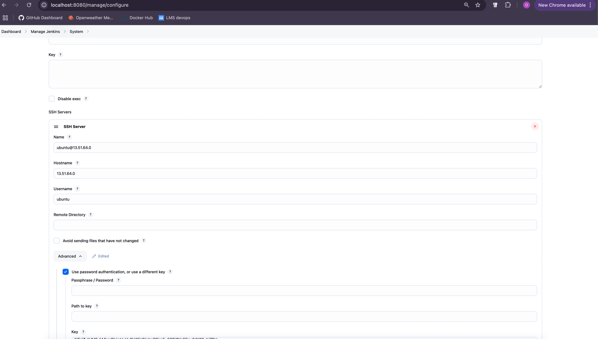
                - У Key вставимо dev-key.pem (вміст приватного ключа, який ми використовували для підключення до EC2).
                - Перевіримо натиснувши Test Configuration. Маємо отримати повідомлення Success.
                  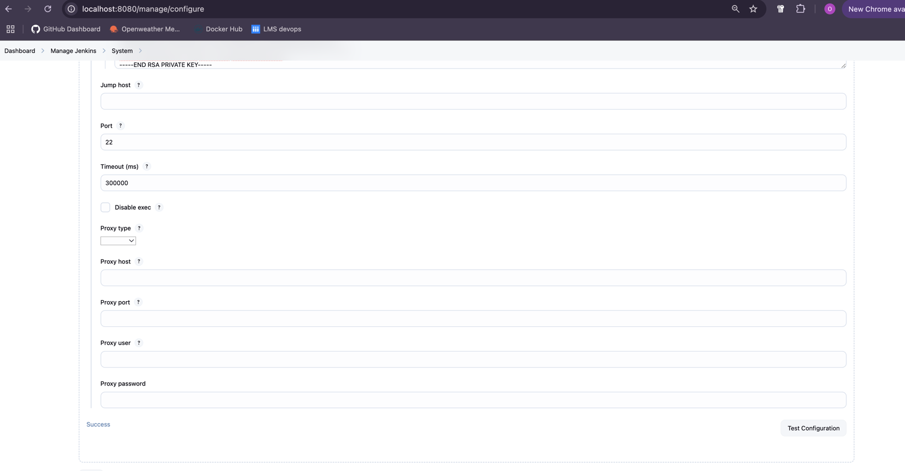
                - Збережемо налаштування.
    - Встановимо плагін "Maven Integration":
      - Перейдемо до Manage Jenkins → Tools → Maven installations. Додамо нову установку Maven:
        - Name: Maven 3.9.10
        - Install automatically: Поставимо галочку.
        - Version: 3.9.10
        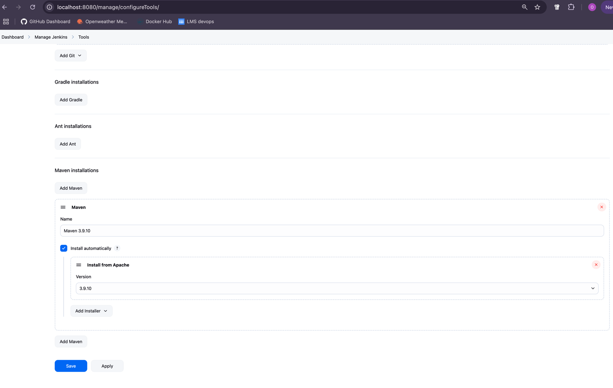
        - Збережемо налаштування.
      - Перейдемо до Manage Jenkins → Plugins
        - У вкладці Available plugins знайдемо "Maven Integration" і встановимо його.
      - Рестартнемо Jenkins:
        ```shell
        docker restart my-jenkins
        ```
2. Створення Job:
   - На головній сторінці Jenkins натиснемо "New Item".
   - Введемо назву: Simple Freestyle Job.
   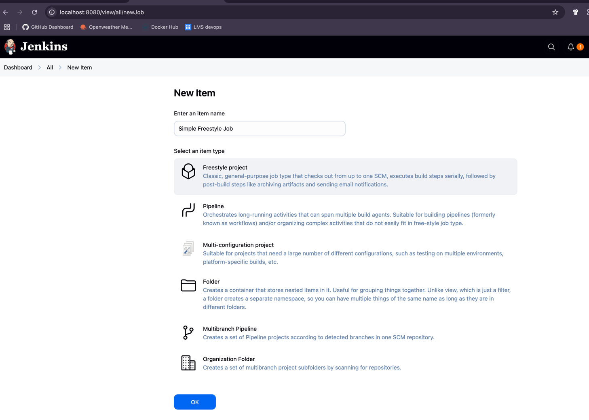
   - Оберемо тип "Freestyle project" і натисни OK.

3. Налаштування:
   - Source Code Management:
      - Оберемо Git. 
      - Repository URL: додамо URL форкнутого репозиторію (https://github.com/olhadevops/gs-spring-boot.git). 
      - Credentials: оберемо об'єкт ec2-ssh-key, який ми створили раніше.
      - Branch Specifier: Залишемо */main (назва головної гілки у форку).
     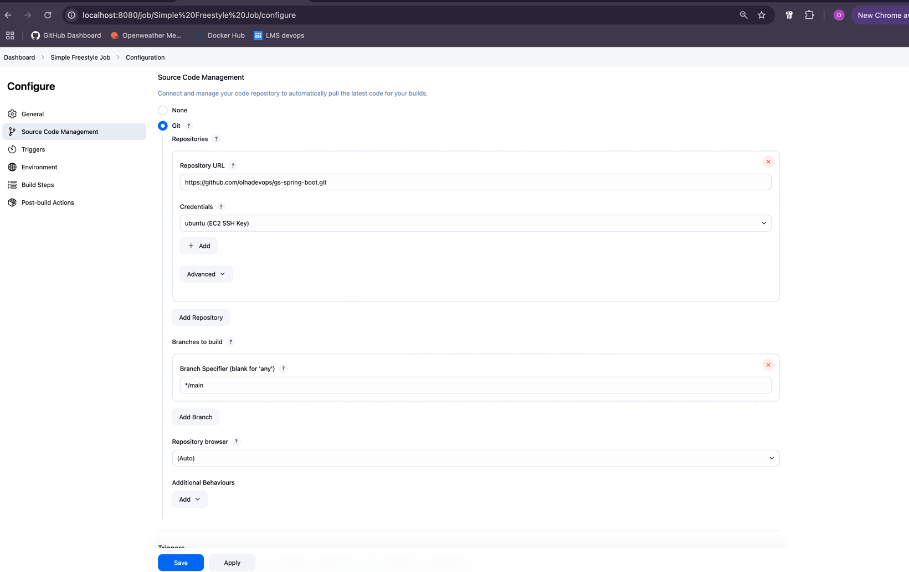
   - Build Steps:
     - Натиснемо "Add build step" та оберемо "Invoke top-level Maven targets". 
     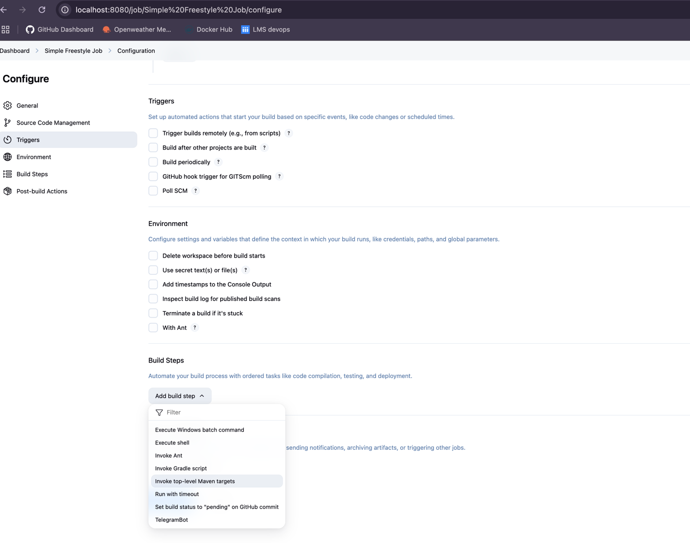
     - Goals: `clean install`. Це очистить попередні збірки і скомпілює проєкт, створивши .jar файл.
     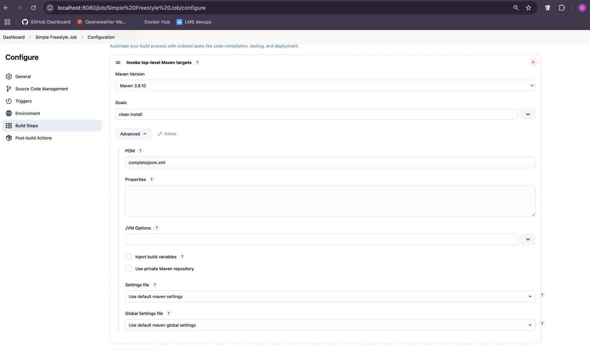
   - Post-build Actions:
     - Натиснемо "Add post-build action" та оберемо "Send build artifacts over SSH".
     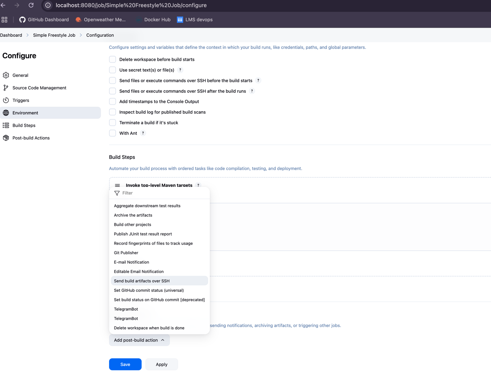
     - SSH Server Name: У списку Name оберемо ubuntu@13.51.64.0 (він з'явиться після вибору credentials).
     - Transfers:
       - Source files: target/*.jar. Jenkins шукатиме артефакт у робочій директорії білда. 
       - Remove prefix: target/. 
       - Remote directory: ~/app. Це папка на EC2, куди буде копіюватися файл.
     - Exec command: Це команди, які виконаються на EC2 після копіювання файлу.
     ```shell
     /home/ubuntu/start_app.sh
      ```
      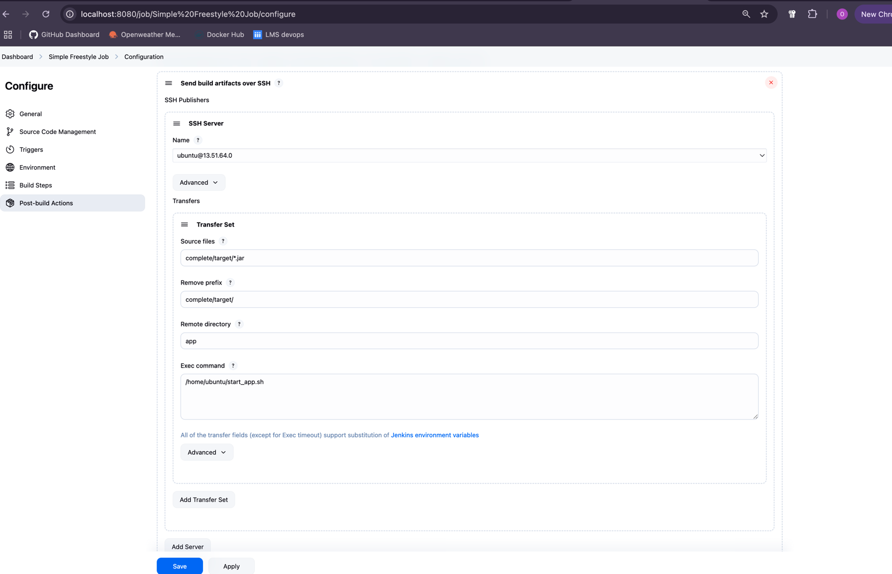
   - Збережемо (Save).


4. Запуск та перевірка:
- На сторінці Simple Freestyle Job натиснемо "Build Now". 
- Спостерігаємо за виконанням у Build History → Console Output. 
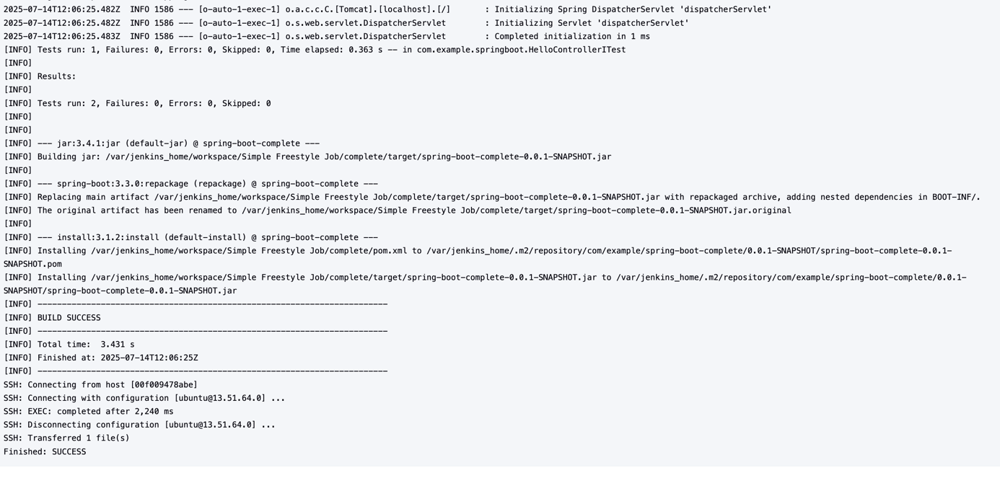
- Відкриваємо у браузері http://13.51.64.0:8080. Маємо побачити сторінку Spring Boot "Greetings from Spring Boot!".
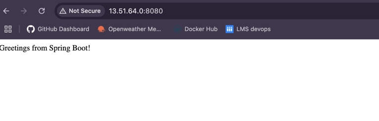

## 📌 Завдання із зірочкою: Декларативний пайплайн

Це сучасний підхід, де весь процес CI/CD описується у файлі Jenkinsfile прямо в коді вашого проєкту.

1. Підготовка: Зберігаємо секрети в Jenkins Credentials

Щоб не зберігати IP-адресу, токени та інші чутливі дані прямо в коді, додамо їх у безпечне сховище Jenkins.
- Перейдемо в Manage Jenkins -> Credentials -> (global) -> Add Credentials.
- Створимо credential для IP-адреси сервера:
    - Kind: Secret text
    - ID: ec2-server-ip
    - Secret: Введемо IP-адресу EC2-інстанса: 13.51.64.0
    - Description: EC2 Public IP.
    - Натиснемо Create.
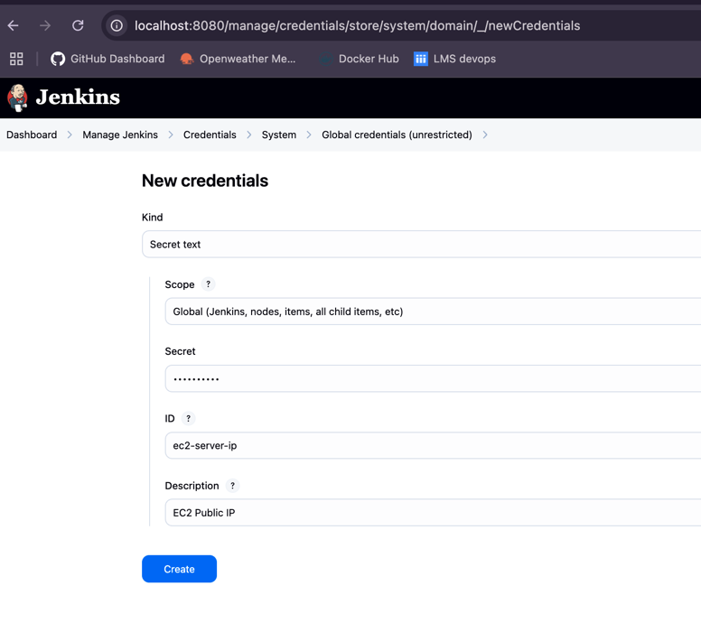

2. Створення Jenkinsfile

У корені форкнутого репозиторію на GitHub створимо файл з назвою Jenkinsfile.

```groovy
pipeline {
    // 1. Агент, на якому буде виконуватися пайплайн
    agent any

    // 2. Інструменти, які потрібно підготувати
    tools {
        // Вказуємо точну назву Maven, як у Manage Jenkins -> Tools
        maven 'Maven 3.9.10'
    }

    // 3. Етапи виконання пайплайну
    stages {
        // Етап 1: Збірка проєкту
        stage('Build') {
            steps {
                // Переходимо в папку 'complete' і виконуємо збірку
                sh 'cd complete && mvn clean install'
            }
        }

        // Етап 2: Розгортання на сервері EC2
        stage('Deploy to EC2') {
            steps {
                // Використовуємо withCredentials для безпечного доступу до IP-адреси
                withCredentials([string(credentialsId: 'ec2-server-ip', variable: 'SERVER_IP')]) {
                    // Використовуємо sshagent для безпечного доступу до SSH-ключа
                    sshagent(credentials: ['ec2-ssh-key']) {
                        sh """
                            # Крок 1: Копіюємо зібраний .jar файл на сервер
                            scp -o StrictHostKeyChecking=no complete/target/*.jar ubuntu@${SERVER_IP}:~/app/
                            
                            # Крок 2: Створюємо скрипт розгортання на віддаленому сервері
                            ssh ubuntu@${SERVER_IP} 'cat > /home/ubuntu/deploy.sh' <<'END_OF_SCRIPT'
#!/bin/bash
echo "--> Stopping old process..."
pkill -f 'spring-boot-complete' || echo "No process to kill."
sleep 2
echo "--> Starting new process..."
cd /home/ubuntu/app
nohup java -jar *.jar > app.log 2>&1 &
echo "--> Deployment finished."
END_OF_SCRIPT

                            # Крок 3: Робимо скрипт виконуваним
                            ssh ubuntu@${SERVER_IP} "chmod +x /home/ubuntu/deploy.sh"

                            # Крок 4: Запускаємо скрипт розгортання
                            ssh ubuntu@${SERVER_IP} "/home/ubuntu/deploy.sh"
                        """
                    }
                }
            }
        }
    }

    // 4. Дії, які виконуються після завершення всіх етапів
    post {
        always {
            // Просто виводимо повідомлення в консоль про завершення
            echo "Pipeline finished with status: ${currentBuild.currentResult}"
        }
    }
}
```

3. Створення Pipeline Job у Jenkins

- На головній сторінці Jenkins натиснемо "New Item". 
- Введемо назву: Declarative-Pipeline-Job. 
- Оберемо тип "Pipeline" і натиснемо OK. 
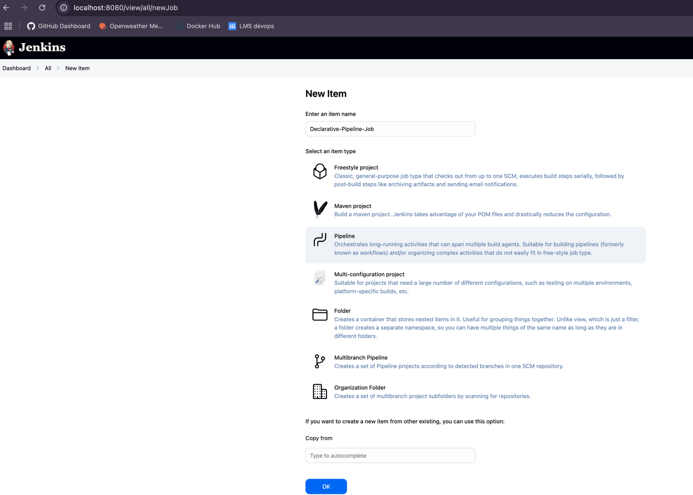
- У налаштуваннях прокрутимо до секції "Pipeline":
  - Definition: Pipeline script from SCM.
  - SCM: Git. 
  - Repository URL: https://github.com/olhadevops/gs-spring-boot.git. 
  - Script Path: Залишимо Jenkinsfile.
- Натиснемо Save.
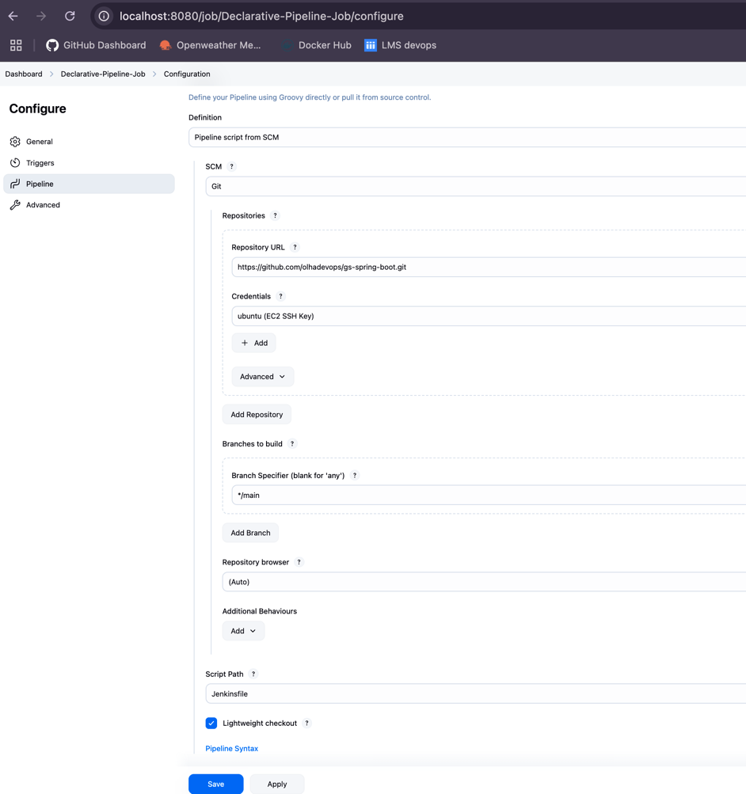
- Запустимо пайплайн кнопкою Build Now.
- Перевіримо виконання у Build History → Console Output.
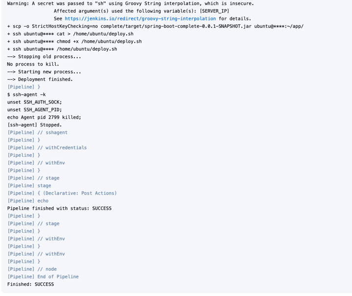
- Відкриваємо у браузері http://13.51.64.0:8080. Маємо побачити сторінку Spring Boot "Greetings from Spring Boot!".

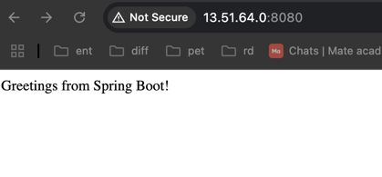

## 📌 Завдання з двома зірочками: Налаштування нотифікацій в Telegram

1. Створення Telegram-бота

- У Telegram знайдемо @BotFather. 
  - Надішлемо йому команду /newbot, дамо боту ім'я `jenkins-bot-olhadevops` та унікальний username `jenkins_olhadevops_bot`. 
- BotFather надішле токен. Скопіюємо його. 
- Створимо нову групу в Telegram, додамо туди нашого бота. Напишемо в групі будь-яке повідомлення. 
- Щоб отримати Chat ID, відкриємо у браузері посилання (підставивши свій токен):
https://api.telegram.org/bot<ТВІЙ_ТОКЕН>/getUpdates 
- У відповіді JSON знайдемо chat -> id. Скопіюємо це число (воно буде зі знаком мінус) і додамо в credential telegram-chat-id в Jenkins нижче.

2. Оновлення Jenkinsfile з нотифікаціями

- Створимо credential для Telegram-токена (отримаємо його на наступному кроці):
    - Kind: Secret text
    - ID: telegram-bot-token
    - Secret: Введемо токен, який отримаємо від BotFather.
    - Description: Telegram Bot Token.
    - Натиснемо Create. (Сам токен додамо пізніше, відредагувавши цей credential)
- Створимо credential для ID чату Telegram:
    - Kind: Secret text
    - ID: telegram-chat-id
    - Secret: Введемо ID чату, куди будемо надсилати повідомлення.
    - Description: Telegram Chat ID.
    - Натиснемо Create.

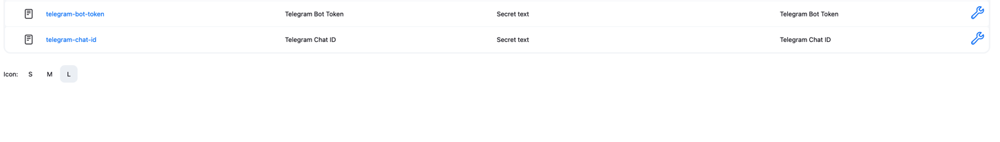

```groovy
pipeline {
    // 1. Агент, на якому буде виконуватися пайплайн
    agent any

    // 2. Інструменти, які потрібно підготувати
    tools {
        // Вказуємо точну назву Maven, як у Manage Jenkins -> Tools
        maven 'Maven 3.9.10'
    }

    // 3. Етапи виконання пайплайну
    stages {
        // Етап 1: Збірка проєкту
        stage('Build') {
            steps {
                // Переходимо в папку 'complete' і виконуємо збірку
                sh 'cd complete && mvn clean install'
            }
        }

        // Етап 2: Розгортання на сервері EC2
        stage('Deploy to EC2') {
            steps {
                // Використовуємо withCredentials для безпечного доступу до IP-адреси
                withCredentials([string(credentialsId: 'ec2-server-ip', variable: 'SERVER_IP')]) {
                    // Використовуємо sshagent для безпечного доступу до SSH-ключа
                    sshagent(credentials: ['ec2-ssh-key']) {
                        sh """
                            # Крок 1: Копіюємо зібраний .jar файл на сервер
                            scp -o StrictHostKeyChecking=no complete/target/*.jar ubuntu@\${SERVER_IP}:~/app/
                            
                            # Крок 2: Створюємо скрипт розгортання на віддаленому сервері
                            ssh ubuntu@\${SERVER_IP} 'cat > /home/ubuntu/deploy.sh' <<'END_OF_SCRIPT'
#!/bin/bash
echo "--> Stopping old process..."
pkill -f 'spring-boot-complete' || echo "No process to kill."
sleep 2
echo "--> Starting new process..."
cd /home/ubuntu/app
nohup java -jar *.jar > app.log 2>&1 &
echo "--> Deployment finished."
END_OF_SCRIPT

                            # Крок 3: Робимо скрипт виконуваним
                            ssh ubuntu@\${SERVER_IP} "chmod +x /home/ubuntu/deploy.sh"

                            # Крок 4: Запускаємо скрипт розгортання
                            ssh ubuntu@\${SERVER_IP} "/home/ubuntu/deploy.sh"
                        """
                    }
                }
            }
        }
    }

    // 4. Дії, які виконуються після завершення всіх етапів
    post {
        always {
            script {
                // Отримуємо всі необхідні дані з Credentials
                withCredentials([
                        string(credentialsId: 'telegram-chat-id', variable: 'CHAT_ID'),
                        string(credentialsId: 'ec2-server-ip', variable: 'SERVER_IP'),
                        string(credentialsId: 'telegram-bot-token', variable: 'BOT_TOKEN')
                ]) {
                    def message
                    if (currentBuild.currentResult == 'SUCCESS') {
                        message = "✅ SUCCESS: Job ${env.JOB_NAME} [#${env.BUILD_NUMBER}] deployed successfully.\\n\\nApplication: http://\${SERVER_IP}:8080"
                    } else {
                        message = "❌ FAILED: Job ${env.JOB_NAME} [#${env.BUILD_NUMBER}] failed.\\n\\nLogs: ${env.BUILD_URL}"
                    }
                    // Відправляємо повідомлення напряму через Telegram API за допомогою curl
                    sh """
                        curl -s -X POST https://api.telegram.org/bot\${BOT_TOKEN}/sendMessage -d chat_id=\${CHAT_ID} -d text="${message}"
                    """
                }
            }
        }
    }
}
```

- Після збереження цього Jenkinsfile у GitHub, запустимо наш Declarative-Pipeline-Job ще раз. 
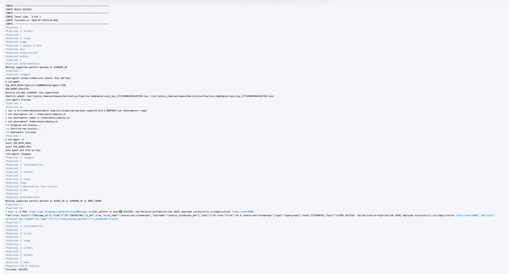

- Після завершення білду ми отримаємо повідомлення в Telegram.

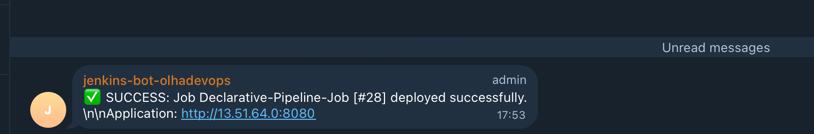

## 🧹 Очищення ресурсів в AWS
1. Видалення EC2-інстанса
    - Перейдемо до сервісу EC2.
    - Виберемо інстанс, який створили для Jenkins.
    - Натиснемо "Actions" -> "Instance State" -> "Terminate Instance".
2. Видалення VPC
   - Перейдемо до сервісу VPC.
   - Виберемо VPC, яку створили для EC2.
   - Натиснемо "Actions" -> "Delete VPC".
3. Видалення IAM політик у юзера
   - Перейдемо до сервісу IAM.
   - Виберемо користувача, для якого створювали політику AmazonSSMManagedInstanceCore.
   - Видалимо цю політику.
