# Налаштування моніторингу вебсервера або сервера бази даних

#### Опис ситуації
`
Уявіть, що ви працюєте DevOps-інженером у компанії, яка підтримує вебзастосунки та бази даних. 
Для забезпечення стабільності роботи інфраструктури вам потрібно налаштувати систему моніторингу з Prometheus та Grafana, а також систему збору логів із Loki. 
Ваше завдання — налаштувати моніторинг для одного із серверів (вебсервер або сервер бази даних), збирати метрики та логи й відтворити їх у Grafana.
`

### Огляд архітектури моніторингу
Ця схема ілюструє, як різні компоненти стеку моніторингу (Prometheus, Grafana, Loki) взаємодіють з веб-сервером Nginx для збору метрик та логів.
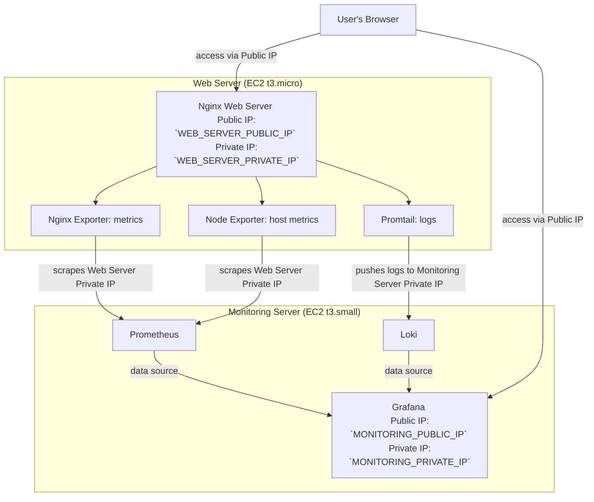

## Налаштування моніторингу для вебсервера Nginx
Далі опис процесу налаштування стеку моніторингу (Prometheus, Grafana, Loki) для вебсервера Nginx. Інструкція розділена на два основні етапи:
- Локальне налаштування: Створення та тестування всього стеку на вашій машині за допомогою Docker.
- Деплой в AWS: Перенесення робочої конфігурації в хмарну інфраструктуру AWS.

## Частина 1: Локальне налаштування та тестування
На цьому етапі ми запустимо всі необхідні сервіси (Prometheus, Grafana, Loki, Nginx, та експортери) в Docker на вашій машині.

#### Крок 1.1: Підготовка структури проекту
Спочатку створимо таку структуру папок та файлів:
- monitoring-stack/
  - docker-compose.local.yml
  - docker-compose.aws.yml
  - prometheus/
    - prometheus.local.yml
    - prometheus.aws.yml
  - loki/
    - loki-config.yml
  - promtail/
    - config.yml
  - nginx/
    - nginx.conf
  - grafana/
    - provisioning/
      - datasources/
        - loki.yaml
        - prometheus.yaml
  - env.local
  - env.aws

1. Файли налаштування Grafana
- grafana/provisioning/datasources/prometheus.yml
```yaml
apiVersion: 1
datasources:
  - name: Prometheus
    type: prometheus
    access: proxy
    url: http://prometheus:9090
    isDefault: true
```

-grafana/provisioning/datasources/loki.yml

```yaml
apiVersion: 1
datasources:
  - name: Loki
    type: loki
    access: proxy
    url: http://loki:3100
```

2. docker-compose.local.yml (для запуску всього стеку локально)
```yaml
services:
  prometheus:
    image: prom/prometheus:latest
    container_name: prometheus
    restart: unless-stopped
    volumes:
      - ./prometheus/prometheus.local.yml:/etc/prometheus/prometheus.yml # <-- Монтуємо локальний конфіг
    ports:
      - "9090:9090"
  grafana:
    image: grafana/grafana-oss:latest
    container_name: grafana
    restart: unless-stopped
    volumes:
      - grafana-data:/var/lib/grafana
      - ./grafana/provisioning:/etc/grafana/provisioning
    ports:
      - "3000:3000"
  loki:
    image: grafana/loki:latest
    container_name: loki
    restart: unless-stopped
    command: -config.file=/etc/loki/local-config.yaml
    volumes:
      - ./loki/loki-config.yml:/etc/loki/local-config.yaml
    ports:
      - "3100:3100"
  promtail:
    image: grafana/promtail:latest
    container_name: promtail
    restart: unless-stopped
    volumes:
      - ./promtail/config.yml:/etc/promtail/config.yml
      - nginx-logs:/var/log/nginx
    command: -config.file=/etc/promtail/config.yml -config.expand-env=true
  node-exporter:
    image: prom/node-exporter:latest
    container_name: node-exporter
    restart: unless-stopped
    ports:
      - "9100:9100"
  nginx:
    image: nginx:latest
    container_name: nginx
    restart: unless-stopped
    volumes:
      - ./nginx/nginx.conf:/etc/nginx/nginx.conf:ro
      - nginx-logs:/var/log/nginx
    ports:
      - "8080:80"
  nginx-exporter:
    image: nginx/nginx-prometheus-exporter:latest
    container_name: nginx-exporter
    restart: unless-stopped
    command: -nginx.scrape-uri http://nginx/nginx_status
    ports:
      - "9113:9113"
volumes:
  grafana-data:
  nginx-logs:
```

3. docker-compose.aws.yml (тільки для моніторинг-сервера в AWS)
```yaml
services:
  prometheus:
    image: prom/prometheus:latest
    container_name: prometheus
    restart: unless-stopped
    volumes:
      - ./prometheus/prometheus.aws.yml:/etc/prometheus/prometheus.yml # <-- Монтуємо локальний конфіг
    ports:
      - "9090:9090"
  grafana:
    image: grafana/grafana-oss:latest
    container_name: grafana
    restart: unless-stopped
    volumes:
      - grafana-data:/var/lib/grafana
      - ./grafana/provisioning:/etc/grafana/provisioning
    ports:
      - "3000:3000"
  loki:
    image: grafana/loki:latest
    container_name: loki
    restart: unless-stopped
    command: -config.file=/etc/loki/local-config.yaml
    volumes:
      - ./loki/loki-config.yml:/etc/loki/local-config.yaml
    ports:
      - "3100:3100"
volumes:
  grafana-data:
```

4. prometheus (конфігурація Prometheus)
- prometheus/prometheus.local.yml
```yaml
global:
  scrape_interval: 15s
scrape_configs:
  - job_name: 'prometheus'
    static_configs:
      - targets: ['localhost:9090']
  - job_name: 'node-exporter'
    static_configs:
      - targets: ['node-exporter:9100'] # Статичні імена для Docker
  - job_name: 'nginx'
    static_configs:
      - targets: ['nginx-exporter:9113'] # Статичні імена для Docker
```
- prometheus/prometheus.aws.yml (ip заповнимо перед деплоєм в AWS)
```yaml
global:
  scrape_interval: 15s
scrape_configs:
  - job_name: 'prometheus'
    static_configs:
      - targets: ['localhost:9090']
  - job_name: 'node-exporter'
    static_configs:
      - targets: ['<WEB_SERVER_PRIVATE_IP>:9100']
  - job_name: 'nginx'
    static_configs:
      - targets: ['<WEB_SERVER_PRIVATE_IP>:9113']
```

5. nginx/nginx.conf (конфігурація Nginx з модулем nginx_status)

```nginx
daemon off;

events {}

http {
  access_log /var/log/nginx/access.log;
  error_log /var/log/nginx/error.log;

  server {
    listen 80;

    location / {
      return 200 'Nginx is running! Welcome to monitoring homework.';
    }

    location /error {
      return 500 'This is a test server error!';
    }

    location /nginx_status {
      stub_status;
      allow all;
    }
  }
}
```

6. promtail/config.yml (конфігурація Promtail для збору логів Nginx)

```yaml
server:
  http_listen_port: 9080
  grpc_listen_port: 0
positions:
  filename: /tmp/positions.yaml
clients:
  - url: http://${LOKI_HOST}:3100/loki/api/v1/push
scrape_configs:
  - job_name: nginx
    static_configs:
      - targets:
          - localhost
        labels:
          job: nginx
          __path__: /var/log/nginx/*.log
```

7. loki/loki-config.yml

```yaml
auth_enabled: false

server:
  http_listen_port: 3100

common:
  path_prefix: /loki
  replication_factor: 1
  ring:
    instance_addr: 127.0.0.1
    kvstore:
      store: inmemory

storage_config:
  tsdb_shipper:
    active_index_directory: /loki/tsdb-index
    cache_location: /loki/tsdb-cache
  filesystem:
    directory: /loki/chunks

schema_config:
  configs:
    - from: 2024-01-01
      store: tsdb
      object_store: filesystem
      schema: v13
      index:
        prefix: index_
        period: 24h
```

8. Файли змінних середовища
- env.local (для локального запуску)
```env
TARGET_IP_NODE=node-exporter
PORT_NODE_EXPORTER=9100
TARGET_IP_NGINX=nginx-exporter
PORT_NGINX_EXPORTER=9113
LOKI_HOST=loki
```

-env.aws
```env
# Перед деплоєм заповнемо ці значення
TARGET_IP_NODE=<WEB_SERVER_PRIVATE_IP>
PORT_NODE_EXPORTER=9100
TARGET_IP_NGINX=<WEB_SERVER_PRIVATE_IP>
PORT_NGINX_EXPORTER=9113
LOKI_HOST=<MONITORING_SERVER_PRIVATE_IP>
```

#### Крок 1.2: Запуск локально
1. Створемо `.env` файл: `cp .env.local .env`
2. Запустимо стек: `docker-compose -f docker-compose.local.yml up -d --force-recreate`
3. Перевіримо, чи запустилися контейнери:
```shell
docker-compose -f docker-compose.local.yml ps
```
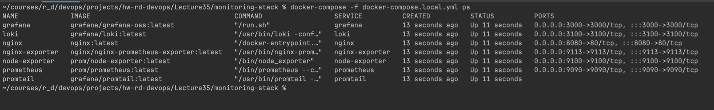

#### Крок 1.3: Налаштування та перевірка в Grafana
1. Перевіряємо Prometheus Targets:
   - Відкриємо Prometheus: http://localhost:9090/targets
   - Переконаймося, що `node-exporter`, `nginx-exporter` та ендпоінт Prometheus працюють:
   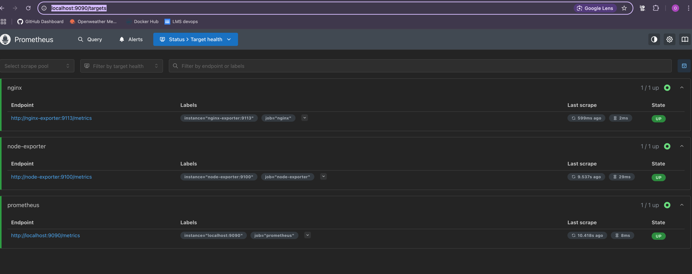
2. Відкриємо Grafana: http://localhost:3000 (логін/пароль: admin/admin).
   - Перевіряємо джерела даних, які ми вказали в grafana/provisioning/datasources:
      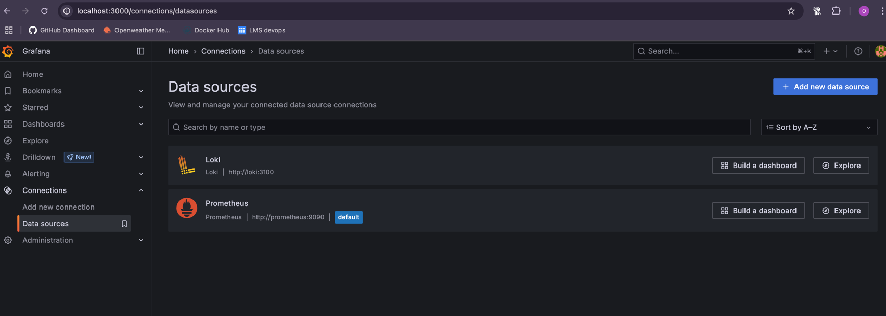
   - Імпортуємо дашборди:
     - Node Exporter: ID 1860. Оберіть джерело даних Prometheus. 
     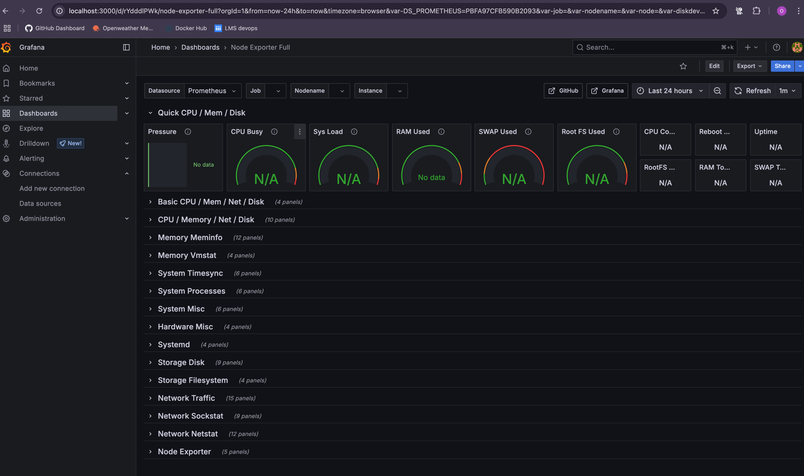
     - Nginx: ID 14900. Оберемо джерело даних Prometheus.
     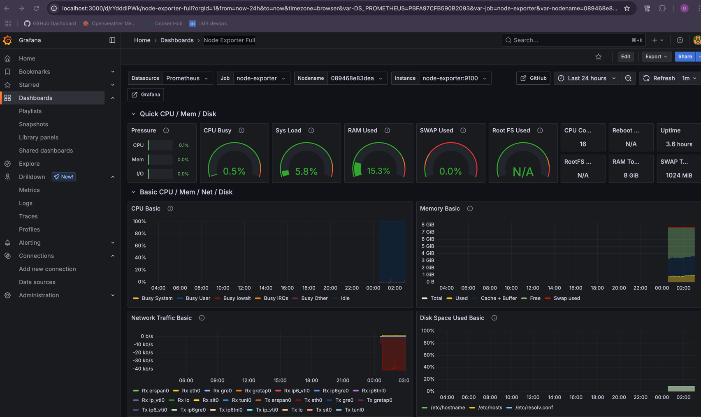

#### Крок 1.4: Тестування навантаження та перевірка логів

Щоб побачити метрики та логи в дії, згенеруємо навантаження на Nginx за допомогою Apache Benchmark (`ab`).

1. Встановлюємо `ab`.
   - На Ubuntu/Debian: `sudo apt-get update && sudo apt-get install apache2-utils `
   - На macOS (з Homebrew): `brew install httpd`

2. Запускаємо тестування в терміналі:
- Згенеруємо 200 успішних запитів (10 одночасно)
- Згенеруємо 50 запитів, які викличуть помилку 500

```shell
ab -n 200 -c 10 http://localhost:8080/
ab -n 50 -c 5 http://localhost:8080/error
```
* `-n`: загальна кількість запитів.
* `-c`: кількість одночасних запитів.

3. Перевіремо результати:
   - Метрики: Відкриємо дашборд Node Exporter Full (ID: 1860) в Grafana. Побачимо зростання навантаження на CPU, RAM та мережу.
   
   - Логи: Перейдемо у Grafana в розділ `Explore`, оберемо `Loki`. Введемо запит `{job="nginx"}`. Побачимо логи, що містять успішні запити (код `200`) та помилки (код `500`).
   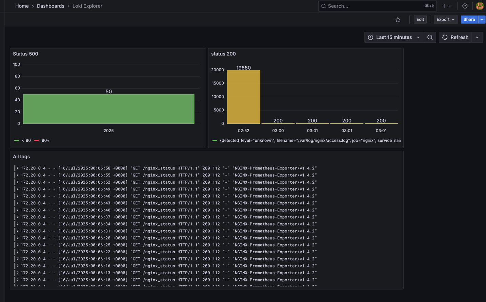
   - Метрики Nginx: Відкриємо дашборд Nginx (ID: 20311) в Grafana. Побачимо кількість запитів, з'єднань та помилок.
   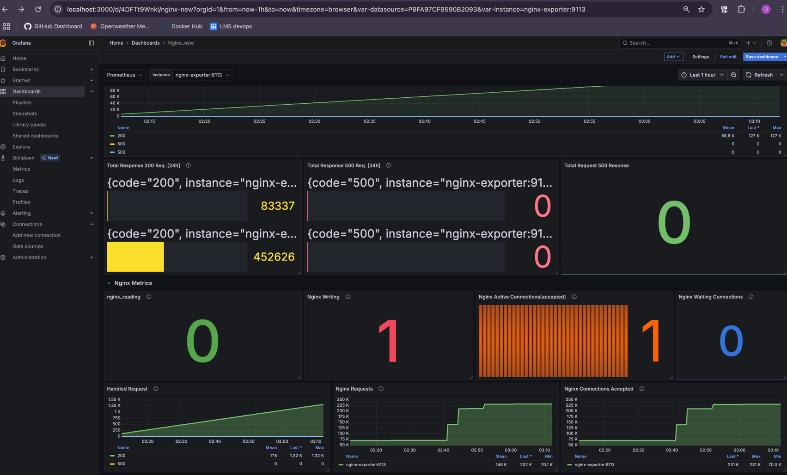

### Частина 2: Деплой в AWS
Після локального тестування, можна переносити конфігурацію в хмару.

#### Крок 2.1: Створення інфраструктури в AWS
Створюємо VPC default VPC, якщо її ще немає.
- VPC -> Your VPCs -> Actions -> Create default VPC
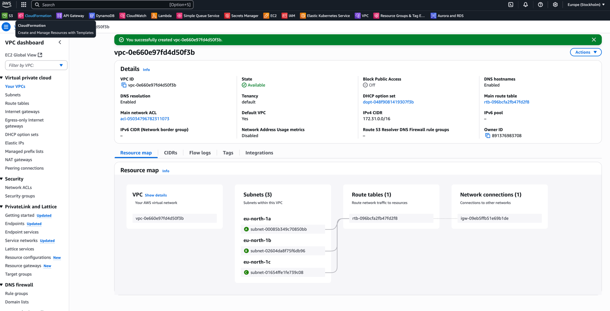

Створюємо два EC2-інстанси з такими параметрами та групами безпеки.
- Моніторинг-сервер: `t3.small`, Ubuntu 22.04, група `monitoring-sg`.
  - Група безпеки `monitoring-sg` (для моніторинг-сервера):
    - `SSH (22)` з вашого IP
    - `Grafana (3000)` звідусіль (Anywhere)
    - `Prometheus (9090)` звідусіль (Anywhere)
    - `Loki (3100)` з групи `webserver-sg`
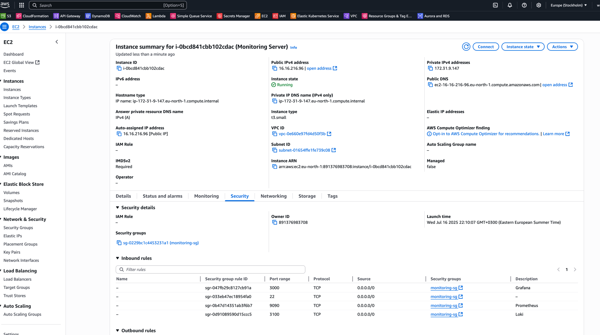
- monitoring public IP: `16.16.216.96`
- monitoring private IP: `172.31.9.147`

- Веб-сервер: `t3.micro`, Ubuntu 22.04, група `webserver-sg`.
  - Група безпеки `webserver-sg` (для веб-сервера):
    - `SSH (22)` з вашого IP
    - `HTTP (80)` звідусіль (Anywhere)
    - `Node Exporter (9100)` з групи `monitoring-sg` (Source)
    - `Nginx Exporter (9113)` з групи `monitoring-sg` (Source)
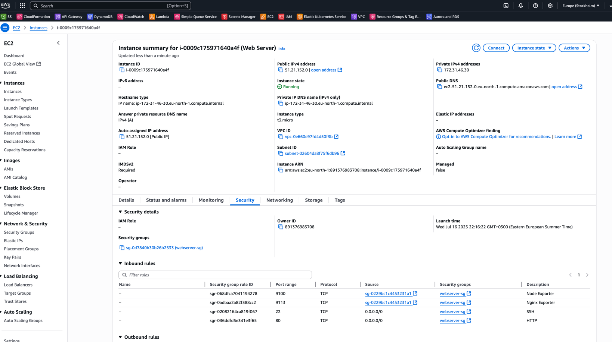
 - webserver public IP: `51.21.152.0`
 - webserver private IP: `172.31.46.30`

#### Крок 2.2: Налаштування та запуск моніторингу на моніторинг-сервері
1. Підключення до моніторинг-сервера по SSH
```bash
chmod 0400 ../dev-key.pem
ssh -i ../dev-key.pem ubuntu@16.16.216.96
```
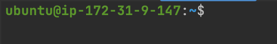

2. Встановлення Docker та Docker Compose
```shell
# Встановлення Docker
sudo apt update
sudo apt install -y apt-transport-https ca-certificates curl software-properties-common
curl -fsSL https://download.docker.com/linux/ubuntu/gpg | sudo gpg --dearmor -o /usr/share/keyrings/docker-archive-keyring.gpg
echo "deb [arch=$(dpkg --print-architecture) signed-by=/usr/share/keyrings/docker-archive-keyring.gpg] https://download.docker.com/linux/ubuntu $(lsb_release -cs) stable" | sudo tee /etc/apt/sources.list.d/docker.list > /dev/null
sudo apt update
sudo apt install -y docker-ce docker-ce-cli containerd.io

# Додаємо поточного користувача до групи docker
sudo usermod -aG docker ${USER}

# Встановлення Docker Compose (перевірте актуальну версію на GitHub Docker Compose)
DOCKER_COMPOSE_VERSION="2.24.5" # Актуальна версія на липень 2025
sudo curl -L "https://github.com/docker/compose/releases/download/v${DOCKER_COMPOSE_VERSION}/docker-compose-$(uname -s)-$(uname -m)" -o /usr/local/bin/docker-compose
sudo chmod +x /usr/local/bin/docker-compose
docker-compose --version
```
- Важливо: Після додавання користувача до групи docker потрібно вийти з SSH та зайти знову для застосування змін.

3. Копіювання файлів конфігурації
На локальній машині (не на AWS інстансі), переконавшись, що знаходимося в кореневій директорії monitoring-stack, скопіюємо необхідні файли на моніторинг-сервер.
```bash
scp -r -i ../dev-key.pem ./ ubuntu@16.16.216.96:/home/ubuntu/monitoring-stack
```
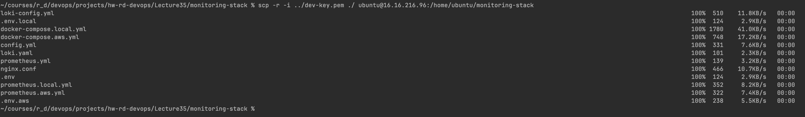
- Після цього, на моніторинг-сервері, повинні мати структуру ~/monitoring-stack з відповідними файлами.
  
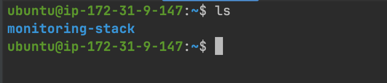

4. Заповнюємо `env.aws` та `prometheus.aws.yml`
На моніторинг-сервері (в папці `~/monitoring-stack`):
   - Отримання приватних IP адрес:
     - Приватний IP веб-сервера: `172.31.46.30`
     - Приватний IP моніторинг-сервера: `172.31.9.147` (це IP твого поточного інстансу)
   - Редагування prometheus/prometheus.aws.yml:
     - Відкриваємо файл 'prometheus/prometheus.aws.yml' і заміни <WEB_SERVER_PRIVATE_IP> на реальний приватний IP веб-сервера '172.31.46.30'.
     ```shell
      nano ~/monitoring-stack/prometheus/prometheus.aws.yml
     ```
     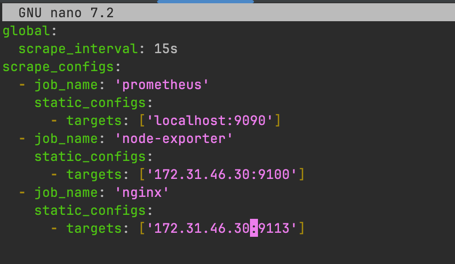
   - Редагування env.aws:
     - Відкриваємо файл '.env.aws' і заповняємо змінні `TARGET_IP_NODE`, `TARGET_IP_NGINX` та `LOKI_HOST` відповідними приватними IP адресами.
    ```shell
    nano ~/monitoring-stack/.env.aws
    ```
    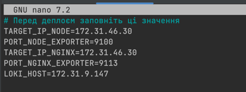
   - Копіювання `.env.aws` в .`env`:
     - Перейдемо в директорію ~/monitoring-stack і скопіюй `.env.aws` в `.env`:
      ```shell
      cp .env.aws .env
      ```
5. Запуск стеку моніторингу Docker Compose
Перебуваючи в директорії `~/monitoring-stack` запускаємо стек моніторингу:
```bash
docker-compose -f docker-compose.aws.yml up -d
````
Перевіремо, чи всі контейнери запущені:
```shell
docker-compose -f docker-compose.aws.yml ps
```
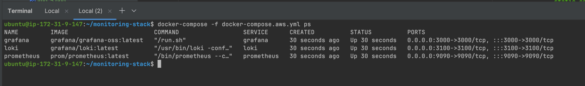

- Маємо побачити запущені Prometheus, Grafana та Loki контейнери.

#### Крок 2.3: Налаштування веб-сервера (t3.micro)
Тепер налаштуємо веб-сервер, який буде моніторитися.
1. Підключення до веб-сервера по SSH
```bash
chmod 0400 ../dev-key.pem
ssh -i ../dev-key.pem ubuntu@51.21.152.0
```
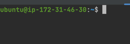

2. Встановлення Nginx, Node Exporter, Nginx Exporter та Promtail
- Увійдемо у режим суперкористувача:
```shell
sudo -i
```

- Створимо скрипт в monitoring-stack/install_web_monitor.sh для налаштування веб-сервера та скопіюємо туди наступний код:
```bash
#!/bin/bash

echo "--- Починаємо налаштування веб-сервера для моніторингу ---"

# --- 1. Оновлення системи та встановлення базових утиліт ---
echo "1. Оновлення системи та встановлення базових утиліт..."
apt update
apt upgrade -y
apt install -y nginx apache2-utils unzip

# --- 2. Встановлення Node Exporter ---
echo "2. Встановлення Node Exporter..."
wget "https://github.com/prometheus/node_exporter/releases/download/v1.8.1/node_exporter-1.8.1.linux-amd64.tar.gz" -O /tmp/node_exporter.tar.gz
mkdir -p /opt/node_exporter
tar -xvf /tmp/node_exporter.tar.gz -C /opt/node_exporter --strip-components=1
useradd -rs /bin/false node_exporter 2>/dev/null
chown -R node_exporter:node_exporter /opt/node_exporter
chmod +x /opt/node_exporter/node_exporter

tee /etc/systemd/system/node-exporter.service > /dev/null <<EOF
[Unit]
Description=Node Exporter
Wants=network-online.target
After=network-online.target

[Service]
User=node_exporter
Group=node_exporter
Type=simple
ExecStart=/opt/node_exporter/node_exporter

[Install]
WantedBy=multi-user.target
EOF
systemctl daemon-reload
systemctl enable node-exporter
systemctl start node-exporter
echo "Статус Node Exporter:"
systemctl status node-exporter --no-pager || true

# --- 3. Встановлення Nginx Exporter ---
echo "3. Встановлення Nginx Exporter..."
wget "https://github.com/nginx/nginx-prometheus-exporter/releases/download/v1.2.0/nginx-prometheus-exporter_1.2.0_linux_amd64.tar.gz" -O /tmp/nginx_exporter.tar.gz
mkdir -p /tmp/nginx_exporter_extract
tar -xvf /tmp/nginx_exporter.tar.gz -C /tmp/nginx_exporter_extract/

mkdir -p /opt/nginx_exporter
mv /tmp/nginx_exporter_extract/nginx-prometheus-exporter /opt/nginx_exporter/nginx-prometheus-exporter

rm -rf /tmp/nginx_exporter_extract /tmp/nginx_exporter.tar.gz

chmod +x /opt/nginx_exporter/nginx-prometheus-exporter
useradd -rs /bin/false nginx_exporter 2>/dev/null
chown -R nginx_exporter:nginx_exporter /opt/nginx_exporter

tee /etc/systemd/system/nginx-exporter.service > /dev/null <<EOF
[Unit]
Description=Nginx Prometheus Exporter
Wants=network-online.target
After=network-online.target nginx.service

[Service]
User=nginx_exporter
Group=nginx_exporter
Type=simple
ExecStart=/opt/nginx_exporter/nginx-prometheus-exporter -nginx.scrape-uri http://localhost/nginx_status

[Install]
WantedBy=multi-user.target
EOF
systemctl daemon-reload
systemctl enable nginx-exporter
systemctl start nginx-exporter
echo "Статус Nginx Exporter:"
systemctl status nginx-exporter --no-pager || true

# --- 4. Налаштування Nginx ---
echo "4. Налаштування Nginx..."
mv /etc/nginx/nginx.conf /etc/nginx/nginx.conf.bak_orig 2>/dev/null # Переміщуємо існуючий конфіг

tee /etc/nginx/nginx.conf > /dev/null <<EOF
events {}

http {
  access_log /var/log/nginx/access.log;
  error_log /var/log/nginx/error.log;

  server {
    listen 80;

    location / {
      return 200 'Nginx is running! Welcome to monitoring homework.';
    }

    location /error {
      return 500 'This is a test server error!';
    }

    location /nginx_status {
      stub_status;
      allow all;
    }
  }
}
EOF
nginx -t
systemctl restart nginx
echo "Статус Nginx:"
systemctl status nginx --no-pager || true

# --- 5. Встановлення Promtail ---
echo "5. Встановлення Promtail..."
wget "https://github.com/grafana/loki/releases/download/v3.0.0/promtail-linux-amd64.zip" -O /tmp/promtail.zip
mkdir -p /tmp/promtail_extract
unzip /tmp/promtail.zip -d /tmp/promtail_extract

mkdir -p /opt/promtail
mv /tmp/promtail_extract/promtail-linux-amd64 /opt/promtail/promtail

rm -rf /tmp/promtail_extract /tmp/promtail.zip

useradd -rs /bin/false promtail 2>/dev/null
chown -R promtail:promtail /opt/promtail
chmod +x /opt/promtail/promtail
mkdir -p /var/lib/promtail
chown promtail:promtail /var/lib/promtail

# ДОДАНО: Додаємо користувача promtail до групи adm для доступу до логів Nginx
echo "Додаємо користувача promtail до групи adm для доступу до логів Nginx..."
usermod -aG adm promtail
echo "Користувач promtail доданий до групи adm."


MONITORING_SERVER_PRIVATE_IP="172.31.9.147" # <--- MONITORING SERVER PRIVATE IP
mkdir -p /etc/promtail
tee /etc/promtail/config.yml > /dev/null <<EOF
server:
  http_listen_port: 9080
  grpc_listen_port: 0
positions:
  filename: /var/lib/promtail/positions.yaml
clients:
  - url: http://${MONITORING_SERVER_PRIVATE_IP}:3100/loki/api/v1/push
scrape_configs:
  - job_name: nginx
    static_configs:
      - targets:
          - localhost
        labels:
          job: nginx
          __path__: /var/log/nginx/*.log
EOF

tee /etc/systemd/system/promtail.service > /dev/null <<EOF
[Unit]
Description=Promtail
Wants=network-online.target
After=network-online.target

[Service]
User=promtail
Group=promtail
Type=simple
ExecStart=/opt/promtail/promtail -config.file=/etc/promtail/config.yml

[Install]
WantedBy=multi-user.target
EOF
systemctl daemon-reload
systemctl enable promtail
# ДОДАНО: Перезапускаємо Promtail тут, щоб зміни групи вступили в силу
systemctl restart promtail
echo "Статус Promtail:"
systemctl status promtail --no-pager || true

echo "--- Налаштування веб-сервера завершено! ---"
echo "Будь ласка, перевірте статус всіх сервісів вище. Всі вони мають бути 'active (running)'."
echo "Потім перейдіть до моніторинг-сервера та перевірте Prometheus Targets і Grafana (Loki logs / Dashboards)."
```
- Скопіюємо скрипт на веб-сервер:
```bash
scp -i ../dev-key.pem ./install_web_monitor.sh ubuntu@51.21.152.0:/home/ubuntu/
```

- Підключимося до веб-сервера та запустимо скрипт
```shell
sudo -i
cd /home/ubuntu/
chmod +x install_web_monitor.sh
./install_web_monitor.sh
```
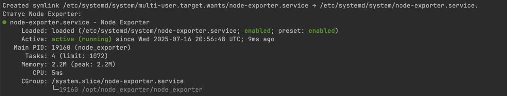
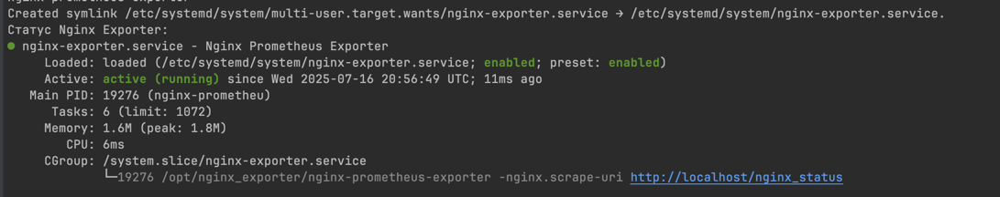
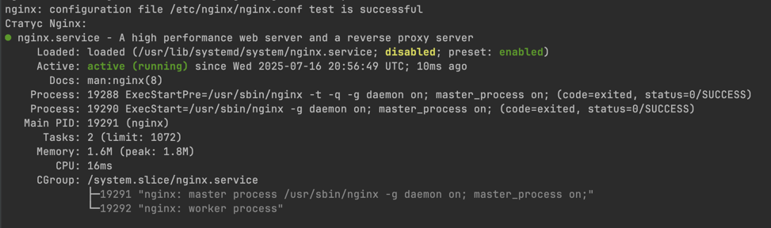

#### Крок 2.4: Налаштування та перевірка (з використанням публічного IP моніторинг-сервера)
Тепер, коли всі сервіси запущені, можна переходити до Grafana.

1. Доступ до Grafana:
- Відкриємо браузер і перейдемо за адресою паблік моніторінг IP: http://16.16.216.96:3000
- Використаємо логін/пароль: admin/admin. Після цього попросять змінити пароль, зробимо це.
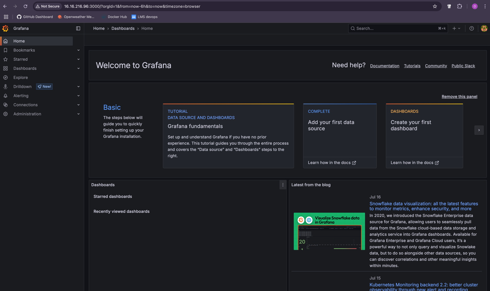
- Перевірка джерел даних:
  - У Grafana перейди до Connections -> Data sources. 
  - Маємо побачити Prometheus та Loki джерела даних, які були автоматично налаштовані завдяки файлам у grafana/provisioning/datasources.
  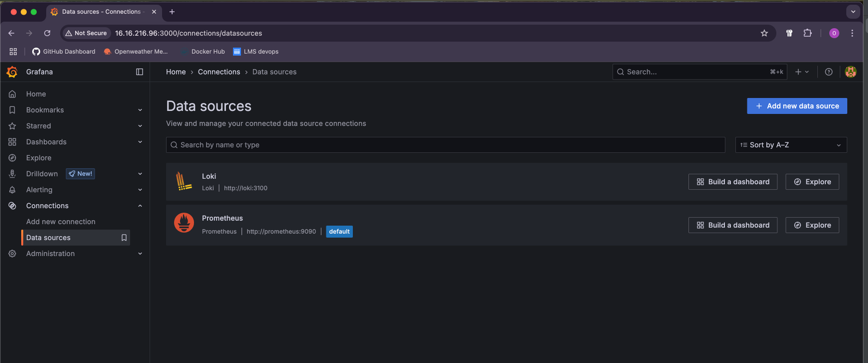

3. Перевіряємо Prometheus Targets:
    - Відкриваємо Prometheus: http://16.16.216.96:9090/targets
    - Переконаємося, що `node-exporter`, `nginx-exporter` та ендпоінт Prometheus працюють:
    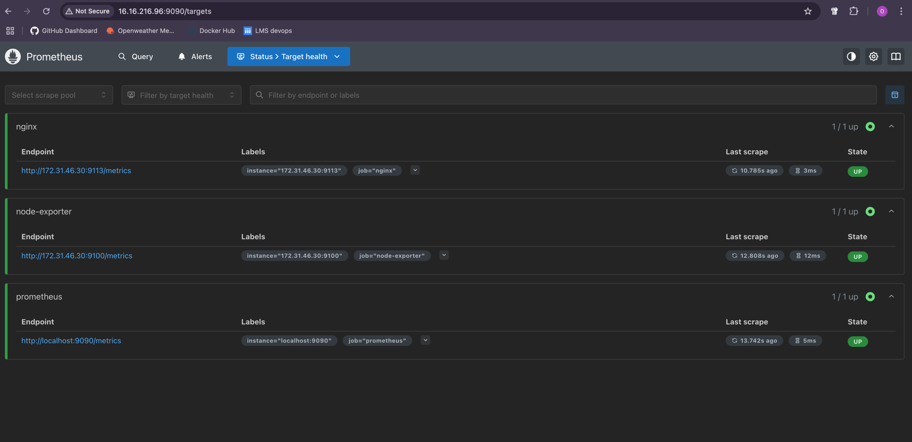

4. Імпортуємо дашборди в Grafana:
   - Переходимо до Dashboards -> Import. 
     - Метрики: Відкриємо дашборд Node Exporter Full (ID: 1860) в Grafana, щоб бачити зростання навантаження на CPU, RAM та мережу.
     - Метрики Nginx: Відкриємо дашборд Nginx (ID: 20311) в Grafana, щоб бачити кількість запитів, з'єднань та помилок.
     - Для Локі експортнемо `json` з попереднього кроку та імпортуємо його в Grafana
```json
{
  "annotations": {
    "list": [
      {
        "builtIn": 1,
        "datasource": {
          "type": "grafana",
          "uid": "-- Grafana --"
        },
        "enable": true,
        "hide": true,
        "iconColor": "rgba(0, 211, 255, 1)",
        "name": "Annotations & Alerts",
        "type": "dashboard"
      }
    ]
  },
  "editable": true,
  "fiscalYearStartMonth": 0,
  "graphTooltip": 0,
  "id": 17,
  "links": [],
  "panels": [
    {
      "datasource": {
        "type": "loki",
        "uid": "P8E80F9AEF21F6940"
      },
      "fieldConfig": {
        "defaults": {
          "color": {
            "mode": "thresholds"
          },
          "custom": {
            "axisBorderShow": false,
            "axisCenteredZero": false,
            "axisColorMode": "text",
            "axisLabel": "",
            "axisPlacement": "auto",
            "fillOpacity": 80,
            "gradientMode": "none",
            "hideFrom": {
              "legend": false,
              "tooltip": false,
              "viz": false
            },
            "lineWidth": 1,
            "scaleDistribution": {
              "type": "linear"
            },
            "thresholdsStyle": {
              "mode": "off"
            }
          },
          "mappings": [],
          "thresholds": {
            "mode": "absolute",
            "steps": [
              {
                "color": "green"
              },
              {
                "color": "red",
                "value": 80
              }
            ]
          }
        },
        "overrides": []
      },
      "gridPos": {
        "h": 8,
        "w": 10,
        "x": 0,
        "y": 0
      },
      "id": 3,
      "options": {
        "barRadius": 0,
        "barWidth": 0.97,
        "fullHighlight": false,
        "groupWidth": 0.7,
        "legend": {
          "calcs": [],
          "displayMode": "list",
          "placement": "bottom",
          "showLegend": true
        },
        "orientation": "auto",
        "showValue": "auto",
        "stacking": "none",
        "tooltip": {
          "hideZeros": false,
          "mode": "single",
          "sort": "none"
        },
        "xTickLabelRotation": 0,
        "xTickLabelSpacing": 0
      },
      "pluginVersion": "12.0.2",
      "targets": [
        {
          "datasource": {
            "type": "loki",
            "uid": "P8E80F9AEF21F6940"
          },
          "direction": "backward",
          "editorMode": "builder",
          "expr": "count_over_time({job=\"nginx\"} |= `HTTP/1.0\" 500` [$__auto])",
          "queryType": "range",
          "refId": "A"
        }
      ],
      "title": "Status 500",
      "type": "barchart"
    },
    {
      "datasource": {
        "uid": "P8E80F9AEF21F6940"
      },
      "fieldConfig": {
        "defaults": {
          "color": {
            "mode": "continuous-GrYlRd"
          },
          "custom": {
            "axisBorderShow": false,
            "axisCenteredZero": false,
            "axisColorMode": "text",
            "axisLabel": "",
            "axisPlacement": "auto",
            "fillOpacity": 80,
            "gradientMode": "none",
            "hideFrom": {
              "legend": false,
              "tooltip": false,
              "viz": false
            },
            "lineWidth": 1,
            "scaleDistribution": {
              "type": "linear"
            },
            "thresholdsStyle": {
              "mode": "off"
            }
          },
          "mappings": [],
          "thresholds": {
            "mode": "absolute",
            "steps": [
              {
                "color": "green"
              },
              {
                "color": "red",
                "value": 80
              }
            ]
          }
        },
        "overrides": []
      },
      "gridPos": {
        "h": 8,
        "w": 10,
        "x": 10,
        "y": 0
      },
      "id": 2,
      "options": {
        "barRadius": 0,
        "barWidth": 0.97,
        "fullHighlight": false,
        "groupWidth": 0.7,
        "legend": {
          "calcs": [],
          "displayMode": "list",
          "placement": "bottom",
          "showLegend": true
        },
        "orientation": "auto",
        "showValue": "auto",
        "stacking": "none",
        "tooltip": {
          "hideZeros": false,
          "mode": "single",
          "sort": "none"
        },
        "xTickLabelRotation": 0,
        "xTickLabelSpacing": 0
      },
      "pluginVersion": "12.0.2",
      "targets": [
        {
          "direction": "backward",
          "editorMode": "builder",
          "expr": "count_over_time({job=\"nginx\"} |~ `HTTP/1.0\" 200` [$__auto])",
          "queryType": "range",
          "refId": "A"
        }
      ],
      "title": "status 200",
      "type": "barchart"
    },
    {
      "datasource": {
        "type": "loki",
        "uid": "P8E80F9AEF21F6940"
      },
      "fieldConfig": {
        "defaults": {},
        "overrides": []
      },
      "gridPos": {
        "h": 11,
        "w": 20,
        "x": 0,
        "y": 8
      },
      "id": 1,
      "options": {
        "dedupStrategy": "none",
        "enableInfiniteScrolling": false,
        "enableLogDetails": true,
        "prettifyLogMessage": false,
        "showCommonLabels": false,
        "showLabels": false,
        "showTime": false,
        "sortOrder": "Descending",
        "wrapLogMessage": false
      },
      "pluginVersion": "12.0.2",
      "targets": [
        {
          "datasource": {
            "type": "loki",
            "uid": "P8E80F9AEF21F6940"
          },
          "direction": "backward",
          "editorMode": "builder",
          "expr": "{job=\"nginx\"} |= ``",
          "queryType": "range",
          "refId": "A"
        }
      ],
      "title": "All logs",
      "type": "logs"
    }
  ],
  "preload": false,
  "schemaVersion": 41,
  "tags": [],
  "templating": {
    "list": []
  },
  "time": {
    "from": "now-6h",
    "to": "now"
  },
  "timepicker": {},
  "timezone": "browser",
  "title": "Loki Explorer",
  "uid": "ad215481-d3a1-409a-81c8-1ff7451fbd97",
  "version": 15
}     
```

#### Крок 2.5: Тестування навантаження та перевірка логів (з використанням публічного IP веб-сервера)
Тепер, коли все налаштовано, можемо генерувати навантаження на Nginx на веб-сервері та перевіряти метрики та логи в Grafana.
1. Запуск тестування з локальної машини (або з веб-сервера):
Запустемо `ab` з локальної машини, використовуючи публічний IP веб-сервера.
```shell
ab -n 200 -c 10 http://51.21.152.0:80/
ab -n 50 -c 5 http://51.21.152.0:80/error
```

2. Перевіремо результати:
    - Метрики: Відкриємо дашборд Node Exporter Full (ID: 1860) в Grafana. Побачимо зростання навантаження на CPU, RAM та мережу.
    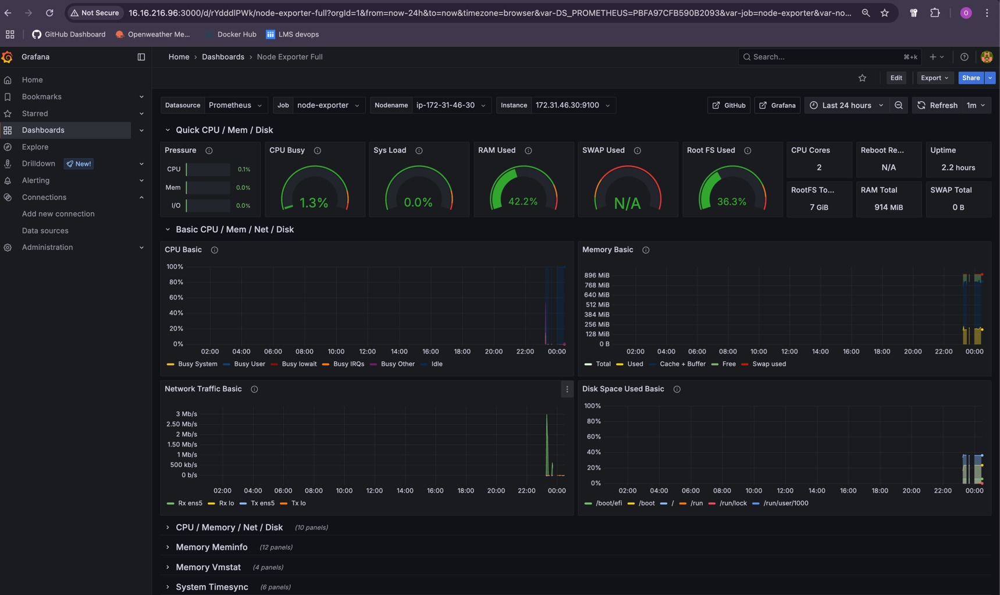
    - Loki Explorer: побачимо логи, що містять успішні запити (код `200`) та помилки (код `500`).
   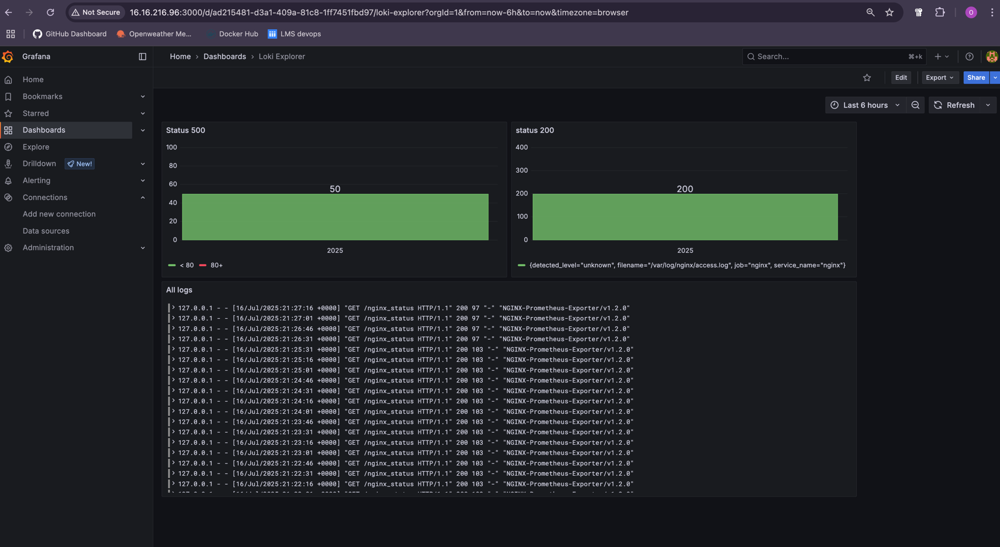
    - Метрики Nginx: Відкриємо дашборд Nginx (ID: 20311) в Grafana. Побачимо кількість запитів, з'єднань та помилок.
   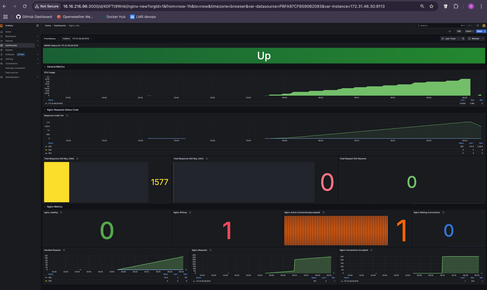

### Очищення інфраструктури
Після завершення роботи з моніторингом, не забудьте видалити створені ресурси в AWS, щоб уникнути непотрібних витрат:
- EC2-інстанси:
  - Моніторинг-сервер (t3.small).
  - Веб-сервер (t3.micro).
- VPC, якщо вона була створена спеціально для цього проекту.
- Перевіримо через Resourse Groups & Tag Editor, чи немає інших ресурсів, пов'язаних з цим проектом і видалимо їх.
