# Автоматизація розсилки електронних листів

## Мета завдання
Розробити систему, яка реагує на події у DynamoDB і автоматично відправляє електронні листи користувачам.

### 📌 Крок 1: Підготовка DynamoDB
Спочатку створимо таблицю для зберігання даних користувачів.
- Перейдемо до консолі AWS і відкрийте сервіс DynamoDB. 
- Натиснемо "Create table". 
  - Table name: Users 
  - Partition key: userId. 
  - Всі інші налаштування залишемо за замовчуванням і натиснемо "Create table".
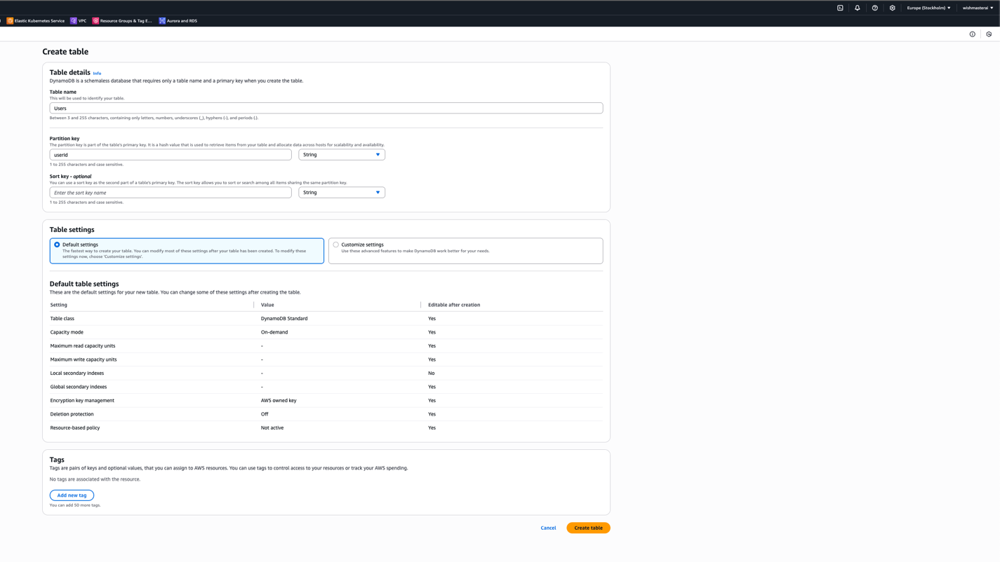

- Після створення таблиці, обираємо її, перейдемо на вкладку "Explore items" (Переглянути елементи) і натиснемо "Create item" (Створемо елемент).
- Додамо запис. Використовуючи вигляд "JSON" для зручності та вставимо щось подібне:
```json
{
  "userId": {
    "S": "user1"
  },
  "email": {
    "S": "olha.devops+1@gmail.com"
  },
  "name":  {
    "S": "Olha1"
  }
}
```
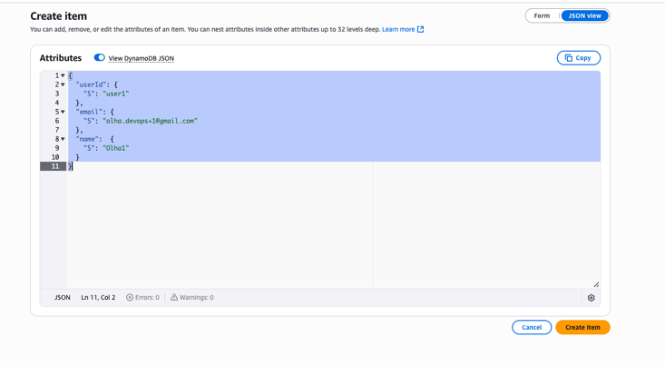

### Крок 2: Налаштування DynamoDB Streams
Тепер увімкнемо потік даних, щоб відстежувати зміни в таблиці.
- У налаштуваннях таблиці Users знаходимо вкладку "Exports and streams". 
- У секції "DynamoDB stream details" натискаємо "Turn on". 
- Оберемо "View type": New and old images. Це дозволить Lambda-функції бачити повну версію запису до і після зміни. 
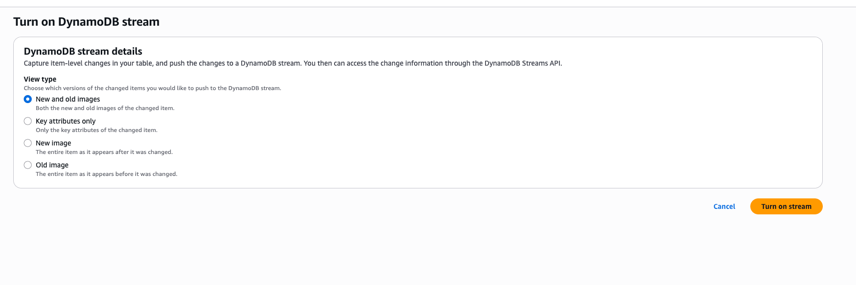
- Натискаємо "Turn on stream". 
- Після ввімкнення скопіюємо Stream ARN (Amazon Resource Name). Він знадобиться нам для налаштування прав доступу.
```text
arn:aws:dynamodb:eu-north-1:<account_id>:table/Users/stream/2025-07-17T21:38:05.645
```

### Крок 3: Налаштування Amazon SES
Щоб надсилати листи, потрібно підтвердити свою особу (email або домен).
- Переходимо до сервісу Amazon SES. 
- В меню зліва оберемо Configuration -> "Identities". 
- Натиснемо "Create identity" (Створити особу). 
- Обераємо "Email address" і вводимо email, з якого будемо надсилати листи (наприклад, особистий емейл).
  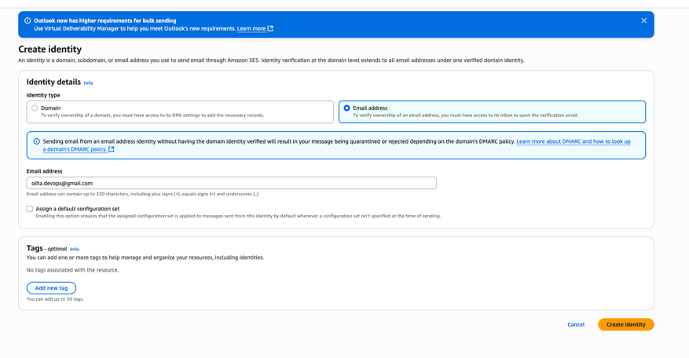
- Натиснемо "Create identity". Отримаємо лист від AWS з посиланням для підтвердження. Обов'язково переходимо за посиланням. 
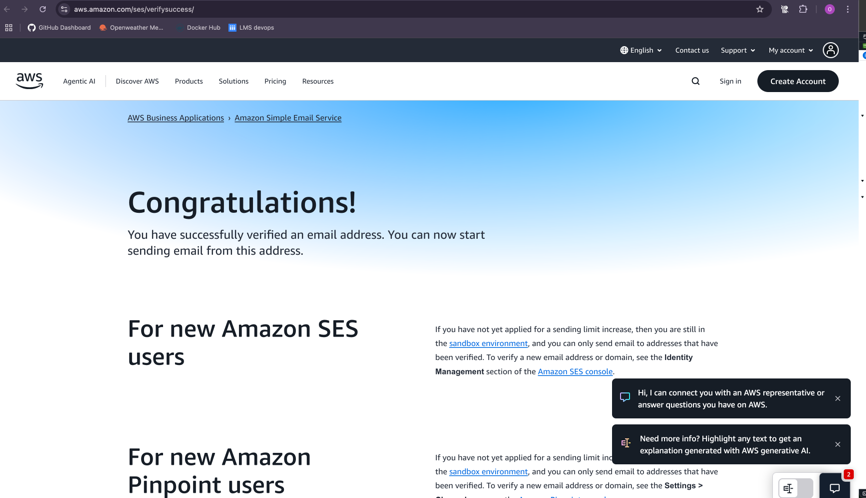
- Увага! Нові акаунти AWS знаходяться в "пісочниці" (sandbox) SES. Це означає, що ви можете надсилати листи тільки на підтверджені email-адреси. Щоб протестувати систему, потрібно буде додати і підтвердити також і email отримувача (якщо це ваша інша пошта).

#### Крок 4: Створення IAM-ролі для Lambda
Лямбда функції потрібні дозволи на читання з DynamoDB Streams та відправку листів через SES.
- Переходимо до сервісу IAM щоб створюємо полісі `LambdaDynamoSESPolicy`, на вкладку JSON і вставляємо наступний код. З кроку 2 скопіюйте Stream ARN таблиці Users і додамо в Resource в політиці:
```json
{
  "Version": "2012-10-17",
  "Statement": [
    {
      "Effect": "Allow",
      "Action": [
        "dynamodb:GetRecords",
        "dynamodb:GetShardIterator",
        "dynamodb:DescribeStream",
        "dynamodb:ListStreams"
      ],
      "Resource": "arn:aws:dynamodb:eu-north-1:<account_id>:table/Users/stream/2025-07-17T21:38:05.645"
    },
    {
      "Effect": "Allow",
      "Action": "ses:SendEmail",
      "Resource": "*"
    },
    {
      "Effect": "Allow",
      "Action": [
        "logs:CreateLogGroup",
        "logs:CreateLogStream",
        "logs:PutLogEvents"
      ],
      "Resource": "arn:aws:logs:*:*:*"
    }
  ]
}
```
- потім створюємо роль `LambdaDynamoSESRole` та обираємо створений полісі `LambdaDynamoSESPolicy`

### Крок 5: Створення та налаштування Lambda-функції
Переходимо до сервісу AWS Lambda.
- Натиснемо "Create function". 
- Оберемо "Author from scratch". 
- Function name: sendWelcomeEmail 
- Runtime: Python 3.13. 
- Permissions: розгорніть секцію, оберіть "Use an existing role" і оберемо `LambdaDynamoSESRole`, яку ми створили на кроці 4.
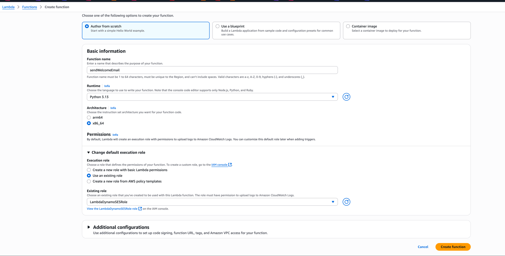
- Натискаємо "Create function". 
- Після створення функції, в розділі "Function overview", натиснемо "+ Add trigger".
- Source: DynamoDB. 
- DynamoDB table: Users. 
- Всі інші налаштування (batch size, starting position) можна залишити за замовчуванням. 
- Натиснемо "Add".

### Крок 6: Код Lambda-функції (Python)
- У вікні функції sendWelcomeEmail перейдемо на вкладку "Code" та замінемо вміст файлу `lambda_function.py` на наступний код:
```python
import json
import boto3
import os

ses_client = boto3.client('ses')
SENDER_EMAIL = os.environ.get('SENDER_EMAIL')

def lambda_handler(event, context):
  print(f"Received event: {json.dumps(event)}")

  if not SENDER_EMAIL:
    print("Error: SENDER_EMAIL environment variable is not set.")
    return {'statusCode': 500, 'body': 'SENDER_EMAIL is not configured'}

  for record in event['Records']:
    try:
      if record['eventName'] == 'INSERT':
        new_image = record['dynamodb']['NewImage']
        user_name = new_image['name']['S']
        user_email = new_image['email']['S']

        print(f"New user: {user_name} ({user_email}). Sending welcome email...")

        subject = f"Welcome to our system, {user_name}!"
        body_text = (f"Hello, {user_name}!\n\n"
                     f"Thank you for registering. We are happy to see you here.\n\n"
                     f"Best regards,\n"
                     f"Your Team")

        response = ses_client.send_email(
          Source=SENDER_EMAIL,
          Destination={'ToAddresses': [user_email]},
          Message={
            'Subject': {'Data': subject, 'Charset': 'UTF-8'},
            'Body': {'Text': {'Data': body_text, 'Charset': 'UTF-8'}}
          }
        )

        print(f"Welcome email sent successfully. Message ID: {response['MessageId']}")

      elif record['eventName'] == 'REMOVE':
        old_image = record['dynamodb']['OldImage']
        user_name = old_image['name']['S']
        user_email = old_image['email']['S']

        print(f"User deleted: {user_name} ({user_email}). Sending farewell email...")

        subject = f"We're sorry to see you go, {user_name}"
        body_text = (f"Hello, {user_name}!\n\n"
                     f"We've seen that you deleted your account. We are very sorry that you are leaving us.\n\n"
                     f"If you have a moment, please let us know what we could have done better.\n\n"
                     f"Sincerely,\n"
                     f"Your Team")

        response = ses_client.send_email(
          Source=SENDER_EMAIL,
          Destination={'ToAddresses': [user_email]},
          Message={
            'Subject': {'Data': subject, 'Charset': 'UTF-8'},
            'Body': {'Text': {'Data': body_text, 'Charset': 'UTF-8'}}
          }
        )

        print(f"Farewell email sent successfully. Message ID: {response['MessageId']}")

    except Exception as e:
      print(f"An error occurred while processing the record: {e}")
      continue

  return {
    'statusCode': 200,
    'body': json.dumps('Processing completed successfully!')
  }
```
- Налаштування змінної оточення:
  - У секції "Environment variables".
  - Додаємо нову змінну:
    - Key: `SENDER_EMAIL`
    - Value: підтверджений email з Amazon SES
    
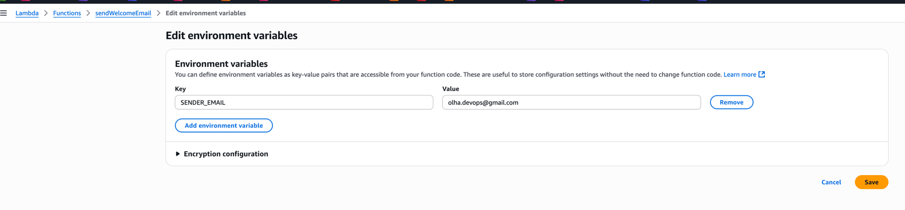
- Зробимо "Deploy" (Розгорнути) функцію, щоб зберегти зміни.

### Крок 7: Тестування
1. Перевіримо стрім на створення нового користувача:
   - Перейдемо до таблиці Users в DynamoDB. 
   - Натискаємо "Create item". 
   - Створюємо нового користувача. Важливо: в полі email вказуємо адресу, яку також підтвердили в SES (через обмеження "пісочниці").
    ```json
    {
        "userId": {
            "S": "new-user-12345"
        },
        "email": {
            "S": "olha.devops+12345@gmail.com"
        },
        "name":  {
            "S": "Olha New"
        }
    }    
    ```
  - Натискаємо "Create item".

  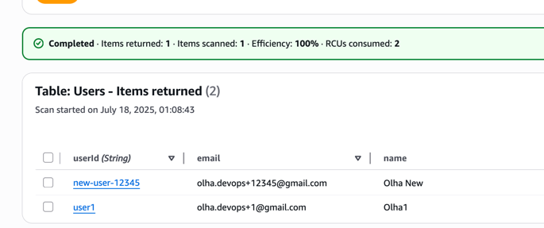

  - Перевіримо, чи надійшов лист:
  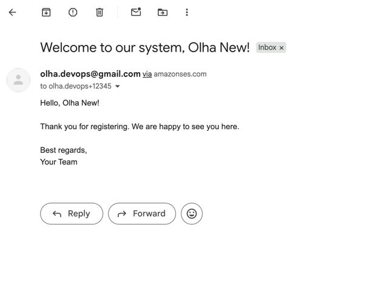

2. Перевіряємо стрім на видалення користувача:
   - Повертаємося до таблиці Users в DynamoDB. 
   - Вибираємо користувача, якого створили на перщому кроці `Olha1`, і натискаємо "Actions" -> "Delete".
   - Підтверджуємо видалення.
   - Перевіримо, чи надійшов лист:
   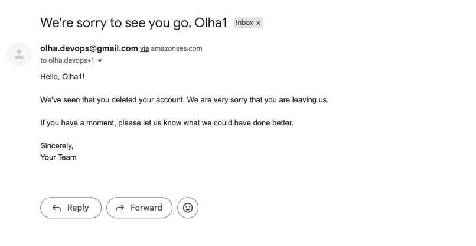
  
#### Що має відбутися:
- Створення/видалення запису в DynamoDB генерує подію в Stream. 
- Ця подія автоматично викликає Lambda-функцію. 
- Функція читає дані нового користувача і надсилає йому вітальний лист через SES. 
- Перевіряємо логи Lambda. Переходимо на вкладку "Monitor" (Моніторинг) -> "View CloudWatch logs". Там побачимо деталі виконання функції, включаючи print заяви, які ми додали в код. Це дуже корисно для налагодження.

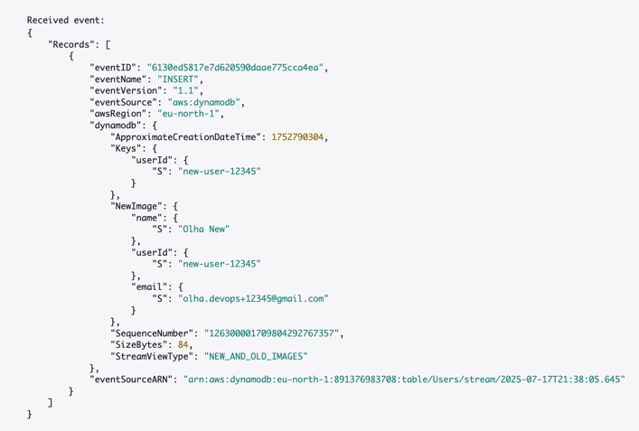
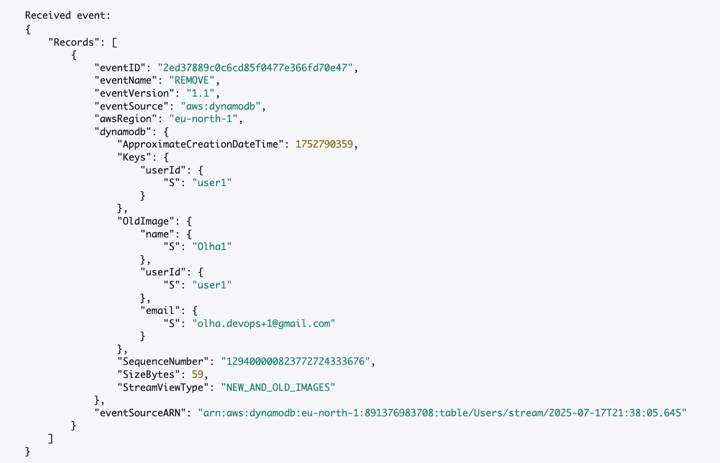

### Очищення ресурсів
Після завершення тестування, не забудьте видалити створені ресурси, щоб уникнути непотрібних витрат:
- Видалити Lambda-функцію.
- Вимкнути та видалити DynamoDB таблицю.
- Видалити IAM роль та політику.
- Видалити SES ідентичність (email).
- Видалити CloudWatch логи, якщо вони більше не потрібні.
