# Встановлюємо на віртуалку Linux
Для Mac M3 для UTM (замість Virtual Box) встановлюємо debian-12-arm64-utm (https://mac.getutm.app/gallery/) 

# Підключення до віртуалки через SSH (для зручної роботи з терміналу локальної машини)

Після старту віртуальної машини з Debian ми можемо підключатися до неї прямо з терміналу нашого Mac через SSH. Це зручно, адже дозволяє:
- працювати у звичному терміналі,
- уникати ручного введення у вікні UTM

## 1. Встановлюємо SSH-сервер у Debian:
```bash
sudo apt install openssh-server
sudo systemctl enable ssh
sudo systemctl start ssh
```

## 2. Дізнаємося IP-адресу віртуалки:
```bash
ip a
```

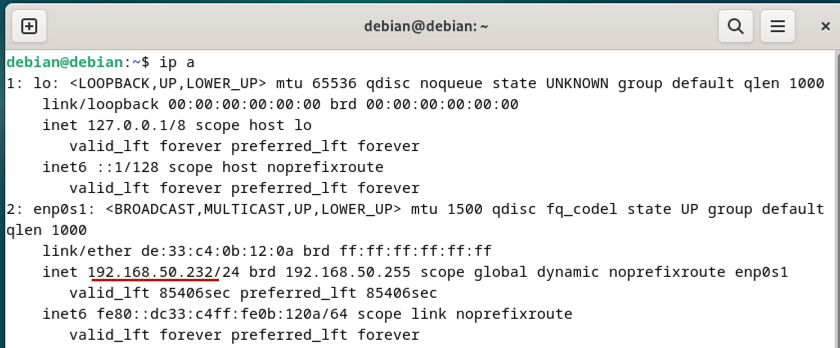

> `192.168.50.232`

## 3. Підключення з локального терміналу:
```bash
ssh debian@192.168.50.232
```

> Пароль — той самий, який використовується для входу у VM.

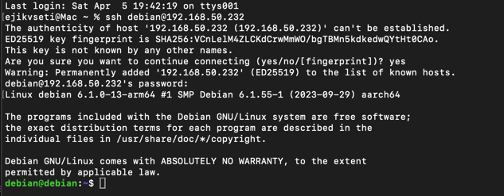

Тепер можна працювати з налаштуваннями на Дебіан через локальний термінал, що зручніше.

---
## Встановлення та налаштування вебсерверу Nginx (Debian)

1. **Оновлюємо пакети та встановлюємо базові інструменти**:
   ```bash
   sudo apt update
   sudo apt install curl gnupg2 ca-certificates lsb-release
   ```

2. **Додаємо офіційний GPG-ключ від Nginx**:
   ```bash
   curl https://nginx.org/keys/nginx_signing.key | sudo gpg --dearmor -o /etc/apt/trusted.gpg.d/nginx.gpg
   ```

3. **Додаємо офіційний репозиторій Nginx**:
   ```bash
   echo "deb http://nginx.org/packages/debian $(lsb_release -cs) nginx" | sudo tee /etc/apt/sources.list.d/nginx.list
   ```

4. **Оновлюємо кеш пакетів та встановлюємо Nginx**:
   ```bash
   sudo apt update
   sudo apt install nginx
   ```

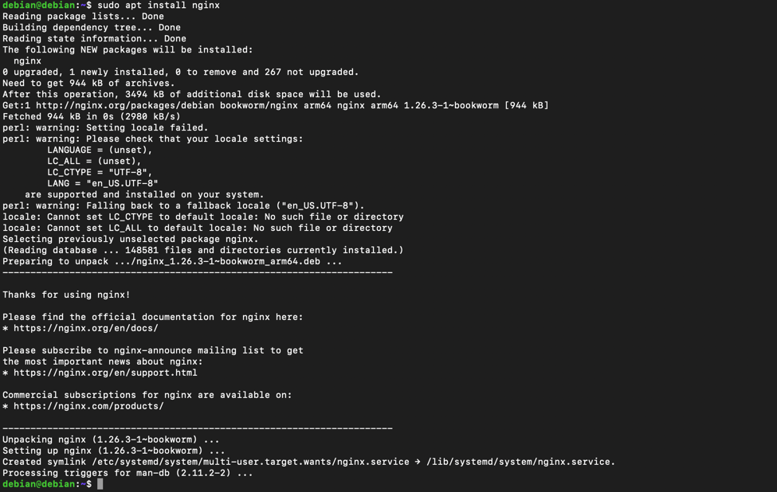

5. **Перевіряємо статус сервісу Nginx**:
   ```bash
   sudo systemctl status nginx
   ```

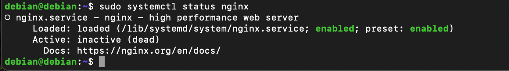

6. **(Опціонально) Повернення до репозиторію Debian**:
    - Видаляємо зовнішній репозиторій:
      ```bash
      sudo rm /etc/apt/sources.list.d/nginx.list
      ```
    - Видаляємо Nginx:
      ```bash
      sudo apt remove nginx nginx-common
      ```
      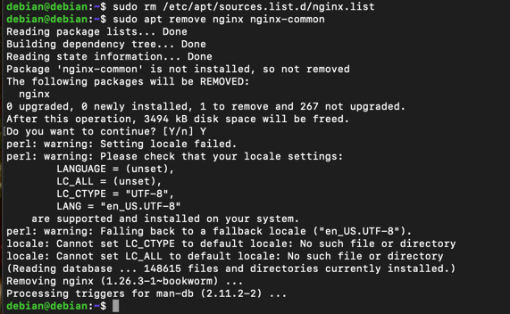
    - Перевіряємо статус сервісу Nginx**:
      ```bash
      sudo systemctl status nginx
      ```
      
   

    - Встановлюємо знову з офіційного Debian:
      ```bash
      sudo apt update
      sudo apt install nginx
      ```
   - Перевіряємо статус сервісу Nginx**:
      ```bash
      sudo systemctl status nginx
      ```
     
     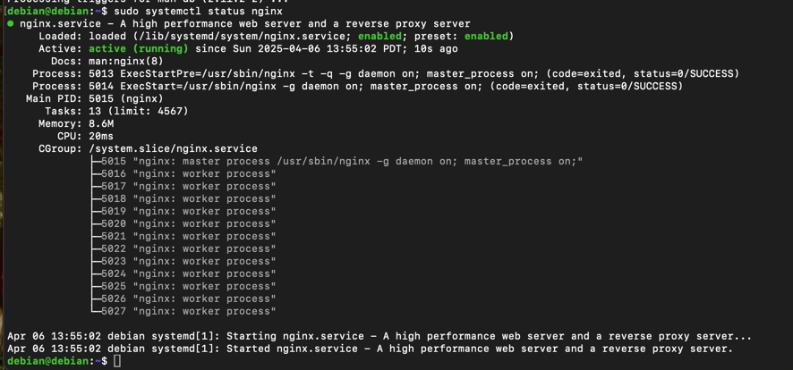
---


# Advanced Linux — Налаштування systemd та брандмауера

## Налаштування systemd-сервісу

1. **Створюємо скрипт** `sudo nano /usr/local/bin/write-time.sh`, який записує поточну дату та час у файл `/var/log/time.log`:
   ```bash
   #!/bin/bash
   date >> /var/log/time.log
   ```

2. **Надаємо права на виконання**:
   ```bash
   sudo chmod +x /usr/local/bin/write-time.sh
   ```

3. **Створюємо systemd-сервіс** `sudo nano /etc/systemd/system/write-time.service`:
```ini
[Unit]
Description=Write current time to log file

[Service]
ExecStart=/usr/local/bin/write-time.sh
```

4. **Створюємо таймер** `sudo nano /etc/systemd/system/write-time.timer`, який запускатиме скрипт щохвилини:
```ini
[Unit]
Description=Run every minute

[Timer]
OnBootSec=1min
OnUnitActiveSec=1min
Unit=write-time.service

[Install]
WantedBy=timers.target
```

5. **Активуємо таймер**:
   ```bash
   sudo systemctl daemon-reexec
   sudo systemctl enable --now write-time.timer
   ```

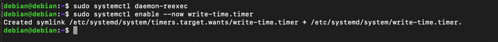
---

- Перевірка роботи systemd-сервісу

  Сервіс write-time.service виконується успішно, що підтверджується логами системного журналу:
  ```bash
  sudo journalctl -u write-time.service
  ```

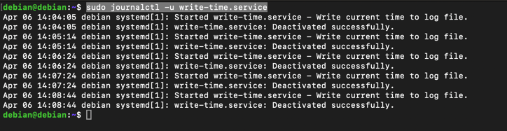

## Налаштування брандмауера (ufw)

1. **Встановлюємо UFW**:
   ```bash
   sudo apt install ufw
   ```

2. **Налаштовуємо доступ до SSH**:
    - Дозволяємо підключення з певного IP:
      ```bash
      sudo ufw allow from 192.168.1.101 to any port 22
      ```
    - Блокуємо з іншого:
      ```bash
      sudo ufw deny from 192.168.50.149 to any port 22
      ```

3. **Увімкнення брандмауера та перевірка**:
   ```bash
   sudo ufw enable
   sudo ufw status
   ```

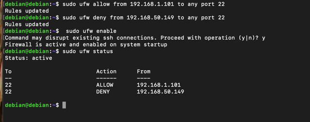
---

 - Спробуємо підключитись з машини 192.168.50.149

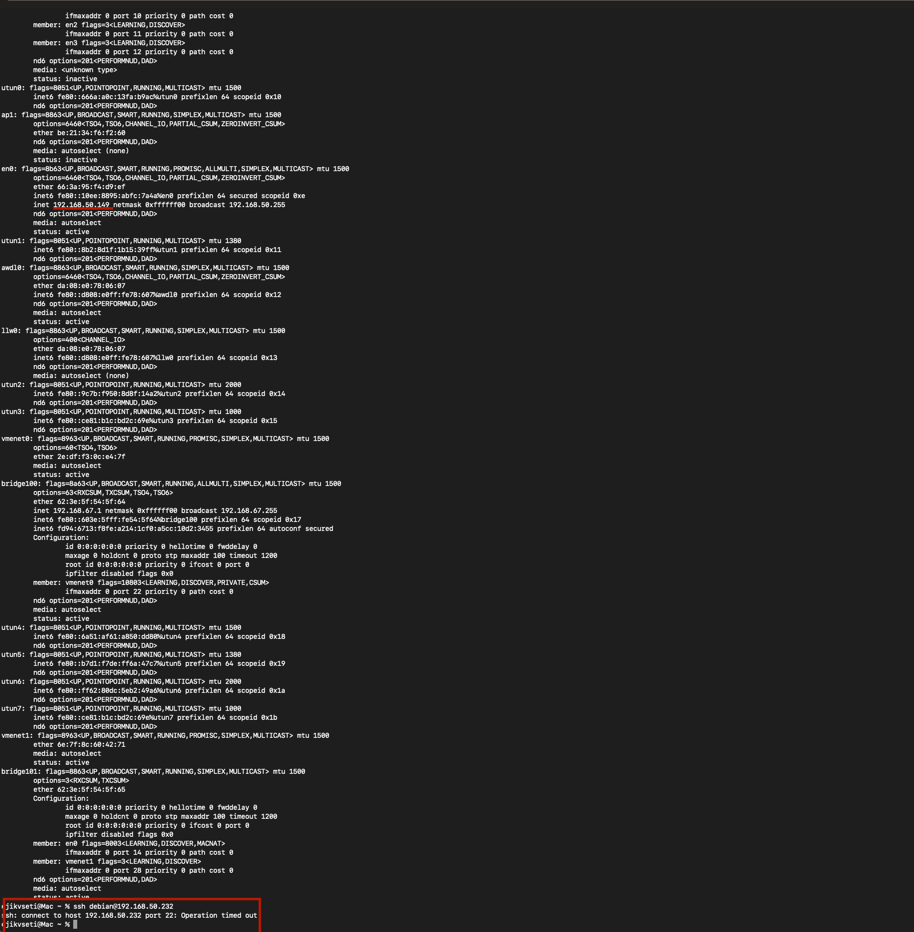

 - Змінемо 192.168.50.149 як allow    

```bash
sudo ufw allow from 192.168.50.149 to any port 22
sudo ufw status
```

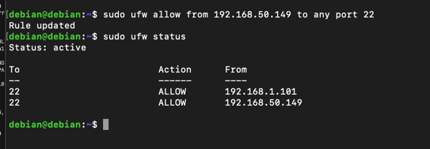

- Знову спробуємо підключитись з машини 192.168.50.149 і все підключається

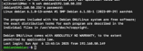

## Налаштування Fail2Ban

1. **Встановлюємо Fail2Ban**:
   ```bash
   sudo apt install fail2ban
   ```

2. **Копіюємо базовий конфіг і редагуємо**:
   ```bash
   sudo cp /etc/fail2ban/jail.conf /etc/fail2ban/jail.local
   sudo nano /etc/fail2ban/jail.local
   ```

3. **Увімкнення захисту SSH у конфігурації (`jail.local`)**:
   ```
   [sshd]
   enabled = true
   maxretry = 3
   ```

4. **Перезапускаємо та перевіряємо статус**:
   ```bash
   sudo systemctl restart fail2ban
   sudo fail2ban-client status sshd
   ```

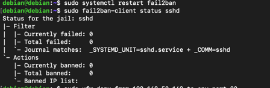

- Спробуємо зайти з неправильним паролем під ssh:
```bash
ssh debian@192.168.50.232
```

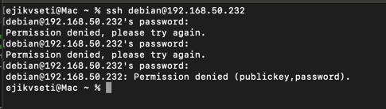

- Перевіремо статус знов і бачимо що ip був забанен:
```shell
   sudo fail2ban-client status sshd
```

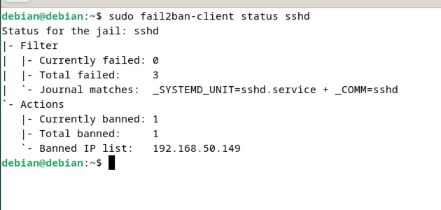

- Разбанемо 192.168.50.149:
```shell
sudo fail2ban-client set sshd unbanip 192.168.50.149
sudo fail2ban-client status sshd
```

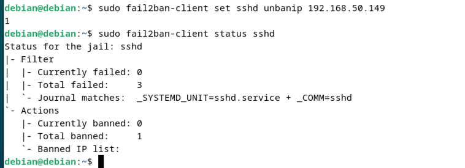

## Додаткове завдання — новий розділ на диску з автоматичним монтуванням

### 0. Додаємо новий диск у віртуальну машину

> ❗️ Перед початком потрібно зупинити віртуалку та додати новий диск у налаштуваннях UTM:

1. Зупинити віртуальну машину
2. Відкрити `Edit` → вкладка `Drives`
3. Натиснути ➕ `New Drive`
4. Запустити віртуалку знову

Після запуску новий диск буде доступний як `/dev/vdb`

### 1. Перевіряємо доступні диски:
```bash
lsblk
```
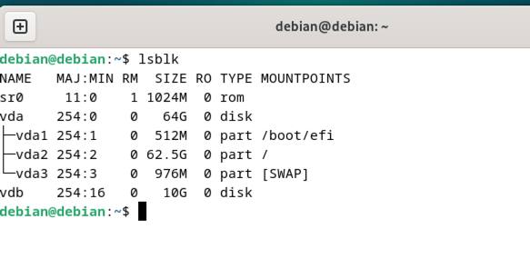

### 2. Створюємо новий розділ:
```bash
sudo fdisk /dev/vdb
```

У `fdisk`:
- натискаємо `n` → `p` → `Enter` кілька разів
- потім `w` — зберігаємо зміни

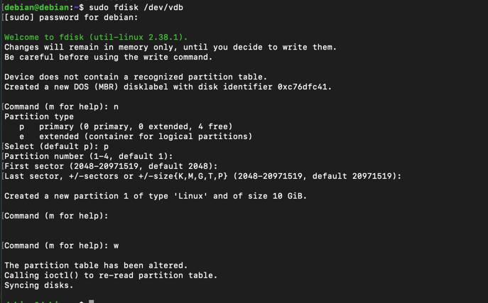

### 3. Форматуємо новий розділ у ext4:
```bash
sudo mkfs.ext4 /dev/vdb1
```

### 4. Створюємо точку монтування:
```bash
sudo mkdir /mnt/mydisk
```

### 5. Монтуємо вручну:
```bash
sudo mount /dev/vdb1 /mnt/mydisk
```

### 6. Отримуємо UUID нового розділу:
```bash
sudo blkid
```

### 7. Додаємо запис до `/etc/fstab` для автозавантаження:
```bash
sudo nano /etc/fstab
```

Додаємо рядок:
```
UUID=56bcfdbe-b2a6-4801-be75-3c9619a640f4 /mnt/mydisk ext4 defaults 0 2
```

### 8. Перевіряємо:
```bash
sudo mount -a
lsblk
```

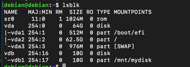

- Зберігаємо файли на новий диск:
```shell
echo "Hello, world!" | sudo tee /mnt/mydisk/hello.txt
```

- Перевіряємо:
```shell
cat /mnt/mydisk/hello.txt
```

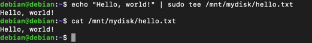