# Lecture 4 — Vagrant

## 🔧 Кроки виконання

1. Встановлення vagrant (Mac):
```shell
brew install --cask vagrant
vagrant --version
```


2. Ініціалізовано Vagrant-проєкт:

```bash
   cd ./Lecture_4
   
   vagrant init
```

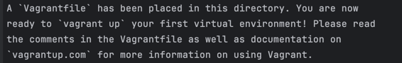

3. Створено три однакові VM: vm1a, vm1b, vm1c
* За допомогою циклу та функції `setup_vm`
* Кожна VM:
  * Має публічну мережу (DHCP)
  * Має спільну папку
  * Використовує provisioning-скрипт

    
3.1 Створено скрипт provision_vm1.sh:
```shell
#!/bin/bash
sudo apt-get update -y
sudo apt-get install -y nginx
```
3.2 Створено папку shared_vm1/

4. Запуск машин:

```shell
vagrant up
```

5. Перевірка роботи

5.1 Статус машин:

```shell
vagrant status
```

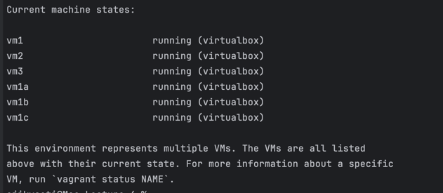


5.2 Перевірка IP та nginx:

```shell
vagrant ssh vm1a
ip a
curl localhost
```

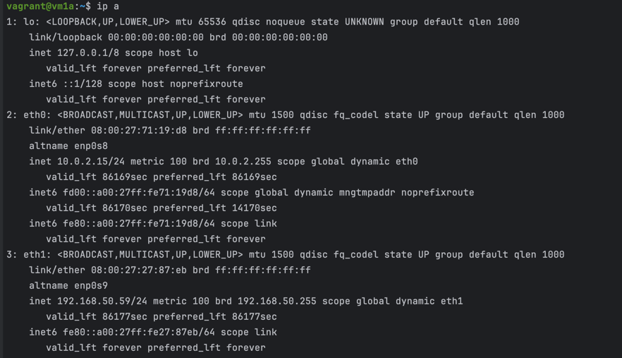
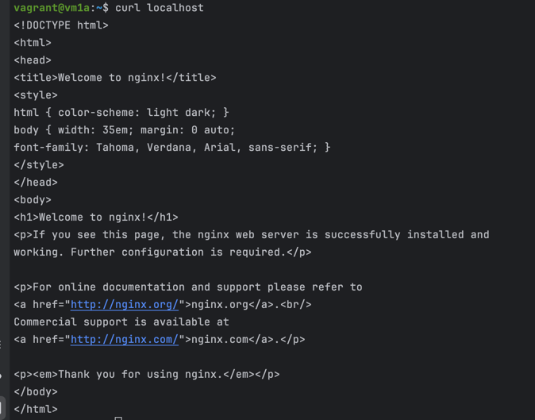

5.2.1 Перевірка спільної папки

```shell
cd /vagrant_data
ls
cat test.txt
```

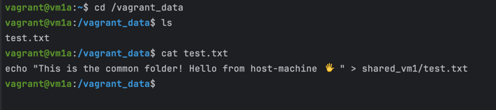

5.3 Перевірка htop у VM2:

```shell
vagrant ssh vm2
htop
```

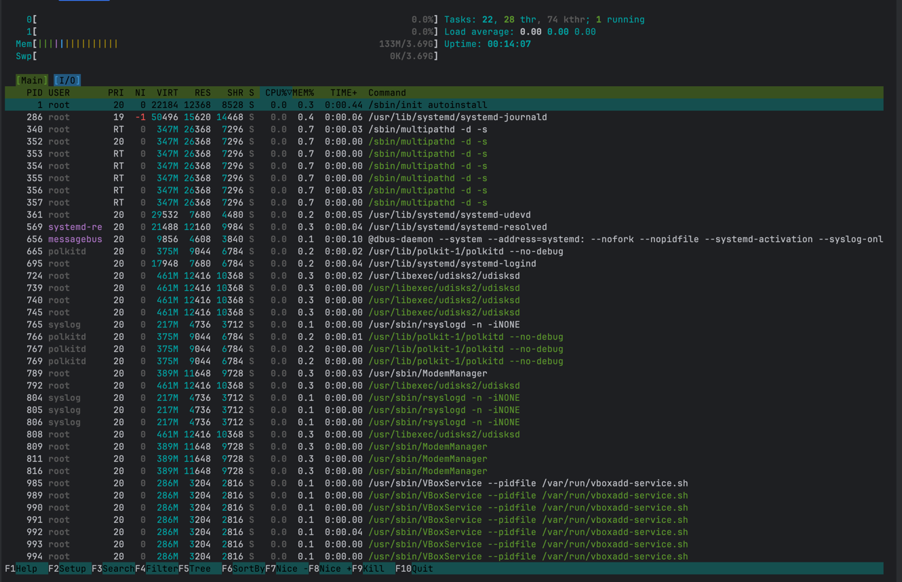

5.4. Перевірка доступності nginx у VM3 через локальний порт:

Оскільки використання bridge через Wi-Fi на macOS не завжди працює стабільно, для VM3 було налаштовано порт-форвардинг:

Порт `80` всередині VM3 прокинуто як `8083` на хості.  
У браузері відкрито: `http://localhost:8083`

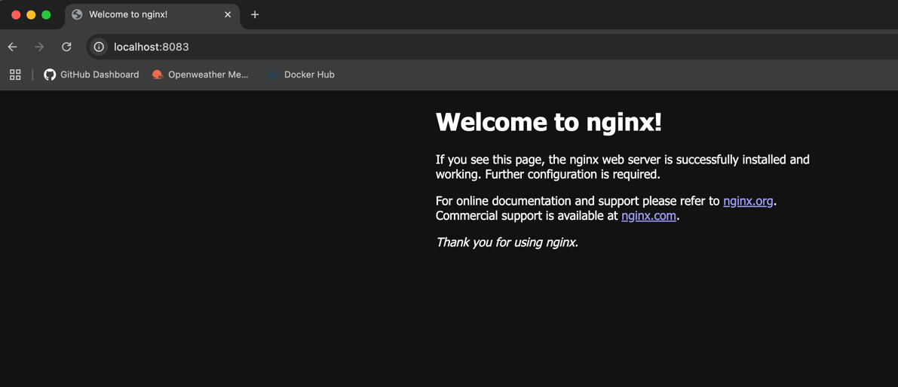

5.5. Перевірка доступності nginx у VM1 через IP:

```shell
vagrant ssh vm1
ip a
```

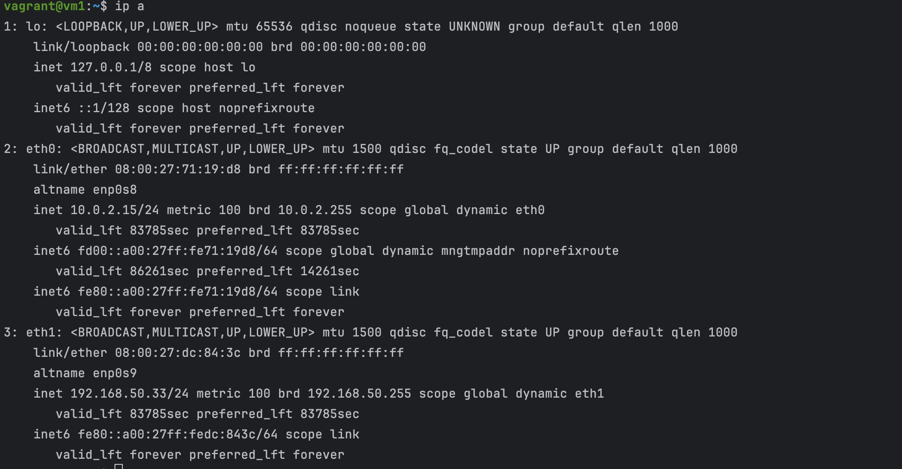


Після цього з локальної машини відкрито IP-адресу VM1 у браузері (ваша IP-адреса з `ip a`):
http://192.168.50.33

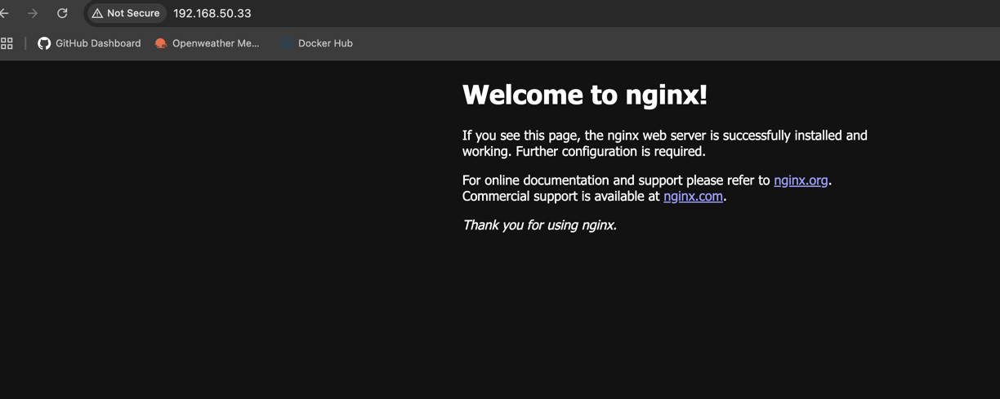


## 6. Завершення роботи

Після завершення роботи з віртуальними машинами їх можна:

### 🔸 Зупинити (залишити стан збереженим):

```bash
vagrant halt

vagrant status
```

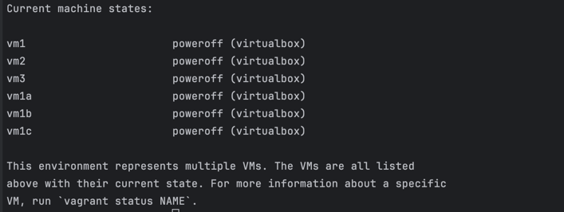

Після цього можна знову запустити машини за допомогою `vagrant up`.

### 🔸 Повністю видалити (зі всіма даними):

```shell
vagrant destroy

vagrant status
```

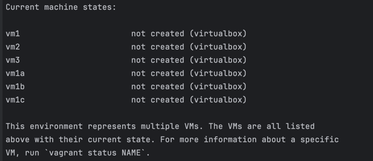