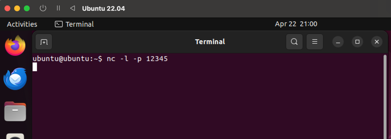
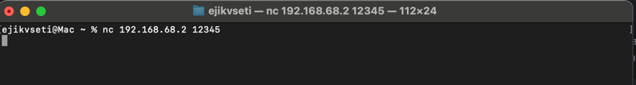
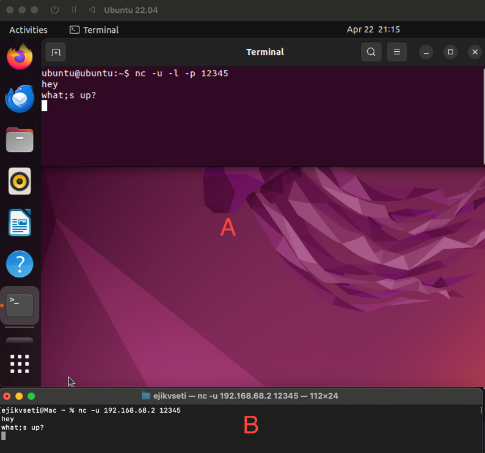
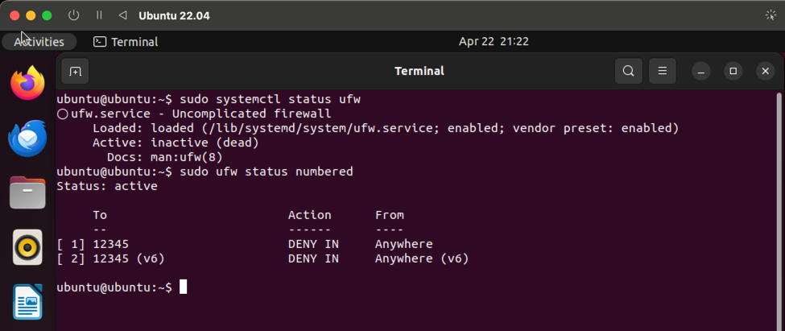
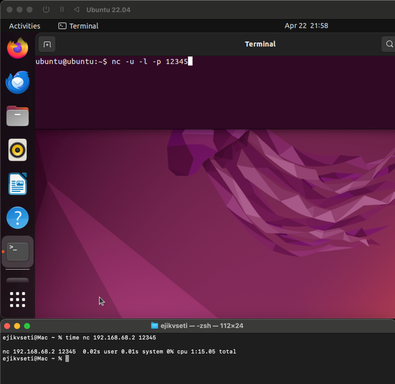
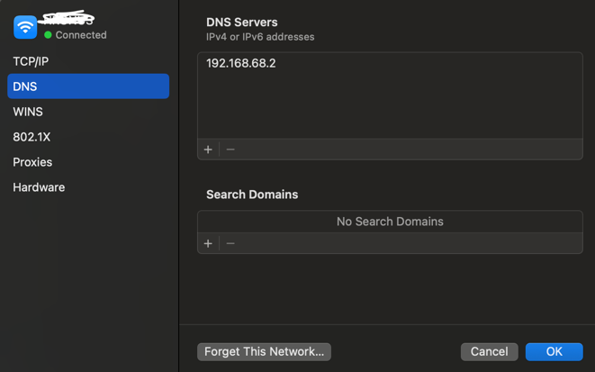

# Завдання 1: Мережеві з’єднання через Netcat

### Встановлення netcat
```bash
sudo apt update
sudo apt install netcat-openbsd
```

### TCP-з’єднання між двома машинами

#### На Машині A (ubuntu на UTM):

1. Перевіряємо IP:
```bash
ip a
```

Зараз на моїй машині A IP дорівнює `192.168.68.2`

2. Запускаємо команду netcat для з'єднання з локальною машиною
```bash
nc -l -p 12345
```


#### На Локальній машині B запускаємо команду для з'єднання з машиною A:
```bash
nc 192.168.68.2 12345
```


#### Після встановлення з’єднання:
* Текст, введений на клієнті, з’явиться на сервері.
* Текст, введений на сервері, з’явиться на клієнті.


### UDP-з’єднання між двома машинами
#### На Машині A (додаємо параметр -u):
```bash
nc -u -l -p 12345
```

#### На Машині B (додаємо параметр -u):
```bash
nc -u 192.168.68.2 12345
```

UDP не гарантує доставку — повідомлення можуть бути втрачені, з’єднання не встановлюється явно.

### Блокування порту фаєрволом
На машині A:
```bash
sudo apt install ufw
sudo ufw enable
sudo ufw deny 12345
```


#### Результат:
**TCP**: клієнт намагається підключитися, але після тайм-ауту (~75 секунд) отримує повідомлення про помилку або роз'єднується.


**UDP**: клієнт надсилає пакети, але:
* повідомлення не доходять до сервера A,
* сервер нічого не бачить,
* клієнт не знає, що сталося (немає зворотного зв’язку)


# Завдання 2: Налаштування DNS-сервера за допомогою dnsmasq

###  Встановлення `dnsmasq` на машині A (сервер)

```bash
sudo apt update
sudo apt install dnsmasq
```

### Налаштування локального DNS
Відкриваємо файл конфігурації:

```bash
sudo nano /etc/dnsmasq.conf
```
Додаємо запис для тестового домену:
```text
address=/mytest.local/192.168.68.2
```
Це означає, що всі запити до mytest.local будуть направлені на IP 192.168.68.2.

Перезапускаємо службу dnsmasq:
```shell
sudo systemctl restart dnsmasq
```

Додаємо в файрвол дозвіл на 53 порт:
```shell
sudo ufw allow 53/udp
```


### Перевірка з машини B (клієнт)
#### Вказуємо DNS-сервер вручну
Для Мак, щоб він використовував DNS адресу через GUI:
Переходимо в System Settings > Network.
Обираємо своє підключення (Wi-Fi в моєму випадку).
Тиснемо "Details…" → вкладка DNS.
додаємо:

```text
192.168.68.2
```


(це IP-адреса машини A, на якій працює dnsmasq)

🔍 Перевіряємо резолюцію домену
```shell
nslookup mytest.local 192.168.68.2
```


Локальний DNS-сервер dnsmasq на машині A працює коректно — домен mytest.local успішно резолвиться в IP 192.168.68.2